# Git Workflows

Branches, commits, merging, rebasing, and surviving team development

> Reference: [git-scm.com/cheat-sheet](https://git-scm.com/cheat-sheet)

---
layout: default
---

# Agenda

- Creating and switching branches
- Staging, committing, and pushing
- Keeping your branch up to date with `main`
- Rebase vs Merge — when to use each
- Fixing divergent branches
- Common team issues

---
layout: two-cols-header
---

# Creating a Branch

::left::

**Create and switch immediately**

```bash
git switch -c <branch-name>
# older syntax
git checkout -b <branch-name>
```

**Switch to existing branch**

```bash
git switch <branch-name>
```

**List / delete branches**

```bash
git branch
git branch --sort=-committerdate

git branch -d <name>   # safe delete
git branch -D <name>   # force delete
```

::right::

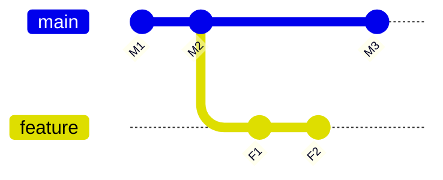

<!-- Branch off main at any point. Work is isolated until you're ready to merge. -->

---
layout: default
---

# Stage → Commit → Push

```bash
# 1. Stage changes
git add <file>           # specific file
git add .                # everything
git add -p               # pick hunks interactively

# 2. Check what's staged
git status

# 3. Commit
git commit -m 'your message'
git commit -am 'message'   # stage all tracked + commit

# 4. Push
git push -u origin <branch-name>   # first push (sets upstream)
git push                           # subsequent pushes
```

<!-- git add -p is great when you've mixed multiple concerns in one file. -->

---
layout: center
---

# Keeping Your Branch Up to Date

Merge `main` into your feature branch **regularly** to avoid large conflicts

---
layout: two-cols-header
---

# Updating via Merge

::left::

```bash
# Fetch latest from remote
git fetch origin main

# Switch to your feature branch
git switch feature

# Bring main's changes in
git merge main

# Or in one step
git pull origin main
```

::right::

**What merge does:**
- Creates a **merge commit** joining both histories
- Preserves full branch history
- Safe on shared branches ✅

<!-- Merge commits make the history more complex but accurately reflect what happened. -->

---
layout: two-cols-header
---

# Merge: Before → After

::left::

**Before** — `feature` and `main` have both diverged

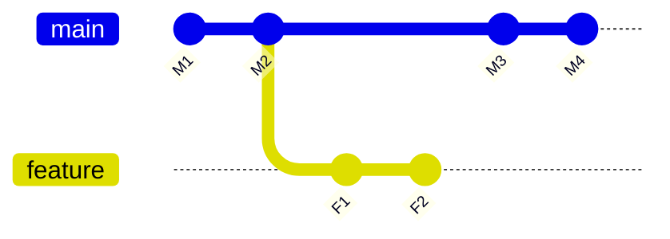

::right::

**After** `git merge main` (on feature branch)

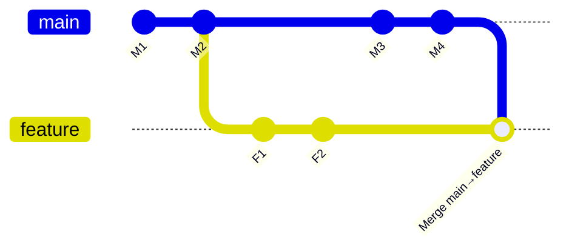

<!-- The merge commit pulls in M3+M4 from main. Feature history is preserved and main's changes are now available on the branch. -->

---
layout: two-cols-header
---

# Rebase Commands

::left::

```bash
# Move your feature branch on top of the latest main
git switch feature
git rebase main

# Fetch latest changes, then rebase in one step
git pull --rebase

# Undo a failed rebase
git reflog feature           # find the commit before rebase
git reset --hard <commit>    # go back to it
```

::right::

**What rebase does:**
- Re-applies your commits on top of the tip of `main`
- Results in a **linear history** — no merge commits
- Rewrites commit SHAs ⚠️ treat as new commits
- Safe only on **local / unshared** branches

---
layout: two-cols-header
---

# Rebase: Before → After

::left::

**Before** — `feature` branched from an older `main`


::right::

**After** `git rebase main` — F1/F2 replayed on top

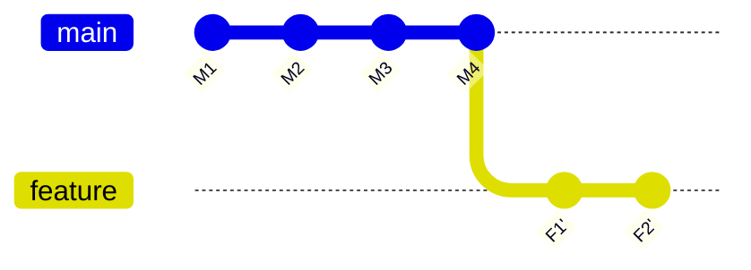

<!-- Rebase rewrites commit SHAs — the commits are new copies, not the originals. -->

---
layout: center
---


# Rebase vs Merge

Two ways to integrate changes — with very different histories

---
layout: two-cols-header
---

# Branch Lifecycle: Merge-only vs Rebase + Merge

From branch creation → daily sync → PR approved → merged

::left::

**⚠️ Merge only** — extra sync commits pile up

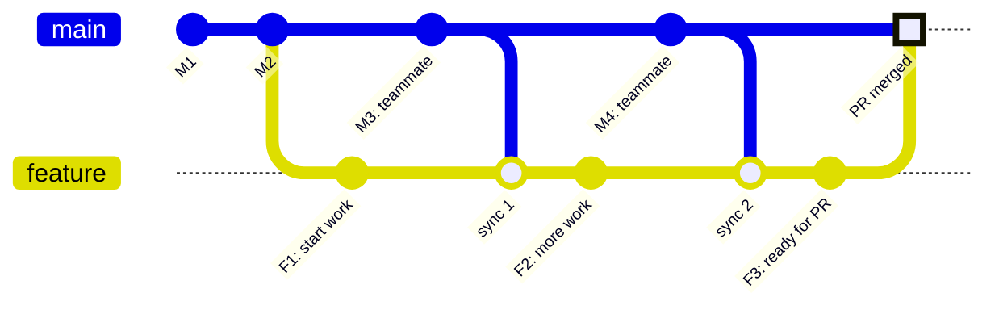

<br>

> Merging main into your branch isn't wrong, but is generally better to rebase
if you are still the only one on the branch
Some project mandate a clean branch history for PRs

::right::

**✅ Rebase during dev, merge at end** — clean history

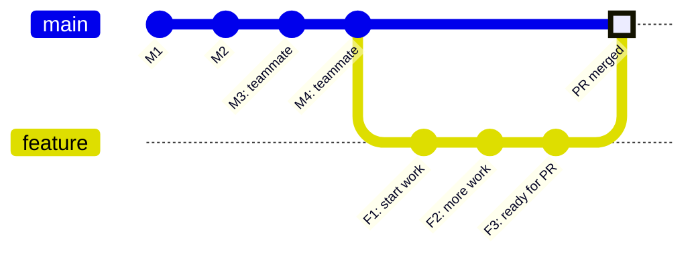

<br>

> Right diagram represents the state **after rebasing** onto the latest `main` before the PR — feature commits appear on top of M4.

<!-- The left graph has 2 extra "sync" merge commits that clutter the log. The right is what reviewers see after a clean rebase — as if you wrote all your commits against the latest main from the start. -->

---
layout: center
---

# Rebase vs Merge — Comparison

| | Merge | Rebase |
|---|---|---|
| History | Full branching history | Linear, cleaner |
| Extra commits | Adds a merge commit | No extra commits |
| Rewrites history | ❌ No | ✅ Yes |
| Safe on shared branches | ✅ Yes | ⚠️ Avoid |
| Use for | Integrating features, PRs | Updating local branch |

**Team rules of thumb:**
- ✅ **Rebase** your feature branch onto `main` before opening a PR
- ✅ **Merge** changes from `main` into your branch after the PR is up or the branch has been shared
- ❌ **Never** rebase a branch others are working from

---
layout: two-cols-header
---

# Squash Merge: Before → After

All feature commits collapsed into **one** commit on `main`

::left::

**Before**

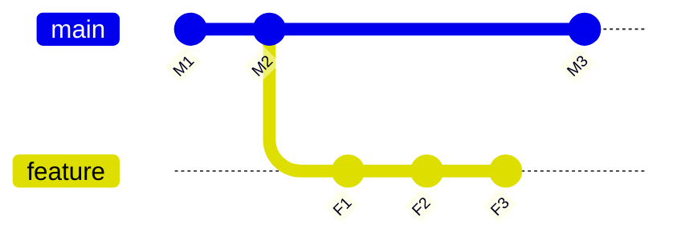

::right::

**After** `git merge --squash feature`

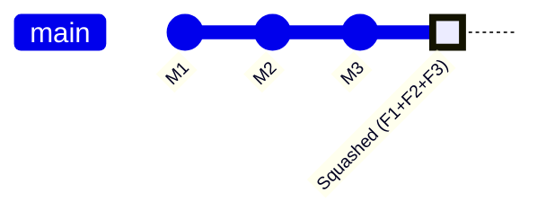

<!-- Squash merge is common in PRs — keeps main's history clean with one logical commit per feature. -->

---
layout: two-cols-header
---

# Fast-Forward Merge: Before → After

When `main` hasn't moved — Git just advances the pointer

::left::

**Before** — `main` hasn't changed since branch

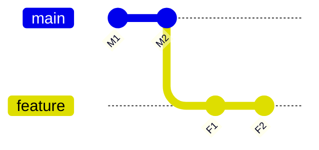

::right::

**After** `git merge feature` — pointer moves forward

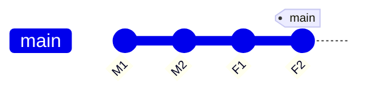

<!-- No merge commit needed — the history is already linear. -->

---
layout: two-cols-header
---

# Fixing Divergent Branches

When both local and remote have commits the other doesn't have

---
layout: two-cols-header
---

# Cherry-Pick: Before → After

Copy a **single commit** from another branch

::left::

**Before** — commit `F2` is on `feature` only

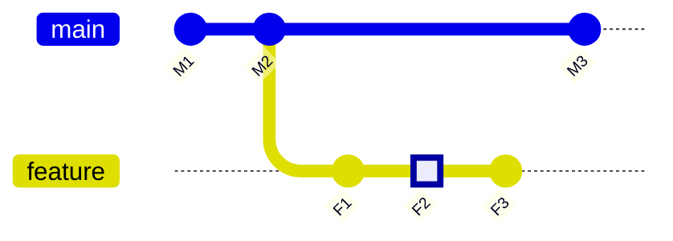

::right::

**After** `git cherry-pick F2`

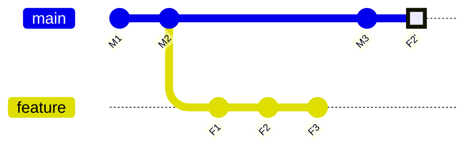

<!-- Cherry-pick copies the commit — the original stays on the feature branch. -->

---
layout: default
---

# Resolving Common Issues

**Merge conflicts** — edit the conflict markers, then:

```bash
git add <resolved-file>
git commit           # after merge
git rebase --continue  # after rebase

git merge --abort    # give up on merge
git rebase --abort   # give up on rebase
```

**Committed to the wrong branch**

```bash
git reset HEAD^      # undo last commit, keep changes staged
git switch <correct-branch>
git commit -m 'message'
```

**Safe force push** (won't overwrite others' work)

```bash
git push --force-with-lease
```

---
layout: default
---

# More Common Fixes

**Stash work in progress**

```bash
git stash          # save changes without committing
git stash pop      # restore them later
```

**Amend last commit** (message or missed file)

```bash
git add <forgotten-file>
git commit --amend
```

**Squash last 5 commits into one**

```bash
git rebase -i HEAD~6
# Change "pick" → "fixup" for commits to squash
```

---
layout: default
---

# Ways to Refer to a Commit

| Reference | Example | Meaning |
|---|---|---|
| Branch | `main` | Tip of the branch |
| Tag | `v1.0` | Named release |
| Commit ID | `3e887ab` | Exact commit |
| Remote branch | `origin/main` | Remote tip |
| Current commit | `HEAD` | Where you are now |
| N commits ago | `HEAD~3` | 3 commits back |

```bash
git diff HEAD~3        # diff against 3 commits ago
git checkout v1.0      # go to a tagged release
git reset origin/main  # reset to what's on remote
```

---
layout: end
---

# Summary

- **`git switch -c`** — create and move to a new branch
- **`git add` → `git commit` → `git push`** — the daily loop
- **Merge** `main` into your branch often to stay up to date
- **Rebase** before PRs for a clean linear history; **merge** to integrate
- **`--force-with-lease`** instead of `--force` to stay safe
- **`git stash`**, **`git reset HEAD^`**, **`git reflog`** — your escape hatches

> [git-scm.com/cheat-sheet](https://git-scm.com/cheat-sheet)
