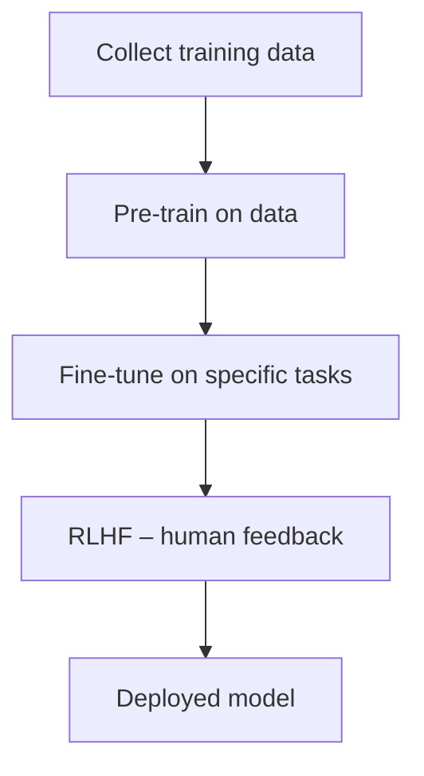

# AI & GitHub Copilot

### Using AI effectively in your workflow

---
layout: default
---

# What is AI?

**Artificial Intelligence** is software that can perform tasks that typically require human-like reasoning.

- **Rule-based systems** – follow explicit if/then logic
- **Machine Learning** – learn patterns from data
- **Deep Learning** – neural networks that model complex relationships
- **Generative AI** – produce new content (text, code, images)

> AI is not one thing — it's a broad field with many sub-disciplines

<!--
Keep this high-level. The goal is to give context, not a CS lecture.
-->

---
layout: default
---

# What are LLMs?

**Large Language Models (LLMs)** are a type of AI trained to understand and generate human language — including code.

```
Text in → Tokens → Transformer model → Predicted next tokens → Text out
```

- Built on **transformer** neural network architecture
- Trained on billions of words from the internet, books, code
- Examples: GPT-4o, Claude, Llama, Gemini

> LLMs are the engine behind GitHub Copilot

<!--
Tokens are chunks of text (~4 characters on average). The model predicts the most likely next token given everything before it.
-->

---
layout: center
---

# How are AI Models Trained?



---
layout: default
---

# How are AI Models Trained?

**Why training data matters:**

| Bad training data | Outcome |
|---|---|
| Biased or unrepresentative data | Biased or unfair outputs |
| Outdated information | Stale / incorrect answers |
| Low-quality / noisy data | Hallucinations and errors |

> **Garbage in, garbage out** — the model is only as good as its training

---
layout: default
---

# What is a Copilot?

A **Copilot** is an AI assistant that works *alongside* you — it doesn't replace you, it augments you.

| Pilot | Copilot |
|---|---|
| You make the decisions | AI suggests and assists |
| You own the outcome | AI accelerates the work |
| You set the direction | AI helps navigate |

- Keeps you in control
- Handles repetitive or boilerplate tasks
- Surfaces relevant information faster
- Still requires your judgement to review and verify

---
layout: default
---

# How to Think About Copilot in Your Workflow

Two mental models to keep in mind:

| Concept | Think of it like |
|---|---|
| **Copilot** | Your IDE |
| **Prompt engineering** | A programming language |

- Like your IDE, Copilot is a tool you get better at over time
- Like a programming language, how you communicate with it determines what you get out

---
layout: default
---

# Copilot & Productivity

AI augments your existing productivity skills — it doesn't replace them.

- **Type speed** – Still matters for editing and reviewing
- **IDE knowledge** – Knowing shortcuts and features maximises Copilot
- **CLI / tooling** – Command-line fluency pairs well with agent mode
- **Communication** – Teams/Slack skills translate to prompting skills
- **AI agent mode** – Code generation + automated review in one loop

> Copilot amplifies what you already bring to the table

---
layout: default
---

# Copilot & Knowledge

Copilot changes *where* you go for information, not whether you need it.

**Finding new information:**

| Before | With Copilot |
|---|---|
| Googling | AI Ask mode |
| Docs / Medium articles | Inline explanations |
| Udemy / Pluralsight | Chat-driven learning |

**What stays uniquely yours:**

- Previous projects and experience
- Problem-solving instincts
- Your current project context

> Copilot has broad knowledge — you have *your* knowledge

---
layout: default
---

# GitHub Copilot

**GitHub Copilot** is Microsoft & GitHub's AI coding assistant, powered by LLMs (OpenAI, Anthropic, Google models).

**What it can do:**

- Complete code as you type (inline suggestions)
- Answer questions about code and concepts
- Generate, refactor, explain, and test code
- Work across your entire workspace (agent mode)
- Integrate with tools and services via MCP

> Available in VS Code, JetBrains, Visual Studio, GitHub.com and more

---
layout: default
---

# Installing GitHub Copilot in VS Code

**Step 1 – Sign in**

Make sure your GitHub account has a Copilot licence

**Step 2 – Install the extension**

Search for `GitHub Copilot` in the Extensions panel (`Cmd+Shift+X`)

**Step 3 – Sign in to GitHub**

VS Code will prompt you to authorise with your GitHub account

**Step 4 – Confirm it's working**

You should see the Copilot icon in the status bar (bottom right)

> Also install **GitHub Copilot Chat** for the full chat experience

---
layout: default
---

# Copilot Modes – Ask

Chat with Copilot about code, concepts, and questions.

- Ask questions in natural language
- Get explanations of code
- Best for: **learning, exploring, quick answers**

---
layout: default
---

# Copilot Modes – Agent

Copilot autonomously edits files, runs commands, and iterates.

- Works across multiple files
- Can run terminal commands
- Iterates until the task is done
- Best for: **building features, scaffolding projects**

> Most powerful mode — review every change it makes

<!--
Agent mode is the most powerful but also the most token-heavy. Remind students to review every change it makes.
-->

---
layout: default
---

# Copilot Modes – Plan

*(Preview)*

Copilot describes what it *would* do before making changes.

- Review the plan before any edits happen
- Great for: **large or risky changes**

> Use **Ask** to learn, **Agent** to build, **Plan** to review first

---
layout: default
---

# Models & Use Cases

Choose the right model for the job:

| Model | Best for |
|---|---|
| **GPT-4.1 Codex** | General-purpose coding & writing |
| **Claude Haiku 4.5** | Fast help with simple or repetitive tasks |
| **Claude Sonnet 4** | Deep reasoning, debugging, complex problems |
| **Claude Opus 4.6** | Hardest reasoning problems |
| **Claude Sonnet 4** | Visuals, diagrams, screenshots |

> You can switch models mid-conversation in Copilot Chat

---
layout: default
---

# Managing Context

**The context window fills up.** When it does, older information is dropped.

**Strategies:**

- Start a **new chat** for a new topic
- Use `#file` references to include only relevant files
- Keep conversations focused — one task per chat
- Use **agent mode** sparingly for long sessions
- Summarise and restart if a chat becomes too long

> A fresh, focused chat often gets better results than a long messy one

---
layout: default
---

# Chat Features – Slash Commands `/`

**Slash commands** trigger built-in Copilot actions quickly.

| Command | What it does |
|---|---|
| `/explain` | Explains selected code |
| `/fix` | Suggests a fix for an issue |
| `/tests` | Generates unit tests |
| `/doc` | Adds documentation comments |

---
layout: default
---

# Chat Features – Slash Commands `/`

**Slash commands** trigger built-in Copilot actions quickly.

| Command | What it does |
|---|---|
| `/new` | Scaffold a new project |
| `/newNotebook` | Create a new Jupyter notebook |
| `/clear` | Clear the chat history |

**Most used:** `/explain`, `/fix`, `/tests`

Type `/` in the chat input to see all available commands

---
layout: default
---

# Chat Features – Chat Participants `@`

**Chat participants** route your question to a specialist context.

| Participant | Scope |
|---|---|
| `@workspace` | Your entire project |
| `@vscode` | VS Code settings & features |
| `@terminal` | Terminal commands & output |
| `@github` | GitHub.com issues, PRs, repos |

---
layout: default
---

# Chat Features – Chat Participants `@`

**Chat participants** route your question to a specialist context.

**When to use each:**

- `@workspace` – *"How does auth work in this project?"*
- `@vscode` – *"How do I enable format on save?"*
- `@terminal` – *"Why did this command fail?"*
- `@github` – *"Summarise PR #42"*

**Most used:** `@workspace`, `@terminal`

---
layout: default
---

# Chat Features – Chat Variables `#`

**Chat variables** attach specific context to your message.

| Variable | What it attaches |
|---|---|
| `#file` | A specific file |
| `#selection` | Your current selection |
| `#editor` | The active editor content |
| `#codebase` | Indexed workspace code |
| `#terminalLastCommand` | Last terminal command + output |

---
layout: default
---

# Chat Features – Chat Variables `#`

**Chat variables** attach specific context to your message.

**Examples:**

```
Explain #selection

Refactor #file:userService.ts to use async/await

Why did #terminalLastCommand fail?

Add tests for #file:calculator.ts
```

**Most used:** `#file`, `#selection`, `#terminalLastCommand`

> Use `#` to be precise about what Copilot should look at

---
layout: center
---

# Summary

| Feature | Purpose |
|---|---|
| **Ask mode** | Learn and explore |
| **Agent mode** | Build and automate |
| **Plan mode** | Review before changes |
| **Slash commands `/`** | Quick built-in actions |
| **Chat participants `@`** | Specialist context routing |
| **Chat variables `#`** | Attach precise context |

> The more precise your context, the better Copilot's output

---
layout: default
---

# Exercise 1 – One-Shot App Idea

Use GitHub Copilot to build a simple app in **one prompt**.

- Pick any small app idea (to-do list, calculator, quiz, etc.)
- Use **Agent mode** to generate it in one shot
- Try with **different models** and compare the results
- Play around with the apps created

> Don't iterate yet — just see what one prompt produces

---
layout: default
---

# Exercise 1 – Review

Reflect on what Copilot produced.

- Did it create what you wanted?
- Did it **over-engineer** the solution?
- What would you change about the app?
- How much did the choice of model affect the output?

---
layout: default
---

# Exercise 2 – Iterative App Improvement

Take your Exercise 1 app and **improve it through follow-up prompts**.

- Use the same app from Exercise 1
- Write follow-up prompts to make targeted changes
- Use **better/more capable models** for this
- Aim for at least 3 iterations

> Observe how the app evolves with each prompt

---
layout: default
---

# Exercise 2 – Review

Reflect on the iterative process.

- How easy was it to make changes?
- Did it **break something else** when you changed one thing?
- Did it still over-engineer?
- How did the quality of your prompts affect the outcome?

---
layout: end
---

# What's Next: Prompt Engineering

- It's quite difficult to get AI to do **exactly** what you want
- AI has to be guided **very precisely** to complete its task
- The solution? **Prompt Engineering**
