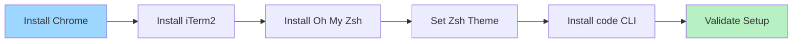

# macOS Terminal Setup
## Chrome, iTerm2, Oh My Zsh, and VS Code CLI

Prepare your machine for academy development workflows.

---

# Learning Goals

By the end, you can:

- Install Google Chrome
- Install and launch iTerm2
- Install Oh My Zsh and set a theme
- Install and verify the `code` CLI command

---

# Setup Flow



---

# Step 1: Install Google Chrome

Install Google Chrome from `Company Portal`.

Launch Chrome once to complete first-run setup.

---

# Step 2: Install iTerm2

Download iTerm2 from:

`https://iterm2.com/downloads/stable/iTerm2-3_6_11.zip`

Unzip the file and drag iTerm2 to Applications.

Open iTerm2 and set it as the default terminal if prompted.

---

# Step 3: Install Oh My Zsh

```bash
/bin/bash -c "$(curl -fsSL https://raw.githubusercontent.com/ohmyzsh/ohmyzsh/master/tools/install.sh)"
```

Restart terminal after installation.

Config file:

```bash
~/.zshrc
```

---

# Step 4: Set a Zsh Theme

```bash
code ~/.zshrc
```

Set:

```bash
ZSH_THEME="agnoster"
```

Apply:

```bash
source ~/.zshrc
```

---

# Theme Options

- `robbyrussell` (default)
- `agnoster` (powerline style)
- `avit` (compact git info)

Tip: install a Nerd Font if your theme uses icons.

---

# Step 5: Install VS Code CLI

Add VS Code CLI path to `.zshrc`:

```bash
echo 'export PATH="$PATH:/Applications/Visual Studio Code.app/Contents/Resources/app/bin"' >> ~/.zshrc
source ~/.zshrc
```

Verify:

```bash
which code
code --version
code .
```

---

# Quick Validation

```bash
echo $SHELL
grep ZSH_THEME ~/.zshrc
code --version
```

If these commands work, your setup is ready.

---

# You Are Ready

Next: open your project from iTerm2 with `code .`.
