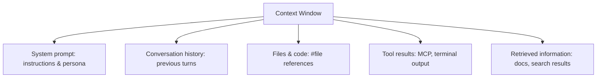
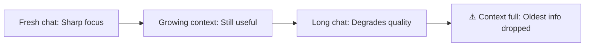
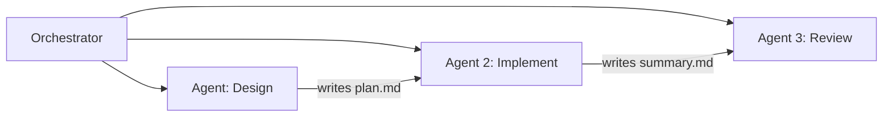
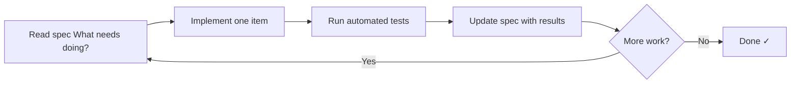

# Context Engineering

Giving AI the right information at the right time

---
layout: default
---

# What We'll Cover

- **What is context engineering?** — beyond prompt engineering
- **Why we need it** — the limitations of LLMs
- **Manual context handling** — strategic conversation management
- **Automatic context handling** — sub-agent architectures
- **The Ralph Wiggum Loop** — autonomous AI development loop
- **Exercise** — build something using these techniques

---
layout: default
---

# What is Context Engineering?

The art of providing AI models with the **right information at the right time**.

- **Context** = everything an LLM sees when generating a response
- Goes beyond prompt engineering — includes tools, files, memory, and system design
- Think of it as *curating the perfect briefing document* for your AI assistant

> The right amount of information doesn't mean *all* of the information

---
layout: default
---

# What Lives in the Context Window?

> Everything here competes for the same limited space

---
layout: default
---

# Why Do We Need It?

LLMs are powerful but have real limitations:

| Limitation | Impact |
|---|---|
| **No memory** | Each conversation starts completely fresh |
| **Knowledge cutoff** | Training data has an end date |
| **Hallucinations** | More likely without grounding context |
| **Eagerness** | LLMs love to implement things you didn't ask for |
| **Context limits** | Too much information degrades quality |

> Good context → accurate responses, fewer hallucinations, less back-and-forth

---
layout: default
---

# The Context Problem

**Too little context** → vague, generic, or wrong answers

**Too much context** → important details get buried or dropped

**Stale context** → model works from outdated information as conversation grows

> Managing context is as important as crafting the prompt itself

---
layout: default
---

# Manual Context Handling

**Conversation 1 — Plan**
- Generate an implementation plan with the model
- Review and refine it together
- **Ask the model to document the plan** for future use

**Conversation 2 — Implement**
- Point the model at the saved plan doc
- Let it execute against a focused, clean context

**Conversation 3 — Review**
- Start a fresh chat and point it at the generated code
- Ask the model to review for correctness, edge cases, and security
- Use this feedback to iterate before shipping

> Starting a new chat resets the context window — use this deliberately

---
layout: default
---

# Manual Context Handling — Tips

**When to start a new chat:**
- Moving from planning to implementation
- Starting a new feature or unrelated task
- When responses start feeling less precise or coherent

**How to hand off between chats:**
- Ask the model to summarise its work into a document
- Use `#file` references to bring key files into the new chat
- Keep instructions and requirements in committed files (not just chat)

> Treat your chat history like RAM — refresh it before it fills up

---
layout: default
---

# Automatic Context Handling

**Sub-agent architectures** break work into chunks — each agent gets a fresh context window.

- Each agent focuses on one task with a clean slate
- Agents communicate via files, not shared memory
- The orchestrator coordinates without holding all context itself
- Important to review the plan and review the output
- You must know what you want it to produce

> This is how production AI systems handle long-running tasks

---
layout: default
---

# The Ralph Wiggum Loop

An **autonomous AI agent loop** that runs until all work items are complete.

Each iteration gets a **fresh context window** — the spec file is the shared memory.

---
layout: default
---

# Why the Ralph Wiggum Loop Works

The spec file acts as **persistent memory** between context windows.

| What the AI reads | What it writes back |
|---|---|
| The spec with remaining items | Test results and outcomes |
| Existing code in the repo | Updated spec status |
| Previous summaries | Implementation notes |

**You don't need to automate it** — running this loop manually is already valuable.
- Really good place to start context engineering/struggling to get your desired output

> Define your spec clearly before starting — vague specs produce vague results

---
layout: default
---

# Putting It All Together

**The full context engineering workflow:**

1. **Define requirements** clearly in a spec file
2. **Start with a plan chat** — refine until the plan is solid
3. **Commit the plan** — now it's available to future chats via `#file`
4. **Implementation chat** — point at the plan, implement one section
5. **Update the spec** after each section — track what's done
6. **Repeat** — fresh context, clear handoffs, documented progress

> This is the difference between AI-assisted coding and AI-driven chaos

---
layout: default
---

# Exercise: Let's Build Something

**Time:** 45 minutes

Use context engineering techniques to build a small website — but **define your requirements first**.

**Guidelines:**
- Keep the scope small and achievable
- Write an implementation plan before writing any code
- Start a new chat for implementation
- Document difficulties you encounter
- Note how the model behaves — does it stay on track?

**Suggested approach:**
1. Chat 1: Requirements → Implementation plan
2. Chat 2: Plan → Working code
3. Review: Does the output match the plan?

---
layout: center
---

# Exercise: Debrief

**Time:** 15 minutes

Form groups of 3–5 and compare your findings.

**Discuss:**
- Did starting with a plan help?
- When did the model go off-track?
- How did managing context affect quality?
- What would you do differently next time?

Report back any common themes after.

---
layout: default
---

# Summary

| Concept | Key takeaway |
|---|---|
| **Context window** | Everything the model sees — manage it deliberately |
| **Manual handling** | New chats at key transitions; document handoffs |
| **Auto handling** | Sub-agents with fresh contexts per task |
| **Ralph Wiggum Loop** | Spec-driven autonomous loop with persistent state |
| **Golden rule** | Right information at the right time — not all information |

---
layout: end
---

# Questions?

**Resources:**
- [GitHub Copilot Context Tips](https://docs.github.com/en/copilot/using-github-copilot/best-practices-for-using-github-copilot#managing-context)
- [VS Code Copilot Chat Docs](https://code.visualstudio.com/docs/copilot/copilot-chat)
