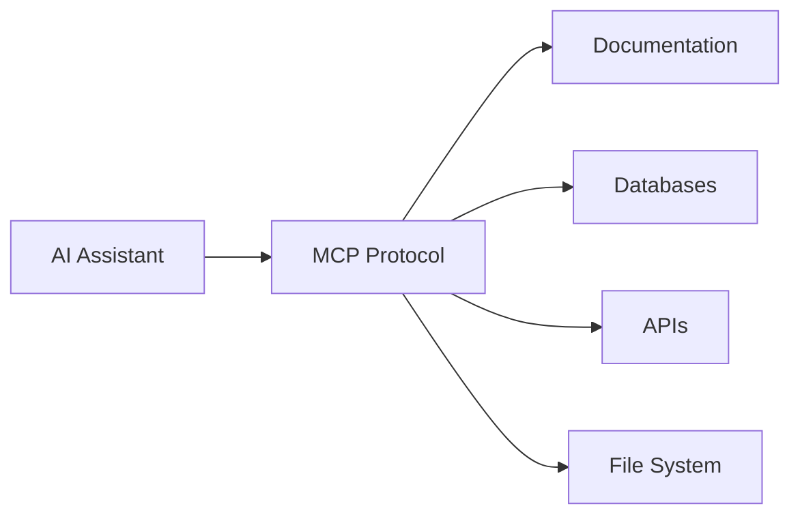
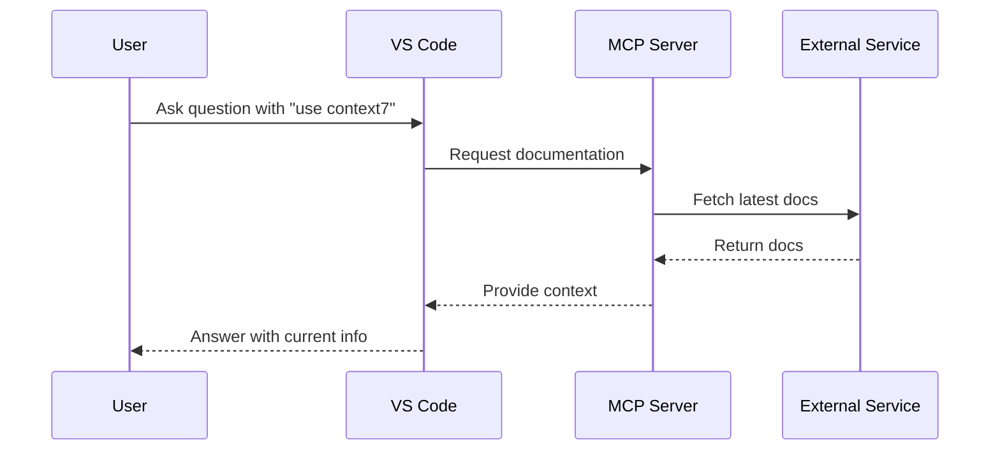
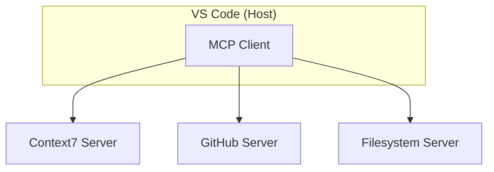

# MCP Servers

Connecting AI assistants to external tools and data sources

---
layout: default
---

# What is MCP?

**Model Context Protocol** — an open standard for AI-tool communication

- Universal interface for AI to access external capabilities
- Created by Anthropic, adopted across the industry
- Think of it as **"USB for AI"** — plug in any tool



---
layout: default
---

# Why Do We Need MCP?

**The Problem:** LLMs have a knowledge cutoff date

| Without MCP | With MCP |
|-------------|----------|
| Outdated code examples | Up-to-date documentation |
| Hallucinated APIs | Real, verified APIs |
| Answers for old versions | Version-specific guidance |
| No access to your tools | Direct integration |

---
layout: default
---

# How MCP Works



---
layout: default
---

# MCP Architecture

**Three key components:**

- **Host**: The application (VS Code, Claude Desktop)
- **Client**: Protocol handler inside the host
- **Server**: Exposes tools, resources, and prompts
  
<div class="flex justify-center">



</div>

---
layout: default
---

# Examples of Popular MCP Servers

| Server | Purpose |
|--------|---------|
| **Context7** | Up-to-date library documentation |
| **GitHub** | Issues, PRs, repository access |
| **Filesystem** | Read/write local files |
| **PostgreSQL** | Database queries |
| **Puppeteer** | Browser automation |

Browse more: [github.com/modelcontextprotocol/servers](https://github.com/modelcontextprotocol/servers)

---
layout: default
---

# What is Context7?

**Context7** fetches current documentation directly into your prompts

**Available tools:**

- `resolve-library-id` — Find the Context7 ID for a library
- `get-library-docs` — Fetch documentation for a specific library

**Supports 1000+ libraries** including React, Next.js, Express, Prisma, and more

---
layout: default
---

# Setting Up Context7 in VS Code

**Step 1:** Create `.vscode/mcp.json` in your project

```json
{
  "servers": {
    "context7": {
      "command": "npx",
      "args": ["-y", "@upstash/context7-mcp@latest"]
    }
  }
}
```

> Requires Node.js >= 18

---
layout: default
---

# Starting the MCP Server

**Step 2:** Start the server in VS Code

1. Open Command Palette (`Cmd+Shift+P`)
2. Run **"MCP: List Servers"**
3. Select **context7**
4. Click **"Start Server"**

Or click the **"Start"** code lens directly in your `mcp.json` file

---
layout: default
---

# Verifying the Setup

**Step 3:** Confirm the server is running

- Open the Chat view (`Cmd+Shift+I`)
- Click the **Tools** icon in the chat box
- You should see Context7 tools listed:
  - `context7 → resolve-library-id`
  - `context7 → get-library-docs`

---
layout: default
---

# Getting 403 Errors?

Context7 is rate-limited for anonymous users — a **403** usually means you need an API key.

| Symptom | Likely cause |
|---------|-------------|
| `403 Forbidden` in MCP output | Anonymous rate limit hit |
| Tools appear but return no results | Same — unauthenticated |
| Works once, then stops | Rate limit reached |

**Fix:** get a free API key at [context7.com/dashboard](https://context7.com/dashboard), login via your GitHub account and inject it via an env file — **do not hardcode it in `mcp.json`**.

---
layout: default
---

# API Key Setup: Using a .env File

**Step 1 — Create a gitignored secrets file**

Create `.vscode/context7.env` with your real key:
```bash
# .vscode/context7.env  ← never commit this
CONTEXT7_API_KEY=your_api_key_here
```

Add this line to your `.gitignore`:
```
# Local MCP secrets
.vscode/context7.env
```

---
layout: default
---

# API Key Setup: Using a .env File

**Step 2 — Point `mcp.json` at it using `envFile`**

```json
{
  "servers": {
    "context7": {
      "command": "npx",
      "args": ["-y", "@upstash/context7-mcp@latest"],
      "envFile": "${workspaceFolder}/.vscode/context7.env"
    }
  }
}
```

**Step 3 — Commit a safe example file for teammates**

```bash
# .vscode/context7.env.example  ← commit this
CONTEXT7_API_KEY=YOUR_CONTEXT7_API_KEY
```

> Restart the MCP server after making these changes

---
layout: default
---

# Using Context7 — Basic Usage

**Add `use context7` to your prompt:**

```
How do I set up authentication in an Express API?
Use context7 to fetch the relevant docs for the version I'm using.
```

**Or specify a library directly:**

```
Show me how I would create a Prisma schema for my database.
Use library /prisma/prisma
```

---
layout: default
---

# Pro Tip: Auto-Invoke Context7

**Add a rule so you don't need to type "use context7" every time**

Create `.github/copilot-instructions.md`:

```markdown
Always use Context7 MCP when a request involves a library that the project uses.
```

---
layout: default
---

# Hands-On: Try It!

**Step 1:** Set up Context7

1. Create `.vscode/mcp.json` with the configuration shown
2. Start the MCP server
3. Verify tools appear in Chat view

**Step 2:** Ask a documentation question

```
How do I create an Express router in my TypeScript project? use context7
```

**More examples to try:**

```
What's new in React 19? use context7
```

```
How do I set up Vitest with TypeScript in a Node project? use context7
```

---
layout: default
---

# Security Considerations

⚠️ **MCP servers can run arbitrary code on your machine**

**Best practices:**

- Only install servers from **trusted sources**
- Review server configuration before starting
- VS Code prompts for **trust confirmation** on first start
- Check **server output logs** if something seems wrong

```
MCP: List Servers → Select server → Show Output
```

---
layout: default
---

# Security: What Servers Can Access

| Capability | Risk Level | Example |
|------------|------------|---------|
| Read files | Medium | Filesystem server |
| Write files | High | Could modify code |
| Network requests | Medium | API calls |
| Execute commands | **VERY HIGH** | Shell access |

**Always review what permissions a server needs before starting it.**

---
layout: default
---

# When NOT to Use MCP

❌ **Don't use MCP when:**

- Working with **proprietary / internal / confidential** client documentation
- Working in **air-gapped** environments
- **Without express approval** from your project

✅ **Use MCP when:**

- You need **current** library documentation
- Working with **rapidly changing** APIs or frameworks
- **You have permission** from your project

---
layout: default
---

# Troubleshooting

**Server won't start?**

1. Check Node.js version: `node --version` (need >= 18)
2. View server output: `MCP: List Servers` → `Show Output`
3. Reset and retry: `MCP: Reset Cached Tools`

**Tools not appearing?**

- Ensure server status shows "Running"
- Try restarting VS Code
- Check `mcp.json` syntax

---
layout: default
---

# Summary

✅ MCP provides a **standard protocol** for AI-tool integration

✅ Context7 gives AI access to **up-to-date documentation**

✅ Setup is simple: **one JSON file** + start server

✅ Always consider **security** when adding MCP servers

---
layout: end
---

# Questions?

**Resources:**

- [modelcontextprotocol.io](https://modelcontextprotocol.io) — MCP Documentation
- [context7.com](https://context7.com) — Context7 Website
- [VS Code MCP Docs](https://code.visualstudio.com/docs/copilot/chat/mcp-servers)
