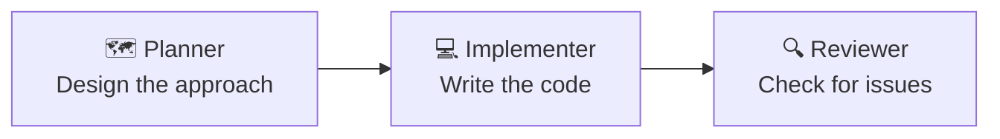

# Using and Creating Agents

Building Custom AI Assistants with GitHub Copilot

---
layout: default
---

# What We'll Cover

- **Agentic AI vs Custom Agents** — clarifying the terms
- **Why use custom agents** — productivity benefits
- **Instruction file types** — the Copilot ecosystem
- **Custom agent file structure** — header + body
- **Header fields** — tools, model, handoffs
- **Writing the body** — effective instructions
- **Best practices** — what works and what doesn't
- **Handoffs** — chaining agents together
- **Examples** — real agent files
- **Exercise** — create your first agent

---
layout: default
---

# Agentic AI vs Custom Agents

| Term | Meaning |
|------|---------|
| **Agentic AI** | AI that acts autonomously — perceiving, deciding, and executing without constant human guidance |
| **AI Agent** | A specific implementation of agentic AI for a task — it observes, reasons, plans, and executes |
| **Custom Agent** | A config file (`.agent.md`) that shapes an AI agent's behaviour, tools, and persona for your workflows |

Agentic AI is the **capability** — agents are **configured instances** of that capability.

---
layout: default
---

# Why Use Custom Agents?

- **Task-specific tools** — limit which tools are available (read-only for planning, full access for implementation)
- **Consistent behaviour** — same instructions every time, no need to repeat yourself
- **Workflow handoffs** — chain agents together (Plan → Implement → Review)
- **Team sharing** — commit to the repo so everyone uses the same configurations
- **Faster context** — AI understands your project conventions immediately

> Custom agents encode your team's workflow into a reusable file

---
layout: default
---

# The Copilot Instruction Ecosystem

```
.github/
├── copilot-instructions.md      # Repository-wide instructions (all interactions)
├── instructions/
│   └── *.instructions.md        # Path-scoped instructions (e.g., all *.ts files)
└── agents/
    └── *.agent.md               # Custom agents (switchable personas)
```

| File Type | Scope |
|-----------|-------|
| `copilot-instructions.md` | Applied to **all** Copilot interactions in the repo |
| `*.instructions.md` | Applied to file patterns (e.g., `**/*.ts`) |
| `*.agent.md` | Switchable personas with their own tools, model, and instructions |

---
layout: default
---

# Custom Agent File Structure

```markdown
---
name: Planner
description: Generate implementation plans without writing code
tools: ['search', 'fetch', 'githubRepo']
model: Claude Sonnet 4
handoffs:
  - label: Start Implementation
    agent: implementation
    prompt: Implement the plan above.
---

# Planning Instructions

You are in planning mode. Generate a detailed
implementation plan. Do NOT make code edits.
```

The `---` block is YAML **frontmatter** (header). Everything after is the **body**.

---
layout: default
---

# Header Fields

| Field | Description |
|-------|-------------|
| `name` | Display name shown in the chat UI |
| `description` | Placeholder text shown when agent is selected |
| `tools` | List of tools available to this agent |
| `model` | AI model to use (e.g., `Claude Sonnet 4`) |
| `handoffs` | Suggested next agents to switch to |
| `argument-hint` | Hint text guiding what the user should type |

---
layout: default
---

# Available Tools

Common built-in tools you can include:

| Tool | What it does |
|------|-------------|
| `search` | Search files in the workspace |
| `fetch` | Fetch web content |
| `githubRepo` | Search GitHub repositories |
| `usages` | Find code usages and references |
| `terminalLastCommand` | Read last terminal output |
| `<mcp-server>/*` | All tools from an MCP server |

**Tip:** Restrict tools for safety. A "Planner" agent shouldn't edit files!

---
layout: default
---

# Writing the Body

The body is Markdown that guides the AI's behaviour:

```markdown
# Code Review Instructions

You are a security-focused code reviewer.

## Your responsibilities:
- Check for SQL injection vulnerabilities
- Verify all inputs are validated
- Flag hardcoded secrets or credentials
- Suggest improvements — do NOT implement them

## Output format:
Provide findings as a numbered list with severity labels.
Save your report to a file called `review.md`.
```

> Refer back to prompt engineering principles — the same rules apply here

---
layout: default
---

# Best Practices for Agent Instructions

1. **Be specific** — *"Check for SQL injection"* > *"Review security"*
2. **Define boundaries** — explicitly state what the agent should NOT do
3. **Set output format** — tables, numbered lists, specific file names
4. **Include examples** — show what good output looks like
5. **Keep it concise** — instructions are prepended to every prompt
6. **Reference other files** — use Markdown links to reuse instructions
7. **Use descriptive names** — `api-designer` not `agent1`

---
layout: default
---

# Handoffs: Chaining Agents

Create guided workflows between agents:

```yaml
handoffs:
  - label: Start Implementation
    agent: implementation
    prompt: Implement the plan outlined above.
    send: false  # User must click to proceed
```

**Example workflow:**



---
layout: default
---

# Example: Solution Architect Agent

```markdown
---
name: Solution Architect
description: Design technical solutions and architecture
tools: ['search', 'fetch', 'githubRepo', 'usages']
model: Claude Sonnet 4
handoffs:
  - label: Create Implementation Plan
    agent: planner
---

# Solution Architect Instructions

You are a senior solution architect. Your role is to:
- Analyse requirements and propose technical designs
- Consider scalability, security, and maintainability
- Reference existing patterns in the codebase
- Document trade-offs between approaches

Do NOT implement code. Focus on design decisions.
```

---
layout: default
---

# Example: Security Reviewer Agent

```markdown
---
name: Security Reviewer
description: Review code for security vulnerabilities
tools: ['search', 'usages']
model: Claude Sonnet 4
---

# Security Review Instructions

You are a security-focused code reviewer.

For every file reviewed, check for:
- SQL injection and injection attacks
- Hardcoded secrets or credentials
- Missing input validation
- Broken access control issues

Output findings as a severity-labelled list in `security-review.md`.
Do NOT modify any code.
```

---
layout: default
---

# Creating Your First Agent

**In VS Code:**

1. `Cmd+Shift+P` → **"Chat: New Custom Agent"**
2. Choose location:
   - **Workspace** (`.github/agents/`) — shared with your team
   - **User profile** — personal, works in all projects
3. Name your agent (e.g., `security-reviewer.agent.md`)
4. Fill in the header fields and write the body instructions

---
layout: default
---

# Exercise

**Create an agent that reviews your codebase and suggests improvements.**

Your agent should:

1. Search the codebase for code quality issues
2. Check for obvious bugs or antipatterns
3. Output a prioritised list of suggestions to `review.md`
4. **Not** make any code changes itself

**Stretch goal:** Add a handoff to an `implementer` agent that picks up the suggestions and makes the fixes.

---
layout: default
---

# Quick Tips

- Start simple — add complexity as needed
- Test your agent — does it behave as expected?
- Iterate on instructions — refine based on outputs
- Don't overload with tools — less is more
- Don't write essays — keep instructions scannable
- Think of it like writing a job description

---
layout: default
---

# Summary

| Concept | Key Takeaway |
|---------|--------------|
| Custom agents | Configure Copilot for a specific task or persona |
| File location | `.github/agents/*.agent.md` |
| Header | YAML frontmatter — tools, model, handoffs |
| Body | Markdown instructions for the AI |
| Best practice | Be specific, set boundaries, keep concise |
| Handoffs | Chain agents together for guided workflows |

---
layout: end
---

# Questions?

**Resources:**

- [VS Code Custom Agents Docs](https://code.visualstudio.com/docs/copilot/customization/custom-agents)
- [GitHub Custom Instructions Docs](https://docs.github.com/en/copilot/customizing-copilot/adding-repository-custom-instructions-for-github-copilot)
- [Awesome Copilot Examples](https://github.com/github/awesome-copilot)
