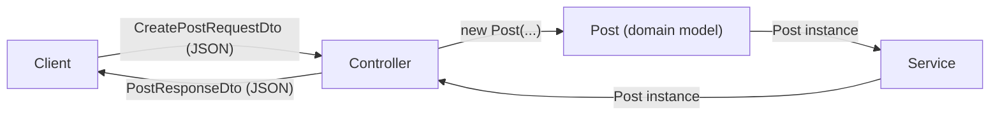

# OOP, Models & DTOs

**Encapsulation, domain models, and typed API responses**

---

## Agenda

1. **OOP & Encapsulation** — why `any` is dangerous, and how classes fix it
2. **Models (MVC)** — interfaces vs classes, domain models vs DTOs
3. **Putting it Together** — typed service, DTO response, updated controller

---
layout: center
---

# Part 1
# OOP & Encapsulation

---

## Where We Left Off

In Part 3, to keep things simple, the service used `any` for its data:

```typescript
// src/services/postService.ts
const mockPosts: any[] = [
  { id: 1, title: "Getting Started", content: "TypeScript basics...", author: "Alice" },
];

export class PostService {
  async findById(id: number): Promise<any> {
    return mockPosts.find(p => p.id === id);
  }
}
```

This works — but it throws away all the benefits of TypeScript.

---

## Why `any` is Bad Practice

```typescript
// TypeScript has no idea what shape this data is
async getById(req: Request, res: Response): Promise<void> {
  const post: any = await this.service.findById(Number(req.params.id));

  console.log(post.tile);    // ❌ typo — no error, undefined at runtime
  console.log(post.Author);  // ❌ wrong case — silently undefined
  res.json(post);             // ❌ could expose any field, including sensitive ones
}
```

Using `any`:
- **Disables type checking** — TypeScript can't catch typos or wrong field names
- **Hides intent** — readers can't tell what shape the data has
- **No IDE help** — no autocomplete, no refactoring support

> `any` is an escape hatch — not a solution.

---

## The Fix Starts with a Shape

The first step is giving your data a **known shape** using an interface:

```typescript
// src/models/post.ts
export interface Post {
  id: number;
  title: string;
  content: string;
  author: string;
}
```

Now TypeScript can **catch typos** at compile time, **provide autocomplete**, and **document intent** — any reader knows exactly what a `Post` looks like.

But interfaces alone can still describe **invalid states** — nothing stops `id: -1` or `title: ""`. That's where classes come in.

---

## Classes vs Interfaces

| | Interface | Class |
|---|---|---|
| **Purpose** | Describe a shape | Implement behaviour |
| **Can have methods** | ✅ (signatures only) | ✅ (with implementation) |
| **Can enforce rules** | ❌ | ✅ |
| **Compiled to JS** | ❌ (erased) | ✅ |
| **Can be `new`-ed** | ❌ | ✅ |

> Use interfaces for **contracts**. Use classes when you need **behaviour and rules**.

---

## What is Encapsulation?

**Encapsulation** — bundle data and the operations on that data together, and **hide internal implementation** from the outside world.

Two key ideas:
- **Data hiding** — only expose what consumers need
- **Controlled access** — use methods to validate changes

> It's the principle behind `private` fields and getters/setters.

---

## Without Encapsulation

An interface is better than `any` — but it still can't enforce rules:

```typescript
// TypeScript is happy; your data is not
const post: Post = { id: -99, title: "", content: "", author: "Alice" };

post.id = -99;   // ❌ Invalid ID — interface allows it
post.title = ""; // ❌ Empty title — interface allows it

// The object exists, but it's in a meaningless state
```

> Interfaces describe **what fields exist** — not **what values are valid**.

---

## With Encapsulation

Using `public readonly` fields keeps the syntax concise while still enforcing rules in the constructor:

```typescript
export class Post {
  constructor(
    public readonly id: number,
    public readonly title: string,
    public readonly author: string,
  ) {
    if (id <= 0) throw new Error("ID must be positive");
    if (!title.trim()) throw new Error("Title cannot be empty");
  }
}
```

`readonly` prevents reassignment after construction — fields can't be changed from outside.

> In larger codebases you may see `private` fields with getters — that gives finer control, but `public readonly` is simpler and idiomatic TypeScript.

---

## Encapsulation & SOLID

Adding encapsulation keeps every other SOLID principle healthier:

| SOLID Principle | How encapsulation helps |
|---|---|
| **Single Responsibility** | Validation lives in the model, not scattered across controllers |
| **Open/Closed** | Add new rules to the constructor without touching callers |
| **Liskov Substitution** | Subclasses can't violate invariants hidden behind private fields |
| **Dependency Inversion** | Consumers depend on the interface, not the internal fields |

---
layout: center
---

# Part 2
# Models (MVC)

---

## What is a Model?

In your MVC stack so far:

| Layer | What it does |
|---|---|
| **Route** | Maps URL + HTTP method to a controller |
| **Controller** | Handles HTTP, validates input, calls service |
| **Service** | Fetches and persists data |
| **Model** | Defines the shape and rules of your data |

The Model is the **single source of truth** for what your data looks like.

---

## Two Types of Model

| | Domain Model | DTO (Data Transfer Object) |
|---|---|---|
| **Lives in** | `models/` | `dtos/` |
| **Purpose** | Represents the real-world entity | Represents data sent over HTTP |
| **Contains** | Business rules, methods | Only raw data fields |
| **Exposed to** | Services only | Controllers and clients |

> Your API response should **never** expose the domain model directly.

---

## Why Separate Them?

Your internal `Post` model might have fields clients should never see:

```typescript
// Domain Model — internal representation
export class Post {
  id: number;
  title: string;
  content: string;
  author: string;
  passwordHash: string;  // ❌ never send this to a client
  internalNotes: string; // ❌ internal use only
  createdAt: Date;
  updatedAt: Date;
}
```

Sending the full domain model leaks sensitive data and couples your API to your internals.

---

## The DTO — What the Client Sees

```typescript
// src/dtos/postDto.ts
export interface PostResponseDto {
  id: number;
  title: string;
  author: string;
}

export interface CreatePostRequestDto {
  title: string;
  content: string;
  author: string;
}
```

> DTOs are plain data shapes — no methods, no private fields, no logic.

---

## Domain Model as a Class

```typescript
// src/models/post.ts
export class Post {
  constructor(
    public readonly id: number,
    public readonly title: string,
    public readonly content: string,
    public readonly author: string,
    public readonly createdAt: Date = new Date(),
  ) {
    if (!title.trim()) throw new Error("Title cannot be empty");
    if (!author.trim()) throw new Error("Author cannot be empty");
  }
}
```

The constructor **enforces invariants** — objects are always valid.

---

## Models & SOLID

| SOLID Principle | How models apply it |
|---|---|
| **Single Responsibility** | Domain model owns its own validation rules |
| **Open/Closed** | Add optional fields without breaking existing code |
| **Liskov Substitution** | A `Post` can always be used where a `Post` is expected |
| **Interface Segregation** | `PostResponseDto` only exposes fields the client needs |
| **Dependency Inversion** | Controller depends on `PostResponseDto`, not the class internals |

---
layout: center
---

# Part 3
# Putting it Together

---

## Step 1 — Typed Service

Replace `any[]` in the service with your domain model class:

```typescript
// src/services/postService.ts
import { Post } from "../models/post";

const mockPosts: Post[] = [
  new Post(1, "Getting Started", "TypeScript basics...", "Alice"),
  new Post(2, "Advanced Patterns", "Generics explained...", "Bob"),
];

export class PostService {
  async findById(id: number): Promise<Post | undefined> {
    return mockPosts.find(p => p.id === id);
  }

  async findAll(): Promise<Post[]> {
    return mockPosts;
  }
}
```

The service now returns **guaranteed-valid** `Post` objects — invalid data can't be stored.

---

## Step 2 — Controller Returns a DTO

The controller receives a `Post` from the service and builds a `PostResponseDto` to send:

```typescript
import { Request, Response } from "express";
import { PostResponseDto } from "../dtos/postDto";
import { PostService } from "../services/postService";

export class PostController {
  constructor(private service: PostService = new PostService()) {}

  async getById(req: Request, res: Response): Promise<void> {
    const post = await this.service.findById(Number(req.params.id));
    if (!post) {
      res.status(404).json({ error: "Post not found" });
      return;
    }
    const dto: PostResponseDto = { id: post.id, title: post.title, author: post.author };
    res.status(200).json(dto);
  }
}
```

Only the fields declared in `PostResponseDto` are sent — sensitive fields are never exposed.

---

## Step 3 — Creating from a Request DTO

Use `CreatePostRequestDto` to type incoming request bodies, then construct a `Post`:

```typescript
async create(req: Request, res: Response): Promise<void> {
  const body: CreatePostRequestDto = req.body;

  // Post constructor validates — throws if title or author is empty
  const post = new Post(Date.now(), body.title, body.content, body.author); // temporary ID — real ID comes from the database

  // In a real app, save to database here
  const dto: PostResponseDto = { id: post.id, title: post.title, author: post.author };
  res.status(201).json(dto);
}
```

Invalid data is **rejected at construction** — it never reaches the service or database.

---

## Why This Follows SOLID

The create flow from the previous slide:

- **Single Responsibility** — `Post` validates, `PostService` stores, controller handles HTTP
- **Open/Closed** — add new fields to `Post` or `PostResponseDto` without touching other layers
- **Interface Segregation** — `CreatePostRequestDto` only carries fields the client should provide
- **Dependency Inversion** — controller depends on the DTO interface, not the internal `Post` class directly

---

## Your Updated File Structure

```
src/
  index.ts                    ← entry point
  controllers/
    postController.ts         ← HTTP handling, builds DTOs, calls service
  routes/
    postRouter.ts             ← thin routes
  services/
    postService.ts            ← data access, works with Post instances
  models/
    post.ts                   ← domain model class with validation
  dtos/
    postDto.ts                ← PostResponseDto, CreatePostRequestDto
dist/                         ← compiled output (git-ignored)
```

---

## How the Layers Flow



> The domain model **never leaves the backend** — the controller extracts only what the DTO declares.

---

## Summary

- **`any`** — disables type checking; avoid it as soon as you know the shape of your data
- **Interfaces** — give data a known shape; use them for DTOs and contracts
- **Classes** — add validation and encapsulation; use them for domain models
- **Domain Models** — represent real entities with rules enforced in the constructor
- **DTOs** — control exactly what enters and leaves your API
- Together: invalid data is rejected early, sensitive fields never leak, every layer has one clear job

> **Scaling up?** In larger projects with many DTOs, extract the mapping into a helper function (e.g. `toPostResponseDto(post)`) to keep controllers clean.

---
layout: center
---

# Now it's your turn

**Exercise 4** — Refactor your expense API:

1. Convert `Expense` from `any` to a typed interface, then to a class with constructor validation
2. Create `ExpenseResponseDto` and `CreateExpenseRequestDto`
3. Update `ExpenseService` to store and return `Expense` class instances
4. Update `ExpenseController` to build an `ExpenseResponseDto` before sending the response
