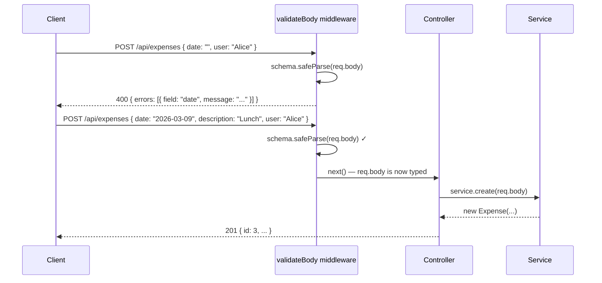

# API Validation with Zod

**Guarding the boundary between your API and the outside world**

---

## Agenda

1. **The Problem** — why constructor validation isn't enough
2. **Zod** — schema-based validation for TypeScript
3. **Validation Middleware** — a reusable pattern for Express

---
layout: center
---

# Part 1
# The Problem

---

## Why Validate HTTP Input?

`req.body` is parsed from JSON — it arrives as `any` with no TypeScript guarantees.

```typescript
// req.body could be anything at runtime:
{ date: "", user: 42, extraField: "<script>..." }
```

- **Fail early** — catch bad input at the boundary before it reaches the service or model
- **Meaningful errors** — return `400 Bad Request` with field-level detail, not a `500`
- **Type safety** — once validated, the data can be trusted as the correct shape

> Our `Expense` constructor guards internal state, but it can't return a useful HTTP error to the client.

---

## The Naive Approach — and Why We Do Better

You could write validation inline in each controller method:

```typescript
async create(req: Request, res: Response): Promise<void> {
  const { date, description, user } = req.body;
  if (!date || !description || !user) {
    res.status(400).json({ error: "fields missing" });
    return;
  }
  // repeated in update, and every other route...
}
```

The obvious fix is to extract this into a **reusable middleware** — but you still write and maintain the rules by hand for every field.

**Zod does this better** — define the rules once as a schema, get validation *and* TypeScript types for free.

---
layout: center
---

# Part 2
# Schema Validation with Zod

---

## What is Zod?

Zod is a **TypeScript-first schema declaration and validation library**.

You define the shape and rules of your data once — Zod validates at runtime *and* infers the TypeScript type automatically.

```bash
npm install zod
```

> No separate type definitions needed — Zod ships with its own types.

---

## Defining a Schema

```typescript
import { z } from "zod";

const CreateExpenseSchema = z.object({
  date: z.string().min(1, "Date cannot be empty"),
  description: z.string().min(1, "Description cannot be empty"),
  user: z.string().min(1, "User cannot be empty"),
});
```

The schema is the **single source of truth** for both validation rules and the TypeScript type.

---

## Inferring Types from Schemas

```typescript
import { z } from "zod";

const CreateExpenseSchema = z.object({
  date: z.string().min(1, "Date cannot be empty"),
  description: z.string().min(1, "Description cannot be empty"),
  user: z.string().min(1, "User cannot be empty"),
});

// Derive the TypeScript type — no duplication
type CreateExpenseRequestDto = z.infer<typeof CreateExpenseSchema>;
//   ^ { date: string; description: string; user: string }
```

Your DTO from Part 4 and your schema stay **in sync automatically** — change one, the other follows.

---

## `parse` vs `safeParse`

| | `parse` | `safeParse` |
|---|---|---|
| **On success** | Returns typed data | `{ success: true, data }` |
| **On failure** | **Throws** a `ZodError` | `{ success: false, error }` |
| **Best for** | Trusted internal data | HTTP request validation |

```typescript
// parse — throws on invalid input
const data = CreateExpenseSchema.parse(req.body); // ❌ throws if invalid

// safeParse — never throws, always returns a result
const result = CreateExpenseSchema.safeParse(req.body);
if (!result.success) {
  // result.error contains structured field-level errors
}
```

> Always use `safeParse` at API boundaries — you control the response, not Zod.

---

## Reading Zod Errors

```typescript
const result = CreateExpenseSchema.safeParse({ date: "", user: "Alice" });

if (!result.success) {
  console.log(result.error.issues);
  // [
  //   { path: ["date"],        message: "Date cannot be empty" },
  //   { path: ["description"], message: "Required" }
  // ]
}
```

Each issue has:
- `path` — the field(s) that failed
- `message` — the rule's error message

---

## Formatting Errors for the Client

```typescript
function formatZodErrors(error: z.ZodError) {
  return error.issues.map((issue) => ({
    field: issue.path.join("."),
    message: issue.message,
  }));
}

// Result:
// [
//   { field: "date",        message: "Date cannot be empty" },
//   { field: "description", message: "Required" }
// ]
```

Consistent, field-level errors that clients can display directly.

---

## Zod Common Validators

```typescript
z.string()                      // must be a string
  .min(1, "Cannot be empty")    // at least 1 character
  .max(200, "Too long")         // at most 200 characters
  .email("Invalid email")       // must be a valid email

z.number()
  .int("Must be a whole number")
  .positive("Must be > 0")
  .max(1_000_000)

z.enum(["admin", "user", "guest"])   // one of a fixed set
z.boolean()
z.date()
z.array(z.string()).min(1)           // non-empty array of strings
z.optional(z.string())               // string or undefined
```

---
layout: center
---

# Part 3
# Validation Middleware

---

## Why Middleware?

Validation is **not** the controller's responsibility:

| Layer | Responsibility |
|---|---|
| **Middleware** | Parse and validate request data |
| **Controller** | Handle HTTP, call service, return response |
| **Service** | Business logic and data access |

If validation belongs in the controller, every controller method validates — the same pattern duplicated across every route.

---

## A Reusable Validation Middleware

```typescript
// src/middleware/validate.ts
import { RequestHandler } from "express";
import { z, ZodSchema } from "zod";

export function validateBody(schema: ZodSchema): RequestHandler {
  return (req, res, next) => {
    const result = schema.safeParse(req.body);
    if (!result.success) {
      res.status(400).json({
        errors: result.error.issues.map((issue) => ({
          field: issue.path.join("."),
          message: issue.message,
        })),
      });
      return;
    }
    req.body = result.data; // replace body with validated, typed data
    next();
  };
}
```

Pass it a schema, get back a middleware function — **works with any route**.

---

## Validation Middleware Flow



---

## Define the Schema Alongside the DTO

```typescript
// src/dtos/expenseDto.ts
import { z } from "zod";

export const CreateExpenseSchema = z.object({
  date: z.string().min(1, "Date cannot be empty"),
  description: z.string().min(1, "Description cannot be empty"),
  user: z.string().min(1, "User cannot be empty"),
});

// Infer the DTO type from the schema — no duplication
export type CreateExpenseRequestDto = z.infer<typeof CreateExpenseSchema>;

export interface ExpenseResponseDto {
  id: number;
  date: string;
  description: string;
  user: string;
}
```

Schema and type live together — one change keeps both in sync.

---

## Keep Your Router Thin

```typescript
// src/routes/expenseRouter.ts
import { Router } from "express";
import { ExpenseController } from "../controllers/expenseController";

const router = Router();
const controller = new ExpenseController();

router.get("/",       (req, res) => controller.getAll(req, res));
router.get("/:id",    (req, res) => controller.getById(req, res));
router.post("/",      (req, res) => controller.create(req, res));
router.put("/:id",    (req, res) => controller.update(req, res));
router.delete("/:id", (req, res) => controller.delete(req, res));

export default router;
```

The router stays exactly as it was — validation moves **into the controller**.

---

## A Better Pattern — Validate in the Router

Calling `safeParse` inside each controller method works, but it violates **Single Responsibility** — the controller is now validating *and* handling HTTP.

A cleaner approach: pass `validateBody` as a middleware argument in the router, *before* the handler. Use `.bind(controller)` to preserve `this` context:

```typescript
import { validateBody, validateParams } from "../middleware/validate";
import { CreateExpenseSchema, IdParamSchema } from "../dtos/expenseDto";

router.get("/",    (req, res) => controller.getAll(req, res));
router.get("/:id", validateParams(IdParamSchema),    controller.getById.bind(controller));
router.post("/",   validateBody(CreateExpenseSchema), controller.create.bind(controller));
router.put("/:id", validateParams(IdParamSchema),
                   validateBody(CreateExpenseSchema), controller.update.bind(controller));
router.delete("/:id", validateParams(IdParamSchema), controller.delete.bind(controller));
```

| Approach | Validation lives in | Controller responsibility |
|---|---|---|
| `safeParse` in controller | Controller | Validate + handle HTTP |
| Middleware in router | Router/middleware | Handle HTTP only |

> The middleware approach keeps controllers focused and makes validation **reusable across any route**.

---

## Validate Inside the Controller

```typescript
async create(req: Request, res: Response): Promise<void> {
  const result = CreateExpenseSchema.safeParse(req.body);
  if (!result.success) {
    res.status(400).json({
      errors: result.error.issues.map((issue) => ({
        field: issue.path.join("."),
        message: issue.message,
      })),
    });
    return;
  }
  const dto: CreateExpenseRequestDto = result.data; // typed and validated

  const expense = await this.service.create(dto);
  const responseDto: ExpenseResponseDto = {
    id: expense.id,
    date: expense.date,
    description: expense.description,
    user: expense.user,
  };
  res.status(201).json(responseDto);
}
```

Call `safeParse` at the top of the method — return `400` on failure, use `result.data` on success.

---

## Validating Route Parameters

`req.params` values are always strings — we need to coerce and validate them:

```typescript
// src/middleware/validate.ts — add a params validator
export function validateParams(schema: ZodSchema): RequestHandler {
  return (req, res, next) => {
    const result = schema.safeParse(req.params);
    if (!result.success) {
      res.status(400).json({
        errors: result.error.issues.map((issue) => ({
          field: issue.path.join("."),
          message: issue.message,
        })),
      });
      return;
    }
    next();
  };
}

// Schema for routes with :id
export const IdParamSchema = z.object({
  id: z.coerce.number().int().positive("ID must be a positive integer"),
});
```

---

## Validate Route Parameters in the Controller

```typescript
async getById(req: Request, res: Response): Promise<void> {
  const result = IdParamSchema.safeParse(req.params);
  if (!result.success) {
    res.status(400).json({
      errors: result.error.issues.map((issue) => ({
        field: issue.path.join("."),
        message: issue.message,
      })),
    });
    return;
  }
  const { id } = result.data; // id is a number, not a string

  const expense = await this.service.findById(id);
  if (!expense) {
    res.status(404).json({ error: "Expense not found" });
    return;
  }
  res.status(200).json({ id: expense.id, date: expense.date,
    description: expense.description, user: expense.user });
}
```

`z.coerce.number()` converts the string `"1"` from `req.params.id` to the number `1` — and rejects anything that isn't a valid integer.

---

## Validation & SOLID

| SOLID Principle | How validation middleware applies it |
|---|---|
| **Single Responsibility** | Middleware validates; controllers handle HTTP; services store data |
| **Open/Closed** | Add new schemas without modifying existing middleware or controllers |
| **Liskov Substitution** | Any route can accept `validateBody` — same contract every time |
| **Interface Segregation** | Each schema only defines the fields *that route* needs |
| **Dependency Inversion** | Controllers depend on validated DTOs, not on raw `req.body` |

---

## Summary

| Concept | What it gives you |
|---|---|
| **Zod schema** | Runtime validation + TypeScript type in one definition |
| **`safeParse`** | Structured errors without throwing, safe at API boundaries |
| **`validateBody` middleware** | Reusable validation before every route handler |
| **`validateParams` middleware** | Type-safe route parameters, no manual `isNaN` checks |
| **Schema-derived DTOs** | DTO type always in sync with validation rules |

> Validate at the boundary. Trust inside.

---
layout: center
---

# Up Next

**Exercise 5 — Add Validation to Your Expenses API**

Install Zod, define schemas for your request bodies and route parameters, create a reusable validation middleware, and wire it into your router.
