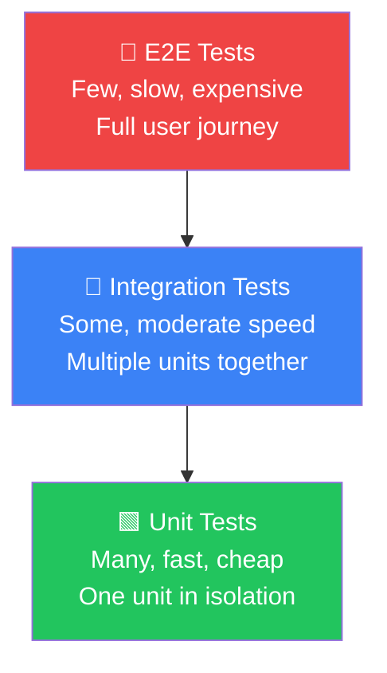
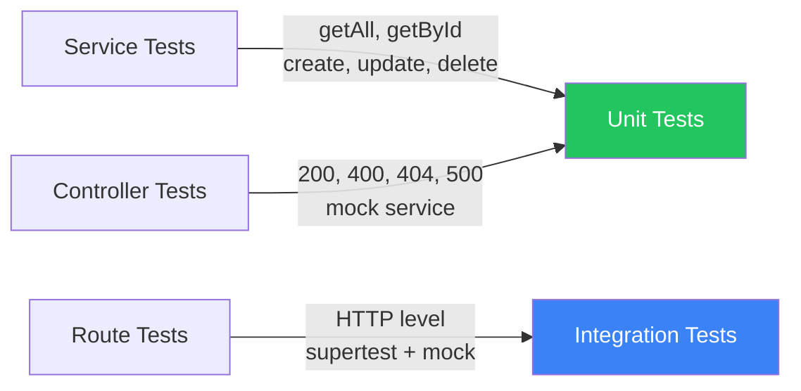

# Unit Testing with Vitest

**Testing your Express API — services, controllers, and routes**

---

## Agenda

1. **Why Unit Tests?** — what to test and why it matters
2. **Vitest** — the test runner and covering all scenarios
3. **Dependency Injection & Mocking** — inject fakes, test in isolation
4. **Supertest** — test routes without calling real endpoints

---
layout: center
---

# Part 1
# Why Unit Tests?

---

## Where We Are

So far, the expenses API has:

- **Routes** — mapping URLs to controllers
- **Controllers** — handling HTTP requests and responses
- **Services** — business logic and data access
- **Models & DTOs** — typed shapes with validation rules
- **Zod middleware** — guarding the API boundary

> But there are no automated tests. How do we know it actually works?

---

## The Problem with Manual Testing

Without automated tests you have to:

- Spin up the server every time
- Use a tool like Postman to send requests manually
- Test every edge case by hand
- Repeat all of that after every change

> Manual testing doesn't scale — it's slow, inconsistent, and easy to miss cases.

---

## What Are Unit Tests?

Unit tests **verify one unit of code in isolation** — typically a single class or function.

- Run in milliseconds — no server required
- Test one behaviour at a time
- Replace real dependencies with controlled fakes (**mocks**)
- Catch regressions instantly when you change code

> If every unit works correctly in isolation, confidence in the whole system is much higher.

---

## The Testing Pyramid

<div class="flex justify-center">



</div>

> Write **lots of unit tests** — they are the foundation.

---

## What Scenarios Must We Cover?

Every important scenario for a unit needs a test:

| Scenario | Example |
|---|---|
| **Happy path** | `getAll` returns a list of posts |
| **Empty result** | `getAll` returns `[]` when there are no posts |
| **Not found** | `getById` returns `null` for an unknown ID |
| **Validation error** | Controller returns `400` when body is invalid |
| **Server error** | Controller returns `500` when service throws |

> Cover **all branches** — not just the success path.

---
layout: center
---

# Part 2
# Vitest

---

## What is Vitest?

Vitest is a **fast, modern test runner built for Vite and TypeScript projects**.

```bash
npm install --save-dev vitest @vitest/coverage-v8
```

- Jest-compatible API — `describe`, `it`, `expect`, `vi`
- Native TypeScript support — no extra config
- Built-in mocking with `vi.fn()` and `vi.spyOn()`
- Coverage reports out of the box

> If you know Jest, you already know Vitest.

---

## Setting Up Vitest

Add a `vitest` config block to `package.json`:

```json
{
  "scripts": {
    "test": "vitest run",
    "test:watch": "vitest",
    "test:coverage": "vitest run --coverage"
  },
  "vitest": {
    "environment": "node"
  }
}
```

Then run all tests:

```bash
npm test
```

---

## Test File Conventions

Mirror your `src/` structure inside a separate `tests/` folder:

```
src/
├── services/
│   └── postService.ts
├── controllers/
│   └── postController.ts
└── routes/
    └── postRouter.ts

tests/
├── services/
│   └── postService.test.ts
├── controllers/
│   └── postController.test.ts
└── routes/
    └── postRouter.test.ts
```

> Same folder structure — but tests live in `tests/` rather than mixed in with source.

---

## Anatomy of a Test

```typescript
import { describe, it, expect } from "vitest";

describe("PostService", () => {
  // Group related tests

  it("should return all posts", async () => {
    // Arrange — set up
    const service = new PostService();

    // Act — run the code
    const result = await service.getAll();

    // Assert — check the outcome
    expect(result).toBeInstanceOf(Array);
  });

});
```

> **Arrange → Act → Assert** — every test follows this pattern.

---
layout: center
---

# Part 3
# Dependency Injection & Mocking

---

## The Problem: Tight Coupling

If a controller creates its own service, you can't replace it in tests:

```typescript
// ❌ Hard to test — controller owns the service
export class PostController {
  private service = new PostService(); // created internally

  async getAll(req: Request, res: Response): Promise<void> {
    const posts = await this.service.getAll();
    res.json(posts);
  }
}
```

To test the controller you'd need a real database — slow, brittle, and hard to control.

---

## The Fix: Inject the Dependency

Pass the service **in** rather than creating it internally:

```typescript
// ✅ Testable — service is injected
export class PostController {
  constructor(private readonly service: PostService) {}

  async getAll(req: Request, res: Response): Promise<void> {
    const posts = await this.service.getAll();
    res.json(posts);
  }
}
```

In production: `new PostController(new PostService())`

In tests: `new PostController(mockService)` — inject a fake

> This is **Dependency Injection** — and it's why DI makes code testable.

---

## What is a Mock?

A **mock** is a controlled fake that replaces a real dependency in a test.

```typescript
import { vi } from "vitest";

const mockService = {
  getAll: vi.fn(),   // a fake function you control
  getById: vi.fn(),
  create: vi.fn(),
  update: vi.fn(),
  delete: vi.fn(),
} as unknown as PostService;
```

`vi.fn()` lets you:
- Control what it **returns** — `mockResolvedValue(...)`, `mockRejectedValue(...)`
- **Assert** it was called — `expect(fn).toHaveBeenCalledWith(...)`

---

## Testing the Service

The service holds business logic — test it directly:

```typescript
import { describe, it, expect, beforeEach } from "vitest";
import { PostService } from "./postService";

describe("PostService", () => {
  let service: PostService;

  beforeEach(() => {
    service = new PostService();
  });

  it("should return an empty array when there are no posts", async () => {
    const result = await service.getAll();
    expect(result).toEqual([]);
  });

  it("should return null when post not found", async () => {
    const result = await service.getById(999);
    expect(result).toBeNull();
  });
});
```

---

## Testing the Controller — Happy Path

```typescript
import { describe, it, expect, vi } from "vitest";
import { PostController } from "./postController";

describe("PostController - getAll", () => {
  it("should return 200 with all posts", async () => {
    const posts = [{ id: 1, title: "Hello World", content: "My first post", author: "Alice" }];

    mockService.getAll = vi.fn().mockResolvedValue(posts);

    const controller = new PostController(mockService);
    await controller.getAll(mockReq, mockRes);

    expect(mockRes.status).toHaveBeenCalledWith(200);
    expect(mockRes.json).toHaveBeenCalledWith(posts);
  });
});
```

---

## Testing the Controller — Error Path

```typescript
describe("PostController - getAll", () => {
  it("should return 500 when the service throws", async () => {
    mockService.getAll = vi.fn().mockRejectedValue(new Error("DB error"));

    const controller = new PostController(mockService);
    await controller.getAll(mockReq, mockRes);

    expect(mockRes.status).toHaveBeenCalledWith(500);
    expect(mockRes.json).toHaveBeenCalledWith({
      error: "Internal server error",
    });
  });
});
```

> Test **both** the happy path **and** every error branch — don't leave gaps.

---

## Mocking the Request and Response

Controllers depend on `req` and `res` — mock those too:

```typescript
import { vi } from "vitest";
import type { Request, Response } from "express";

const mockReq = {
  params: {},
  body: {},
} as unknown as Request;

const mockRes = {
  status: vi.fn().mockReturnThis(), // enables chaining: res.status(200).json(...)
  json: vi.fn(),
} as unknown as Response;
```

> `mockReturnThis()` makes `status()` return `mockRes` so `.json()` can be chained.

---
layout: center
---

# Part 4
# Testing Routes with Supertest

---

## Why Not Just Call the Real Server?

You _could_ start your Express server and make real HTTP requests — but that means:

- Spinning up the server in every test
- Hitting real services and real data
- Tests are slow, brittle, and stateful

> Routes should be tested at the HTTP level — but without the real network overhead.

---

## What is Supertest?

**Supertest** lets you send HTTP requests directly to an Express `app` — no server needed.

```bash
npm install --save-dev supertest @types/supertest
```

- Wraps your app without calling `app.listen()`
- Returns real HTTP responses — status codes, headers, body
- Works perfectly with Vitest's async helpers

> You test the HTTP interface without touching a real endpoint.

---

## Setting up Supertest

Export your `app` without calling `listen()` — keep them separate:

```typescript
// src/app.ts — export the app
import express from "express";
import { postRouter } from "./routes/postRouter";

export const app = express();
app.use(express.json());
app.use("/posts", postRouter);
```

```typescript
// src/index.ts — start the server separately
import { app } from "./app";

app.listen(3000, () => console.log("Server running on port 3000"));
```

> Separating `app` from `listen()` is best practice — it enables testing and reuse.

---

## Testing a Route with Supertest

```typescript
import { describe, it, expect, vi } from "vitest";
import request from "supertest";
import { app } from "../../app";

describe("GET /posts", () => {
  it("should return 200 with a list of posts", async () => {
    const response = await request(app).get("/posts");

    expect(response.status).toBe(200);
    expect(response.body).toBeInstanceOf(Array);
  });
});
```

> `request(app)` wraps the app — no `listen()`, no real ports.

---

## Mocking the Service in Route Tests

Inject a mock service so routes don't hit real data:

```typescript
import { vi } from "vitest";
import { PostService } from "../../services/postService";

vi.mock("../../services/postService");

const mockGetAll = vi.fn().mockResolvedValue([
  { id: 1, title: "Hello World", content: "My first post", author: "Alice" },
]);

(PostService as unknown as { prototype: PostService }).prototype.getAll = mockGetAll;

describe("GET /posts", () => {
  it("should return mocked posts", async () => {
    const response = await request(app).get("/posts");

    expect(response.status).toBe(200);
    expect(response.body).toHaveLength(1);
    expect(mockGetAll).toHaveBeenCalledOnce();
  });
});
```

---

## Testing Validation at the Route Level

Supertest is also great for testing Zod validation middleware:

```typescript
describe("POST /posts", () => {
  it("should return 400 when body is missing required fields", async () => {
    const response = await request(app)
      .post("/posts")
      .send({ content: "Some content" }); // missing title and author

    expect(response.status).toBe(400);
    expect(response.body.errors).toBeDefined();
  });

  it("should return 201 when body is valid", async () => {
    const response = await request(app)
      .post("/posts")
      .send({ title: "Hello World", content: "My first post", author: "Alice" });

    expect(response.status).toBe(201);
  });
});
```

---

## What We Now Have



| Layer | Tool | What it tests |
|---|---|---|
| **Service** | Vitest | Business logic in isolation |
| **Controller** | Vitest + mock req/res | HTTP handling, status codes |
| **Route** | Vitest + Supertest | Full HTTP request/response |

---

## Key Takeaways

- **Unit tests** verify one unit at a time — fast, focused, and cheap
- **Vitest** is a modern, TypeScript-native test runner — Jest-compatible API
- **Cover all scenarios** — happy path, empty results, not found, validation errors, server errors
- **Dependency injection** makes controllers and services testable by allowing mocks to be injected
- **Supertest** tests routes at the HTTP level without starting a real server

---
layout: end
---

# Now it's your turn

Add unit tests to the expenses API

`npm test`
