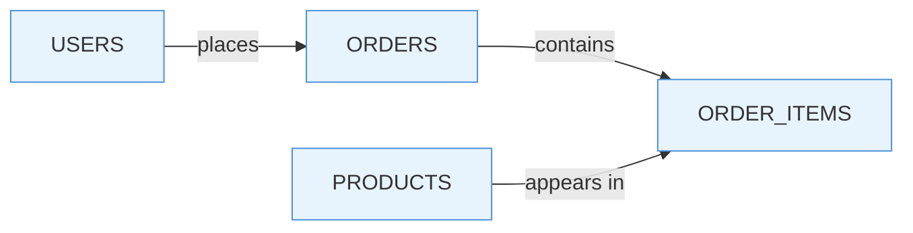
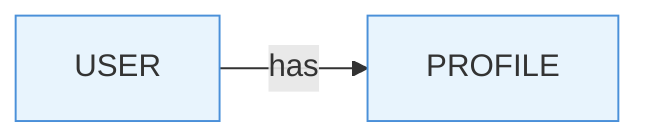
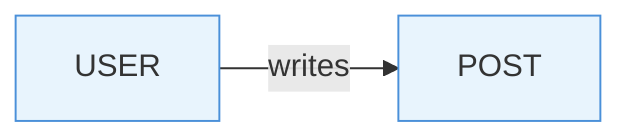
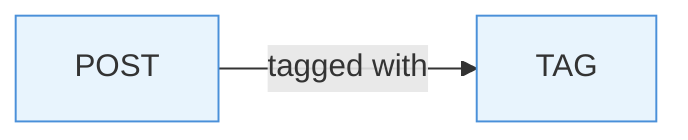
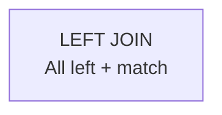
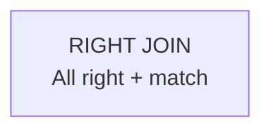

# Introduction to SQL

From relational databases to Prisma ORM

---

# What Is a Relational Database?

- Data stored in **tables** (rows and columns)
- Tables linked through **relationships**
- Enforced structure via a **schema**
- Queried using **SQL** (Structured Query Language)



<!--
Relational databases organise data into tables with defined schemas. Each table has columns (fields) and rows (records). Tables reference each other through keys. PostgreSQL, MySQL, and SQL Server are popular examples. We'll use PostgreSQL throughout.
-->

---

# Normalisation

Design technique to **reduce redundancy** and **improve data integrity**

| Normal Form | Rule |
|-------------|------|
| **1NF** | Atomic values, no repeating groups |
| **2NF** | 1NF + no partial dependencies |
| **3NF** | 2NF + no transitive dependencies |

Benefits: consistency, simpler updates, less wasted storage

<!--
Normalisation is the process of structuring tables so that each piece of data lives in exactly one place. The three normal forms build on each other. Denormalisation is sometimes used deliberately for read performance, but start normalised.
-->

---

# First Normal Form (1NF)

Each cell holds **one value**. Every row is **unique**.

**Before 1NF:**

```
Student | Courses
--------|--------------------
John    | Math, Science, Art
```

**After 1NF:**

```
Student | Course
--------|--------
John    | Math
John    | Science
John    | Art
```

<!--
1NF eliminates lists and repeating groups inside cells. Every column must contain a single, atomic value. A primary key ensures each row is unique. This is the foundation all other normal forms build upon.
-->

---

# Second Normal Form (2NF)

1NF + every non-key column depends on the **entire** primary key

**Before 2NF (composite key: StudentID, CourseID):**

```
StudentID | CourseID | StudentName | CourseName
----------|----------|-------------|------------
1         | 101      | John        | Math
```

**After 2NF:**

```
Students:   StudentID | StudentName
Courses:    CourseID  | CourseName
Enrolment:  StudentID | CourseID
```

<!--
Partial dependency means a non-key column depends on only part of a composite key. StudentName depends only on StudentID, not on (StudentID, CourseID). Moving it to its own table prevents update anomalies where changing a name would require updating many rows.
-->

---

# Third Normal Form (3NF)

2NF + no **transitive dependencies** between non-key columns

**Before 3NF:**

```
StudentID | Name | Department | DeptHead
----------|------|------------|----------
1         | John | CS         | Dr. Smith
```

**After 3NF:**

```
Students:    StudentID | Name | DeptID
Departments: DeptID    | Department | DeptHead
```

<!--
If DeptHead depends on Department, and Department depends on StudentID, then DeptHead transitively depends on the key. Moving it into its own table eliminates that chain. Most production schemas aim for at least 3NF.
-->

---

# Relationships

How tables connect to each other through **keys**

- **One-to-One** — User → Profile
- **One-to-Many** — User → Posts
- **Many-to-Many** — Posts ↔ Tags (via junction table)

<!--
Relationships are implemented using foreign keys. Each type has different characteristics and use cases. We'll explore each one in detail.
-->

---

# One-to-One Relationship

Each record in Table A relates to **exactly one** record in Table B



Example: A user has one profile, a profile belongs to one user

Implementation: Foreign key with `UNIQUE` constraint

```sql
CREATE TABLE profiles (
    id SERIAL PRIMARY KEY,
    user_id INT NOT NULL UNIQUE REFERENCES users(id),
    bio TEXT
);
```

<!--
One-to-one relationships are less common. They're used when you want to split related data into separate tables for logical separation (like keeping user auth separate from user profile). The UNIQUE constraint ensures each user maps to exactly one profile.
-->

---

# One-to-Many Relationship

One record in Table A relates to **multiple** records in Table B



Example: A user writes many posts, each post belongs to one user

Implementation: Foreign key on the "many" side

```sql
CREATE TABLE posts (
    id SERIAL PRIMARY KEY,
    user_id INT NOT NULL REFERENCES users(id),
    title VARCHAR(255)
);
```

<!--
One-to-many is the most common relationship. The "many" side (posts) holds the foreign key pointing to the "one" side (users). This prevents data duplication — we don't repeat the user record for each post.
-->

---

# Many-to-Many Relationship

Records in Table A relate to **multiple** records in Table B and vice versa



Example: Posts have many tags, tags belong to many posts

Implementation: **Junction table** (join table) with two foreign keys

```sql
CREATE TABLE post_tags (
    post_id INT NOT NULL REFERENCES posts(id),
    tag_id INT NOT NULL REFERENCES tags(id),
    PRIMARY KEY (post_id, tag_id)
);
```

<!--
Many-to-many relationships require a junction table in between. This table has two foreign keys, one pointing to each side. The composite primary key ensures we don't duplicate the same post-tag pair. Without the junction table, we'd either duplicate data or have no way to represent the relationship.
-->

---

# Keys

- **Primary Key (PK)** — Uniquely identifies each row
- **Foreign Key (FK)** — References a PK in another table
- **Composite Key** — PK made of multiple columns

```sql
CREATE TABLE posts (
    id SERIAL PRIMARY KEY,
    title VARCHAR(255) NOT NULL,
    user_id INT NOT NULL REFERENCES users(id)
);
```

<!--
The primary key guarantees uniqueness. Foreign keys enforce referential integrity — you can't insert a post for a user that doesn't exist. Composite keys are used when no single column is unique, such as in junction tables.
-->

---
layout: center
---

# SQL — Structured Query Language

Three sub-languages: **DDL**, **DML**, **DQL**

---

# DDL — Data Definition Language

Define and modify the **structure** of your database

```sql
-- Create a table
CREATE TABLE users (
    id SERIAL PRIMARY KEY,
    email VARCHAR(255) UNIQUE NOT NULL,
    created_at TIMESTAMP DEFAULT NOW()
);

-- Add a column
ALTER TABLE users ADD COLUMN username VARCHAR(50);

-- Remove a table
DROP TABLE users;
```

Key commands: `CREATE`, `ALTER`, `DROP`, `TRUNCATE`

<!--
DDL shapes the schema — the blueprint of your database. CREATE makes new objects, ALTER changes existing ones, DROP removes them entirely, TRUNCATE empties a table but keeps its structure. These commands auto-commit in most databases.
-->

---

# DML — Data Manipulation Language

**Insert**, **update**, and **delete** data

```sql
-- Insert a row
INSERT INTO users (email, username)
VALUES ('alice@example.com', 'alice');

-- Update existing rows
UPDATE users SET username = 'alice_dev'
WHERE email = 'alice@example.com';

-- Delete specific rows
DELETE FROM users WHERE id = 42;
```

Always use a `WHERE` clause with `UPDATE` and `DELETE`!

<!--
DML modifies the data inside tables. INSERT adds new records. UPDATE changes existing records — without a WHERE clause, it changes EVERY row. DELETE removes records — without WHERE, it deletes ALL rows. Always double-check your WHERE clauses.
-->

---

# DQL — Data Query Language

**Read** data with `SELECT`

```sql
-- Filter rows
SELECT * FROM users WHERE username LIKE 'alice%';

-- Join tables
SELECT u.username, p.title
FROM users u
JOIN posts p ON u.id = p.user_id;

-- Aggregate
SELECT COUNT(*) AS total, AVG(age) AS avg_age
FROM users;
```

Key clauses: `WHERE`, `JOIN`, `GROUP BY`, `ORDER BY`, `LIMIT`

<!--
DQL is what you'll use most. SELECT retrieves data without changing it. JOINs combine rows from multiple tables. Aggregation functions like COUNT, SUM, AVG, MIN, MAX summarise data. GROUP BY groups rows before aggregation. ORDER BY sorts results. LIMIT restricts how many rows you get back.
-->

---

# JOINs Overview

Combine rows from two or more tables based on a matching condition

<div style="display: grid; grid-template-columns: 1fr 1fr; gap: 20px;">

<div>


</div>

<div>



</div>

<div>



</div>

<div>


</div>

</div>

Four types, each with different behavior when rows don't match

<!--
JOINs are how you combine data from multiple tables. Think of Venn diagrams — each JOIN type has different rules about which rows to include.
-->

---

# INNER JOIN — Where Data Overlaps

Returns only rows that have **matching values in both tables**

Only the **intersection** is included in the result

```sql
SELECT customers.name, orders.order_date
FROM customers
INNER JOIN orders
ON customers.id = orders.customer_id;
```

**Result:**
- Only customers who have placed at least one order appear
- If a customer never made a purchase, they won't show up
- If an order has no matching customer, it won't show up

**Use case:** "Show me customers with orders"

<!--
INNER JOIN is the strictest. Both sides must match. If you have 100 customers but only 80 placed orders, you get 80 rows. Missing customers and orphaned orders are excluded.
-->

---

# LEFT JOIN — Keep Everything from the Left Table

Returns **all rows from the left table** plus matching rows from the right table

Entire **left table** included, right table only where matched

```sql
SELECT customers.name, orders.order_date
FROM customers
LEFT JOIN orders
ON customers.id = orders.customer_id;
```

**Result:**
- You see all customers, including those who never placed an order
- Their order_date will be NULL
- Great for finding inactive or new users

**Use case:** "Show me all customers and their orders (if any)"

<!--
LEFT JOIN is lenient on the left side. All customers survive the join, whether they have orders or not. The right side is matched when possible, but left-side data is guaranteed.
-->

---

# RIGHT JOIN — The Mirror of LEFT JOIN

Returns **all rows from the right table** plus matching rows from the left table

Entire **right table** included, left table only where matched

```sql
SELECT customers.name, orders.order_date
FROM customers
RIGHT JOIN orders
ON customers.id = orders.customer_id;
```

**Result:**
- You get all orders, even orphaned ones
- If an order was made by a deleted customer, the name will be NULL
- Helpful for finding data inconsistencies

**Use case:** "Show me all orders and their customers (if any)"

<!--
RIGHT JOIN is the opposite of LEFT. All orders survive the join. It's less common in practice because you can usually rewrite it as a LEFT JOIN on the opposite tables. But it's useful when the right table is your primary focus.
-->

---

# FULL OUTER JOIN — Bring Everything Together

Returns **all rows from both tables**, merging matches and filling unmatched fields with NULL

**Everything** from both tables is included

```sql
SELECT customers.name, orders.order_date
FROM customers
FULL OUTER JOIN orders
ON customers.id = orders.customer_id;
```

**Result:**
- You see all customers and all orders
- Matched pairs are joined normally
- Unmatched customers have NULL in order fields
- Orphaned orders have NULL in customer fields
- Perfect for finding gaps and inconsistencies

**Use case:** "Show me the complete picture — all customers and all orders"

<!--
FULL OUTER JOIN is the most inclusive. Nothing is filtered out. You get the union of both result sets. This is useful for data reconciliation and auditing, but can produce large, sparse result sets with many NULLs.
-->

---

# Choosing the Right JOIN

| Situation | Use |
|-----------|-----|
| Both sides must have matches | INNER JOIN |
| Keep all left-side rows | LEFT JOIN |
| Keep all right-side rows | RIGHT JOIN |
| Keep everything from both | FULL OUTER JOIN |
| Find unmatched rows | LEFT or RIGHT with WHERE NULL filter |

Most common: **LEFT JOIN** (find all X and their related Y, if any)

<!--
Most database queries use LEFT JOIN because you typically want all records from your primary table (left) and their related data (right). INNER JOIN is next most common. RIGHT JOIN is rare — usually rewrite as LEFT. FULL OUTER JOIN is for special use cases like data cleaning and reconciliation.
-->

---

# What Is an ORM?

**Object-Relational Mapping** — a bridge between code objects and database tables

- Write queries in your **programming language**
- Get **type-safe** database operations
- Automatic **migrations** and schema management
- **Database-agnostic** — swap providers without rewriting queries

Popular ORMs: **Prisma**, TypeORM, Sequelize (Node.js), Hibernate (Java)

<!--
ORMs translate between object-oriented code and relational tables. Instead of writing raw SQL strings, you call methods on objects. This gives you autocompletion and compile-time type checking. The trade-off is that complex queries can be harder to optimise through an ORM.
-->

---

# Migrations

**Version control** for your database schema

- Track every schema change as a **timestamped file**
- Apply changes **consistently** across dev, staging, production
- **Rollback** capability when things go wrong
- Team members get the same schema via `migrate deploy`

```
migrations/
  20260301120000_create_users/
    migration.sql
  20260302090000_add_posts/
    migration.sql
```

<!--
Without migrations, you'd need to manually run SQL on every environment. Migrations solve this by recording each change in order. Running migrate applies any pending changes. Rolling back undoes the last change. This is essential for team development and CI/CD pipelines.
-->

---

# Prisma — Modern TypeScript ORM

Define your schema, generate a type-safe client

```prisma
model User {
  id        Int      @id @default(autoincrement())
  email     String   @unique
  username  String?
  posts     Post[]
  createdAt DateTime @default(now())
}

model Post {
  id     Int    @id @default(autoincrement())
  title  String
  user   User   @relation(fields: [userId], references: [id])
  userId Int
}
```

<!--
Prisma uses a dedicated schema file (.prisma) to define your data model. From this schema it generates a fully typed TypeScript client. Relations are declared explicitly. The schema is the single source of truth for your database structure.
-->

---

# Prisma in Action

```typescript
// Create a user with a post
const user = await prisma.user.create({
  data: {
    email: "alice@example.com",
    posts: {
      create: { title: "Hello World" },
    },
  },
});

// Query with relations
const users = await prisma.user.findMany({
  include: { posts: true },
});
```

Features: auto-complete, type safety, Prisma Studio GUI

<!--
The Prisma client gives you full type safety — if a field doesn't exist, TypeScript catches it at compile time. The include option eagerly loads relations. Prisma Studio provides a web-based GUI to browse and edit your data during development.
-->

---

# Optimisation

Strategies to keep your database **fast**

| Strategy | What It Does |
|----------|-------------|
| **Indexing** | Speed up lookups on frequently queried columns |
| **Query analysis** | Use `EXPLAIN ANALYZE` to find slow queries |
| **Avoid N+1** | Fetch related data in one query, not N extra ones |
| **Connection pooling** | Reuse connections instead of opening new ones |
| **Caching** | Store hot data in memory (Redis) |

<!--
Indexes are the single biggest performance lever — they turn full table scans into fast lookups. But indexes slow down writes, so only index what you query. N+1 is the classic ORM trap: loading 100 users then 100 separate queries for their posts. Use includes/joins instead. Connection pooling avoids the overhead of creating a new connection per request.
-->

---

# Security

Protecting your data from threats

- **SQL Injection** — Never concatenate user input into queries

```sql
-- DANGEROUS
SELECT * FROM users WHERE name = '' + userInput + '';

-- SAFE — parameterized query
SELECT * FROM users WHERE name = $1;
```

- **Least Privilege** — App accounts get only the permissions they need
- **Encryption** — Encrypt sensitive data at rest and in transit (TLS)
- **Backups** — Regular, tested, automated backups

<!--
SQL injection remains in the OWASP Top 10 every year. Always use parameterized queries or an ORM — both prevent injection by separating code from data. Give your app's DB user only SELECT/INSERT/UPDATE/DELETE, not CREATE/DROP. Encrypt data with TLS in transit and AES at rest. Test your backup restore process.
-->

---

# NoSQL

When relational isn't the right fit

| Type | Example | Use Case |
|------|---------|----------|
| **Document** | MongoDB | Flexible schemas, nested data |
| **Key-Value** | Redis | Caching, sessions |
| **Column-Family** | Cassandra | High-write, time-series |
| **Graph** | Neo4j | Relationship-heavy queries |

Trade-offs: flexibility vs consistency, scale vs ACID guarantees

<!--
NoSQL databases sacrifice some guarantees (like strict ACID transactions) for flexibility and horizontal scalability. Document stores are the most common — they store JSON-like documents instead of rows. Key-value stores are blazing fast for simple lookups. Choose based on your data access patterns, not hype.
-->

---

# Summary

| Topic | Key Takeaway |
|-------|-------------|
| Normalisation | 1NF→2NF→3NF |
| Relationships | 1:1, 1:many, many:many |
| SQL | DDL/DML/DQL commands |
| ORM | Type-safe access |
| Migrations | Versioned schema |
| Optimisation | Indexes, N+1, pooling |
| Security | Parameterized queries |
| NoSQL | Document, K-V, graph |

---
layout: end
---

# Next Up: Hands-on with Prisma

Questions?
