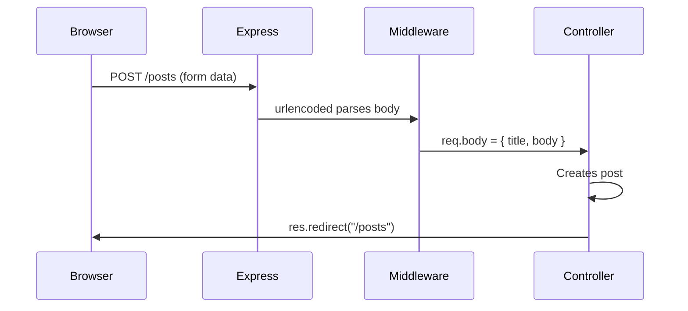
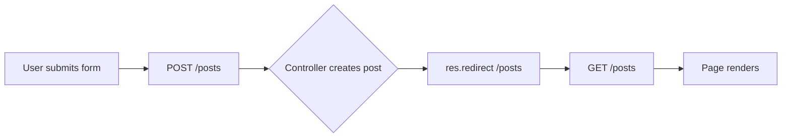
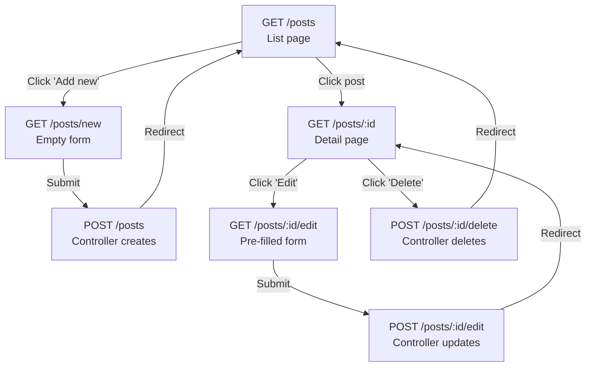

# Frontend Forms & User Input

Sending data from the browser to the server

---

# What We'll Cover

- How HTML forms submit data
- `express.urlencoded()` middleware
- Reading form data with `req.body`
- The Post/Redirect/Get pattern
- Shared create/edit templates
- Route ordering pitfalls
- Delete via POST

> 📝 Code examples use a **blog posts** domain — you'll apply these patterns to your **expenses** app in the exercise

---

# How HTML Forms Work

A form collects user input and sends it to the server

```html
<form method="POST" action="/posts">
  <input type="text" name="title" />
  <input type="text" name="body" />
  <button type="submit">Add post</button>
</form>
```

**Three key attributes:**

| Attribute | Purpose | Example |
|-----------|---------|-------|
| `method` | HTTP verb to use | `POST` |
| `action` | URL to send data to | `/posts` |
| `name` | Key for each field's value | `title` |

---

# What Happens When a Form Submits?

The browser sends a POST request with URL-encoded data

```
POST /posts HTTP/1.1
Content-Type: application/x-www-form-urlencoded

title=Hello+World&body=My+first+post
```

- Each `<input name="...">` becomes a **key=value** pair
- Pairs are joined with `&`
- Special characters are percent-encoded

> This is the same format as query strings, but sent in the **request body**.

---

# Parsing Form Data in Express

Express doesn't parse form bodies by default

```typescript
// index.ts — add BEFORE your routes
app.use(express.urlencoded({ extended: true }));
```

**Without this middleware:** `req.body` is `undefined`

**With this middleware:** `req.body` is an object

```typescript
// After the form from slide 3 submits:
req.body = {
  title: "Hello World",
  body: "My first post"  // ⚠️ Always a string!
}
```

> All form values arrive as **strings** — parse numbers with `Number()` or `parseFloat()` where needed.

---

# The Data Flow

From `<input>` to controller



The `name` attribute on each `<input>` determines the key in `req.body`.

---

# Post/Redirect/Get (PRG)

Why controllers redirect after form submissions

**The problem:** If the server renders a page directly after a POST, refreshing the page re-submits the form — creating duplicates.



**The rule:** After any create, update, or delete → **redirect, don't render**.

```typescript
// ✅ Correct — PRG pattern
res.redirect("/posts");

// ❌ Wrong — refreshing re-submits the form
res.render("pages/posts.njk", { posts });
```
---

# PRG: What the User Sees

The redirect is invisible to the user

| Step | HTTP | What happens |
|------|------|-------------|
| 1 | `POST /posts` | Form data sent to server |
| 2 | `302 Found` → `/posts` | Server responds with redirect |
| 3 | `GET /posts` | Browser follows redirect automatically |
| 4 | `200 OK` | Page renders — safe to refresh |

> Open DevTools → Network tab to see the 302 redirect in action.

---

# Route Ordering Matters

Static routes must come before dynamic parameters

```typescript
// ✅ Correct order
router.get("/posts/new",  controller.showCreateForm);  // static
router.get("/posts/:id",  controller.getById);         // dynamic

// ❌ Wrong order — "new" is treated as an :id
router.get("/posts/:id",  controller.getById);         // catches "new"!
router.get("/posts/new",  controller.showCreateForm);  // never reached
```

**Why?** Express matches routes top-to-bottom. `:id` matches **any** string — including `"new"`.

**Rule of thumb:** Specific routes first, parameterised routes after.

---

# Full Route Table


| Method | Path | Purpose |
|--------|------|---------|
| `GET` | `/posts` | List all |
| `GET` | `/posts/new` | Show create form |
| `GET` | `/posts/:id` | View one |
| `GET` | `/posts/:id/edit` | Show edit form |
| `POST` | `/posts` | Create (from form) |
| `POST` | `/posts/:id/edit` | Update (from form) |
| `POST` | `/posts/:id/delete` | Delete |

> Notice: forms only use **GET** and **POST** — no PUT or DELETE.

---

# Why No PUT or DELETE?

HTML forms only support GET and POST

```html
<!-- ❌ This does NOT work in browsers -->
<form method="DELETE" action="/posts/1">

<!-- ✅ Instead, use POST with a descriptive path -->
<form method="POST" action="/posts/1/delete">
```

- The `<form>` element only allows `method="GET"` or `method="POST"`
- APIs use PUT/DELETE, but **server-rendered forms** cannot
- Convention: use the URL path to indicate the action (`/edit`, `/delete`)

> Some frameworks add a hidden `_method` field to work around this. We'll keep it simple with POST.

---

# GOV.UK Form Components

Building accessible forms with the Design System

```html
<div class="govuk-form-group">
  <label class="govuk-label" for="title">Title</label>
  <input class="govuk-input" id="title"
         name="title" type="text" />
</div>
```

---

# GOV.UK Form Components

**Key classes:**

| Class | Purpose |
|-------|---------|
| `govuk-form-group` | Wraps label + input with spacing |
| `govuk-label` | Styled label |
| `govuk-input` | Styled text input |
| `govuk-button` | Primary action button |
| `govuk-button--warning` | Red destructive button |

🔗 [GOV.UK Text Input](https://design-system.service.gov.uk/components/text-input/)

---

# Shared Create/Edit Template

One template handles both creating and editing

```html
<h1 class="govuk-heading-l">
  Edit PostNew Post
</h1>

<form method="POST"
      action="/posts/{{ post.id }}/edit
              /posts">

  <div class="govuk-form-group">
    <label class="govuk-label" for="title">Title</label>
    <input class="govuk-input" id="title" name="title"
           value="{{ post.title if post else '' }}" />
  </div>

  <button class="govuk-button">
    UpdateAdd post
  </button>
</form>
```

---

# How the Shared Template Works

The controller decides what data to pass

```typescript
// Show empty form → no post passed
showCreateForm(req: Request, res: Response) {
  res.render("pages/post-form.njk");
}

// Show pre-filled form → post object passed
showEditForm(req: Request, res: Response) {
  const post = this.service.getById(req.params.id);
  res.render("pages/post-form.njk", { post });
}
```

| Scenario | `post` variable | Form action | Button text |
|----------|----------------|-------------|-------------|
| Create | `undefined` | `/posts` | "Add post" |
| Edit | `{ id, title, … }` | `/posts/1/edit` | "Update post" |

---

# Delete via POST

A form disguised as a button

```html
<!-- On the detail page -->
<form method="POST" action="/posts/{{ post.id }}/delete"
      style="display: inline;">
  <button type="submit"
          class="govuk-button govuk-button--warning"
          data-module="govuk-button">
    Delete this post
  </button>
</form>
```

- Uses `govuk-button--warning` for a red destructive style
- `display: inline` keeps it on the same line as other links
- The controller deletes the expense and **redirects** (PRG pattern)

> **Stretch goal:** Add a confirmation page before actually deleting.

---

# The Complete Flow

Create, Read, Update, Delete



---

# Key Takeaways

- Forms use `method`, `action`, and `name` to send data to the server
- `express.urlencoded()` parses form data into `req.body`
- **Post/Redirect/Get** prevents duplicate submissions on refresh
- Route ordering matters — static routes before `:id` parameters
- HTML forms only support **GET** and **POST** — use URL paths for edit/delete
- A single Nunjucks template can handle both create and edit with conditionals

---
layout: center
---

# Exercise Time

Add forms to your expenses frontend — create, edit, and delete!
