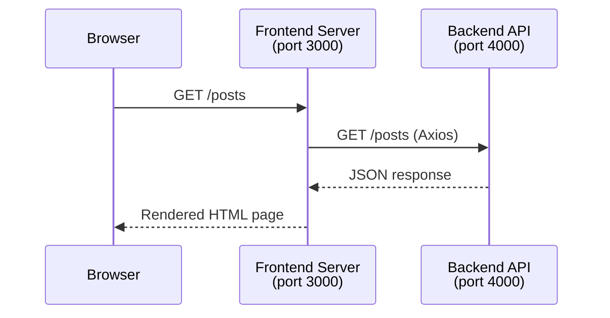
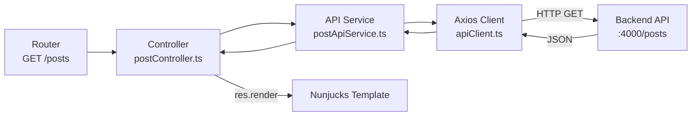

# Calling the Backend API with Axios

Connecting your frontend service to your backend API

---

# What We'll Cover

- What Axios is and why we use it
- Port configuration with `.env` files
- Installing and configuring Axios
- Creating an API service layer
- GET, POST, PUT & DELETE calls
- Handling errors gracefully

> 📝 Code examples use a **blog posts** domain — you'll apply these patterns to your **expenses** app in the exercise

---

# The Architecture

Your two services need to talk to each other



> The frontend server calls the backend API — **not** the browser directly

---

# Why Two Ports?

Both services are Node.js apps listening on a port

| Service | Default Port | Purpose |
|---------|-------------|---------|
| Backend API | `4000` | Serves JSON responses |
| Frontend Server | `3000` | Serves HTML pages |

> ⚠️ They **must** run on different ports — two servers cannot share the same port

---

# Configuring Ports with `.env`

Each service needs its own `.env` file

**Backend `.env`:**

```ini
PORT=4000
```

**Frontend `.env`:**

```ini
PORT=3000
API_BASE_URL=http://localhost:4000
```

> ⚠️ The frontend `PORT` **must** differ from the backend `PORT`  
> Use `API_BASE_URL` so you can change the backend location without touching code

---

# Reading `.env` in Your App

Load environment variables early — before anything else

```typescript
// src/app.ts (frontend)
import "dotenv/config";
import express from "express";

const app = express();
const PORT = process.env.PORT ?? "3000";

app.listen(Number(PORT), () => {
  console.log(`Frontend running on http://localhost:${PORT}`);
});
```

> Install dotenv: `npm install dotenv`  
> Add `"dotenv/config"` as the **first** import so env vars are available everywhere

---

# Installing Axios

```bash
npm install axios
```

Axios gives you:

- A clean `async/await` API over `fetch`
- Automatic JSON parsing on responses
- Typed responses with TypeScript generics
- Interceptors for centralised error handling
- Base URL and header configuration

---

# Creating an API Client

Centralise your Axios configuration in one place

```typescript
// src/config/apiClient.ts
import axios from "axios";

const apiClient = axios.create({
  baseURL: process.env.API_BASE_URL ?? "http://localhost:4000",
  headers: {
    "Content-Type": "application/json",
  },
  timeout: 5000,
});

export default apiClient;
```

> One place to change the base URL, headers, or timeouts — follows **DRY** & **SRP**

---

# Creating a Post API Service

Wrap each backend endpoint in a typed function

```typescript
// src/services/postApiService.ts
import apiClient from "../config/apiClient.js";
import type { Post, CreatePostDto } from "../models/post.js";

export async function getAllPosts(): Promise<Post[]> {
  const response = await apiClient.get<Post[]>("/posts");
  return response.data;
}

export async function getPostById(id: number): Promise<Post> {
  const response = await apiClient.get<Post>(`/posts/${id}`);
  return response.data;
}
```

> `response.data` is already parsed JSON — no need for `.json()` like with `fetch`

---

# POST — Creating a Resource

Send data to the backend to create a new record

```typescript
// src/services/postApiService.ts (continued)
export async function createPost(
  dto: CreatePostDto
): Promise<Post> {
  const response = await apiClient.post<Post>("/posts", dto);
  return response.data;
}
```

**In your controller:**

```typescript
// src/controllers/postController.ts
async createPost(req: Request, res: Response): Promise<void> {
  const post = await createPost(req.body);
  res.redirect(`/posts/${post.id}`);
}
```

---

# PUT — Updating a Resource

Replace an existing record with updated data

```typescript
// src/services/postApiService.ts (continued)
export async function updatePost(
  id: number,
  dto: CreatePostDto
): Promise<Post> {
  const response = await apiClient.put<Post>(`/posts/${id}`, dto);
  return response.data;
}
```

> Use `PUT` to replace the whole resource  
> Use `PATCH` for partial updates (only send changed fields)

---

# DELETE — Removing a Resource

```typescript
// src/services/postApiService.ts (continued)
export async function deletePost(id: number): Promise<void> {
  await apiClient.delete(`/posts/${id}`);
}
```

**In your controller:**

```typescript
async deletePost(req: Request, res: Response): Promise<void> {
  const id = Number(req.params.id);
  await deletePost(id);
  res.redirect("/posts");
}
```

> DELETE returns no body — no need to capture `response.data`

---

# Handling Errors

Axios throws for non-2xx responses — always catch

```typescript
import axios from "axios";

export async function getAllPosts(): Promise<Post[]> {
  try {
    const response = await apiClient.get<Post[]>("/posts");
    return response.data;
  } catch (error) {
    if (axios.isAxiosError(error)) {
      const status = error.response?.status;
      if (status === 404) throw new Error("No posts found");
      if (status === 500) throw new Error("Backend server error");
    }
    throw error;
  }
}
```

> `axios.isAxiosError()` narrows the type so you can safely access `error.response`

---

# Wiring It All Together



Each layer has a **single responsibility** — easy to test and swap out

---

# Full `.env` Checklist

<br/>

| Variable | Where | Example |
|----------|-------|---------|
| `PORT` | Frontend `.env` | `3000` |
| `API_BASE_URL` | Frontend `.env` | `http://localhost:4000` |
| `PORT` | Backend `.env` | `4000` |
| `DATABASE_URL` | Backend `.env` | `file:./dev.db` |

<br/>

> ⚠️ Never commit `.env` files — add them to `.gitignore`  
> Use `.env.example` with placeholder values so teammates know what to set

---

# Key Takeaways

- Use **`.env`** to configure ports — never hardcode them
- Frontend and backend **must** run on different ports
- Create a single **`apiClient.ts`** for Axios configuration
- Wrap each endpoint in a **typed service function**
- Always **handle errors** — check status codes with `axios.isAxiosError()`
- Keep controllers **thin** — they call the service and render/redirect

---
layout: center
---

# Up Next

Exercise 11 — Wire up your frontend to call the backend API using Axios
