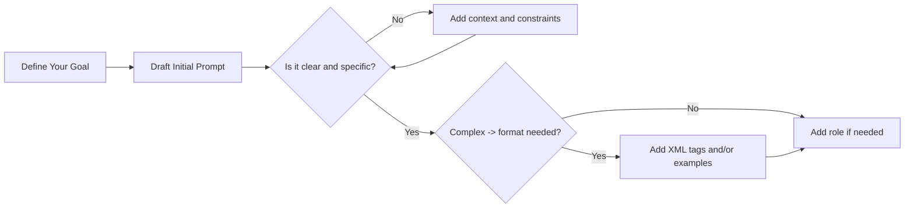
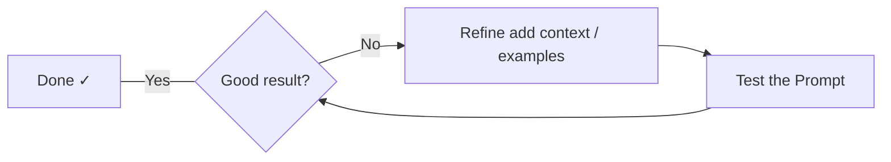

# Prompt Engineering Best Practices

Getting better results from large language models

<!--
Welcome to the prompt engineering best practices guide. This covers foundational techniques that apply broadly across models like Claude, GPT-4, and Gemini.
-->

---
layout: default
---

# What We'll Cover

- **Be clear and direct** — explicit beats implicit
- **Add context** — explain the *why*
- **Use examples** — few-shot prompting
- **XML structure** — organise complex prompts
- **Assign a role** — focus the model's behaviour
- **Long context** — handle large documents
- **Output formatting** — control the response shape
- **Chain of thought** — step-by-step reasoning

---
layout: default
---

# Think of the LLM as a New Employee

> A brilliant but new team member who lacks context on your norms and workflows.

The more precisely you explain what you want, the better the result.

**Golden rule:** Show your prompt to a colleague. If they'd be confused, the model will be too.

---
layout: two-cols-header
---

# Be Clear and Direct

::left::

**Less effective:**

```text
Create an analytics dashboard
```

::right::

**More effective:**

```text
Create an analytics dashboard.
Include as many relevant features
and interactions as possible.
Go beyond the basics to create
a fully-featured implementation.
```

<!--
Being specific about your desired output enhances results. "Above and beyond" behaviour must be explicitly requested.
-->

---
layout: default
---

# Add Context to Improve Performance

Explaining *why* helps the model understand your goals.

**Less effective:**
```text
NEVER use ellipses
```

**More effective:**
```text
Your response will be read aloud by a text-to-speech engine,
so never use ellipses since the TTS engine won't know how to pronounce them.
```

Modern LLMs are smart enough to generalise from the explanation.

---
layout: default
---

# Use Examples (Few-Shot Prompting)

Examples are one of the most reliable ways to steer output format, tone, and structure.

**Make examples:**

| Property | Description |
|---|---|
| **Relevant** | Mirror your actual use case |
| **Diverse** | Cover edge cases and variations |
| **Clearly marked** | Wrap in `<example>` / `<examples>` tags |

> Tip: Include **3–5 examples** for best results.

---
layout: default
---

# Structure Prompts with XML Tags

XML tags help the model parse complex prompts unambiguously.

```xml
<task>
  <objective>Create a login endpoint</objective>
</task>

<requirements>
  <must>
    <item>Hash passwords with bcrypt</item>
    <item>Return JWT token</item>
  </must>
  <mustnot>
    <item>Store plaintext passwords</item>
  </mustnot>
</requirements>

<output>
  <file>src/routes/auth.ts</file>
  <format>TypeScript with JSDoc</format>
</output>
```

<!--
Use consistent, descriptive tag names. Nest tags when content has a natural hierarchy.
-->

---
layout: default
---

# Give the Model a Role

Setting a role focuses the model's behaviour and tone.

```text
You are a senior software engineer focused on clean, extendable code.
```

**Use roles to:**

- Set expertise level — `"You are a cybersecurity expert"`
- Define tone — `"You are a friendly teacher for beginners"`
- Restrict scope — `"You are a SQL assistant. Only answer database questions."`

---
layout: default
---

# Long Context Prompting

When working with large documents, structure carefully.

**Key rules:**
- **Put longform data at the top** of your prompt, above the query
- **Wrap documents in XML tags** with source and content subtags
- **Ground responses in quotes** — ask the model to quote relevant parts first

> Queries at the end can improve response quality by up to 30%.

---
layout: default
---

# Long Context — Document Structure

```xml
<documents>
  <document index="1">
    <source>annual_report_2023.pdf</source>
    <document_content>
      {{ANNUAL_REPORT}}
    </document_content>
  </document>
  <document index="2">
    <source>competitor_analysis_q2.xlsx</source>
    <document_content>
      {{COMPETITOR_ANALYSIS}}
    </document_content>
  </document>
</documents>

Analyze the annual report and competitor analysis.
Identify strategic advantages and recommend Q3 focus areas.
```

---
layout: two-cols-header
---

# Control Output Formatting

::left::

**Instead of telling what NOT to do:**

```text
Do not use markdown
```

**Tell it what TO do:**

```text
Write responses in smoothly
flowing prose paragraphs.
```

::right::

**Or use XML format indicators:**

```text
Write prose in
<smoothly_flowing_prose_paragraphs>
tags.
```

**Match prompt style to desired output style.**

---
layout: default
---

# Chain of Thought Prompting

For complex tasks, ask the model to reason *before* answering.

```text
Think through this step by step before giving your final answer.
```

Or more explicitly:

```text
Before answering, write out your reasoning in <thinking> tags,
then provide your final answer in <answer> tags.
```

Reduces errors on multi-step problems — maths, logic, analysis.

---
layout: default
---

# Prompt Engineering Flow



<div class="flex justify-center">



</div>

---
layout: default
---

# Summary

<div style="transform: scale(0.95); transform-origin: top left;">

| Technique | When to use |
|---|---|
| **Be clear and direct** | Always — the most fundamental principle |
| **Add context / motivation** | When instructions might seem arbitrary |
| **Few-shot examples** | When format, tone, or style is hard to describe |
| **XML tags** | Complex prompts mixing instructions and data |
| **Assign a role** | When you need consistent expertise or tone |
| **Long context structure** | Working with large documents or multiple sources |
| **Chain of thought** | Maths, logic, multi-step reasoning tasks |
| **Format instructions** | When default formatting doesn't match your needs |

</div>

---
layout: default
---

# Happy Prompting!

Apply these techniques to get consistently better results from any LLM.
