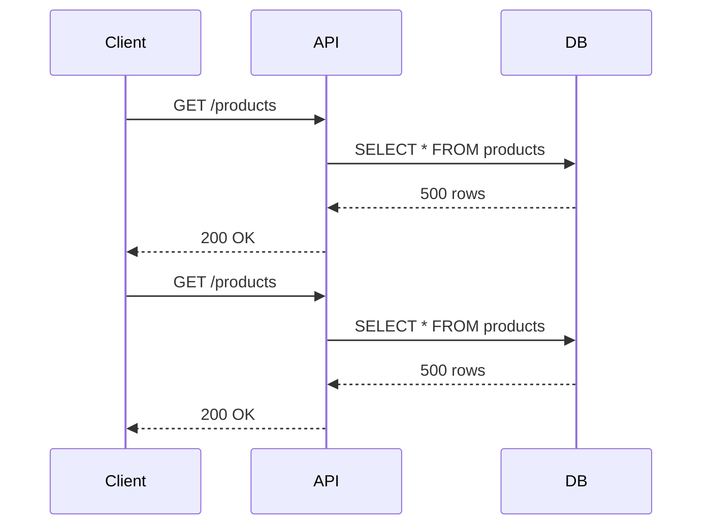
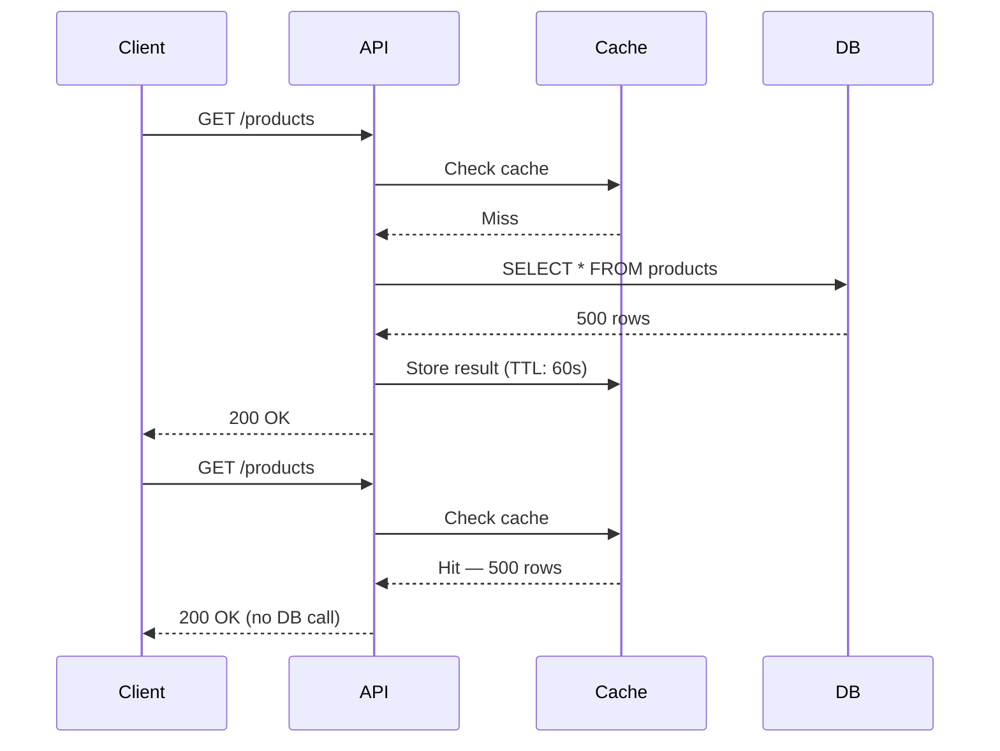
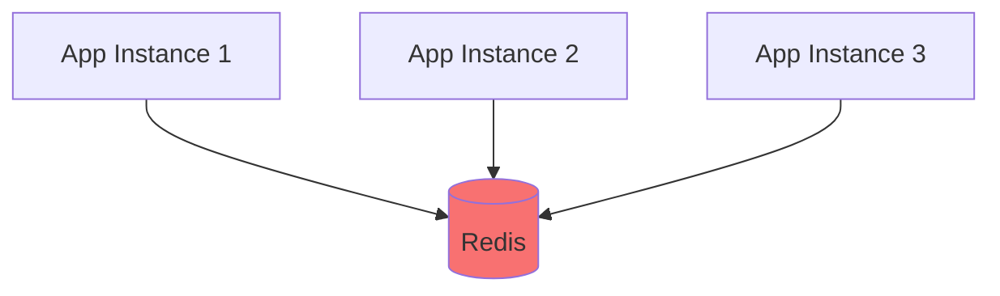
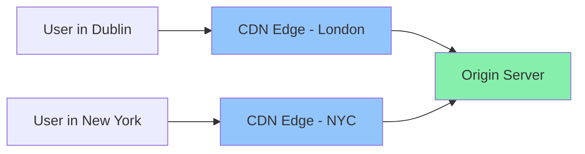
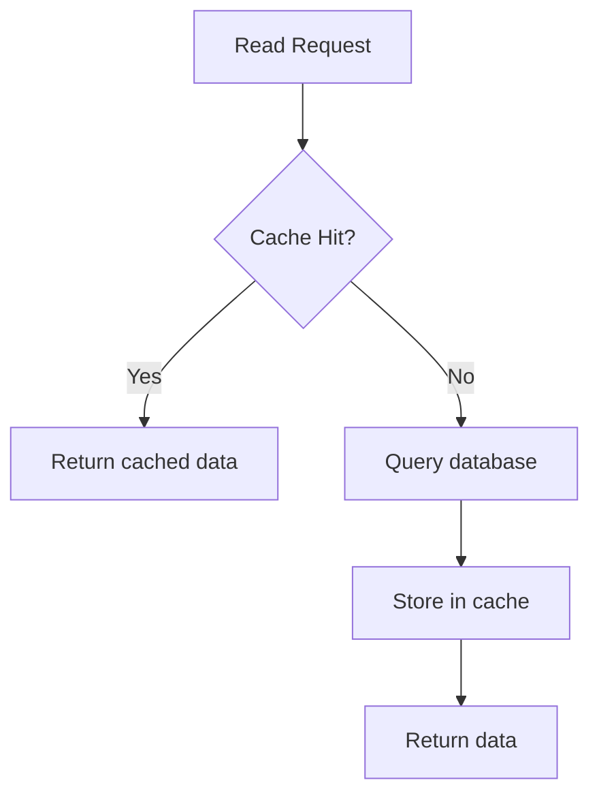
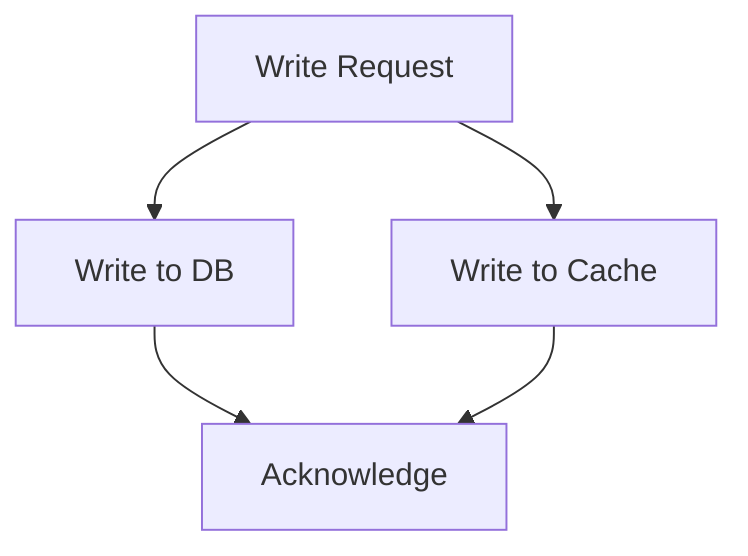
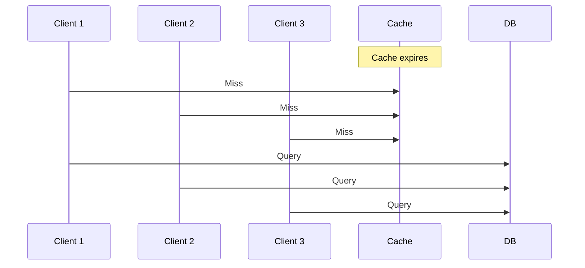

# Caching

Storing data closer to where it's needed — so you don't fetch it twice

---
layout: center
---

# Why Cache?

---
layout: default
---

# The Problem Without Caching

Every request hits the database or a downstream service — even for data that rarely changes.



> Same query, same data — but the database was hit twice.

---
layout: default
---

# With Caching



---
layout: default
---

# Benefits of Caching

- **Speed** — memory reads are orders of magnitude faster than DB queries
- **Reduced load** — fewer queries to your database or upstream services
- **Cost** — fewer compute/DB operations = lower infrastructure bills
- **Resilience** — cache can serve stale data if the DB is temporarily unavailable

---
layout: center
---

# Caching Methods

---
layout: default
---

# In-Memory Cache (Application-Level)

Data is stored in your application's own memory — the simplest form of caching.

```typescript
// Using a plain Map
const cache = new Map<string, { value: unknown; expiresAt: number }>();

function setCache(key: string, value: unknown, ttlMs: number) {
  cache.set(key, { value, expiresAt: Date.now() + ttlMs });
}

function getCache(key: string): unknown | null {
  const entry = cache.get(key);
  if (!entry || Date.now() > entry.expiresAt) {
    cache.delete(key);
    return null;
  }
  return entry.value;
}
```

---
layout: two-cols
---

# In-Memory Cache

## ✅ Pros

- Zero setup — no extra infrastructure
- Extremely fast (same process)
- Simple to implement

## ❌ Cons

- Lost on every app restart
- **Not shared** between multiple instances
- Grows unchecked without eviction logic
- Not suitable for large datasets

::right::

## When to use

- Single-instance applications
- Short-lived computed values
- Prototype or low-traffic services

## Popular libraries

- `node-cache` — TTL + stats built-in
- `lru-cache` — LRU eviction, bounded size
- Plain `Map` — for simple cases

---
layout: default
---

# Distributed Cache (e.g. Redis)

A dedicated caching server shared across all application instances.



```typescript
import { createClient } from "redis";

const client = createClient({ url: process.env.REDIS_URL });
await client.connect();

// Store with TTL of 60 seconds
await client.set("products:all", JSON.stringify(data), { EX: 60 });

// Retrieve
const cached = await client.get("products:all");
const products = cached ? JSON.parse(cached) : null;
```

---
layout: two-cols
---

# Distributed Cache (Redis / Memcached)

## ✅ Pros

- Shared across all app instances
- Survives individual app restarts
- Rich data structures (Redis)
- Pub/sub, queues, rate limiting (Redis)
- High throughput — microsecond latency

::right::

## ❌ Cons

- Extra infrastructure to set up and maintain
- Network hop adds latency (~1ms vs ~0.1µs)
- Serialisation/deserialisation overhead
- Additional failure point in your system
- Cost of running a cache server

## When to use

- Multi-instance / horizontally scaled apps
- Session storage
- Rate limiting
- Shared computed results

---
layout: default
---

# HTTP / Browser Caching

The browser (or a CDN) stores responses locally, avoiding repeat network requests entirely.

```http
HTTP/1.1 200 OK
Cache-Control: max-age=3600, public
ETag: "abc123"
Last-Modified: Thu, 13 Mar 2026 08:00:00 GMT
```

Key headers:

| Header | Purpose |
|---|---|
| `Cache-Control: max-age=N` | Cache for N seconds |
| `Cache-Control: no-store` | Never cache |
| `ETag` | Fingerprint — browser sends back to validate |
| `Last-Modified` | Date-based validation |

---
layout: two-cols
---

# HTTP / Browser Caching

## ✅ Pros

- Zero server load for cache hits
- No extra infrastructure
- Works automatically with CDNs
- Greatly improves frontend performance

::right::

## ❌ Cons

- Hard to invalidate immediately (max-age is fixed)
- Stale content can be served to users
- Different browsers cache differently
- `Cache-Control` misconfiguration leaks sensitive data

## When to use

- Static assets (JS, CSS, images)
- Publicly readable API responses
- Infrequently changing pages

---
layout: default
---

# CDN Caching

A Content Delivery Network stores responses on **edge nodes** geographically close to the user.



- First request hits origin, response cached at the edge
- Subsequent requests served from the edge — no trip to origin

---
layout: two-cols
---

# CDN Caching

## ✅ Pros

- Dramatically reduces latency for global users
- Reduces load on your origin servers
- Handles traffic spikes
- DDoS protection (many CDN providers)

::right::

## ❌ Cons

- Cost (paid CDN services)
- Cache invalidation is complex and sometimes slow
- Not suitable for user-specific / private data
- Debugging cache hits/misses can be tricky

## When to use

- Public websites and APIs
- Static assets
- Media files (images, video)
- High-traffic, globally distributed apps

---
layout: default
---

# Database Query Caching

Some databases (e.g. PostgreSQL with `pg_query_cache`, MySQL query cache) or ORMs can cache query results.

**Prisma with Redis — manual approach:**

```typescript
async function getExpenses(userId: string) {
  const cacheKey = `expenses:${userId}`;
  const cached = await redis.get(cacheKey);

  if (cached) {
    return JSON.parse(cached);
  }

  const expenses = await prisma.expense.findMany({ where: { userId } });
  await redis.set(cacheKey, JSON.stringify(expenses), { EX: 30 });
  return expenses;
}
```

> Most modern ORMs do **not** cache automatically — you must implement it.

---
layout: two-cols
---

# Database Query Cache

## ✅ Pros

- Avoids expensive aggregate or join queries
- Can be fine-grained (per-user, per-query)
- Works alongside any database

::right::

## ❌ Cons

- Cache invalidation is your responsibility
- Stale data risk if writes don't clear cache
- Adds complexity to your data layer
- MySQL's built-in query cache was **removed** in v8 due to bugs

## When to use

- Expensive read-heavy queries
- Data that changes infrequently
- Per-user computed results

---
layout: center
---

# Cache Invalidation

> "There are only two hard things in Computer Science: cache invalidation and naming things."
> — Phil Karlton

---
layout: default
---

# Cache Invalidation Strategies

How do you keep cached data fresh?

| Strategy | How it works |
|---|---|
| **TTL (Time to Live)** | Data expires after a fixed time — simplest approach |
| **Cache-Aside (Lazy)** | App checks cache; on miss, loads from DB and populates cache |
| **Write-Through** | Every write updates the DB **and** the cache simultaneously |
| **Write-Behind** | Write to cache first, asynchronously persist to DB |
| **Event-Driven** | An event (e.g. message queue) triggers cache invalidation |

---
layout: default
---

# Cache-Aside (Lazy Loading)

The most common pattern — the application manages the cache explicitly.



**Pros:** Only caches what's actually needed — no wasted memory  
**Cons:** First request is always slow (cold miss); stale data possible

---
layout: default
---

# Write-Through Cache

Every write goes to the DB and cache at the same time.



**Pros:** Cache is always up to date — no stale data  
**Cons:** Every write is slower; cache fills with data that may never be read

---
layout: center
---

# Cache Eviction Policies

What happens when the cache is full?

---
layout: default
---

# Eviction Policies Explained

| Policy | Description | Best for |
|---|---|---|
| **LRU** (Least Recently Used) | Evicts the item not accessed for the longest time | General purpose |
| **LFU** (Least Frequently Used) | Evicts the item accessed the fewest times | Popularity-biased data |
| **FIFO** (First In, First Out) | Evicts the oldest inserted item | Simple, predictable workloads |
| **TTL** | Evicts items after a fixed time, regardless of use | Time-sensitive data |
| **Random** | Evicts a random item | When access patterns are unpredictable |

> Redis default eviction policy: `noeviction` — returns an error when full.  
> Use `allkeys-lru` or `volatile-lru` for most production setups.

---
layout: default
---

# LRU in Practice (node lru-cache)

```typescript
import { LRUCache } from "lru-cache";

const cache = new LRUCache<string, string>({
  max: 500,        // Maximum number of items
  ttl: 1000 * 60, // TTL: 60 seconds
});

cache.set("user:42", JSON.stringify({ name: "Alice" }));

const user = cache.get("user:42");
// Automatically evicts least-recently-used when max is reached
```

---
layout: center
---

# Common Pitfalls

---
layout: default
---

# Cache Stampede (Thundering Herd)

When a popular cache entry expires, **many requests** hit the DB simultaneously.



**Solutions:** Lock / mutex on cache population, probabilistic early expiry, request coalescing

---
layout: default
---

# Stale Data

A cache hit returns **outdated** information after the source has changed.

- A product price changes in the DB — but users see the old price for 60 seconds
- A deleted user's session is still cached

**Mitigations:**
- Use short TTLs for rapidly changing data
- Bust the cache on write: `redis.del("products:all")` after an update
- Use versioned cache keys: `products:v2:all`

---
layout: default
---

# Caching Sensitive Data

⚠️ **Never cache** data that shouldn't be shared across users:

```typescript
// ❌ Wrong — all users share the same key
await redis.set("user-profile", JSON.stringify(profile), { EX: 60 });

// ✅ Correct — scoped to the user
await redis.set(`user-profile:${userId}`, JSON.stringify(profile), { EX: 60 });
```

- Always scope cache keys to the user or context
- Avoid caching responses with `Set-Cookie` headers via CDN
- Set `Cache-Control: private` for user-specific HTTP responses

---
layout: default
---

# Comparison Summary

| Method | Speed | Shared | Setup | Best For |
|---|---|---|---|---|
| In-Memory | ⚡⚡⚡ | ❌ | None | Single-instance, simple apps |
| Redis | ⚡⚡ | ✅ | Medium | Scaled apps, sessions |
| HTTP Cache | ⚡⚡⚡ | ✅ (public) | None | Static assets, public APIs |
| CDN | ⚡⚡⚡ | ✅ | Medium | Global, high-traffic apps |
| DB Query Cache | ⚡⚡ | ✅ | Medium | Heavy read queries |

---
layout: default
---

# Key Takeaways

- Caching trades **memory for speed** — use it for data that is expensive to fetch and infrequently changed
- **Cache-Aside** is the most common pattern in web APIs
- **TTL** is your first line of defence against stale data
- Always **scope cache keys** — never share user-specific data unintentionally
- **Cache invalidation** is hard — design your invalidation strategy before you build
- Monitor cache **hit rate** — a low hit rate means your cache isn't helping

---
layout: end
---

# Caching

Questions?
