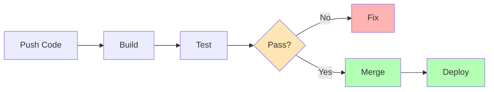

# CI/CD Fundamentals

Building, Testing, and Deploying with Confidence

---
layout: center
---

# What is CI/CD?

**Continuous Integration (CI)**
- Automatically build and test code changes
- Merge code frequently to main branch
- Detect integration issues early

**Continuous Delivery (CD)**
- Automatically preparing code for release
- Code is always deployment-ready
- Manual approval for production

---
layout: center
---

# Why Use CI/CD?

- **Fast Feedback** - Know immediately if code breaks
- **Reduced Risk** - Smaller changes easier to debug
- **Consistent Quality** - Automated tests every time
- **Faster Releases** - Eliminate manual steps
- **Better Collaboration** - Catch issues early

<!--
CI/CD transforms how teams work by automating repetitive tasks and providing rapid feedback on code quality and functionality.
-->

---
layout: two-cols
---

# Common CI/CD Providers

**Cloud-Based**
- GitHub Actions
- GitLab CI/CD
- CircleCI
- Travis CI
- Azure DevOps
- AWS CodePipeline

::right::

**Self-Hosted Options**
- Jenkins
- TeamCity
- Bamboo
- Drone CI
- Buildkite

**Most Popular for New Projects**: GitHub Actions (integrated) or GitLab CI/CD

---
layout: center
---

# What is GitHub Actions?

GitHub's built-in CI/CD platform that automates workflows directly in your repository.

**Key Features:**
- Triggered by GitHub events (push, PR, schedule)
- Runs on GitHub-hosted or self-hosted runners
- YAML-based configuration
- Free for public repos

**Location:** `.github/workflows/` directory

---

# Anatomy of a GitHub Actions Workflow

```yaml
name: CI Pipeline                    # Workflow name

on:                                  # Trigger events
  push:
    branches: [main]
  pull_request:

jobs:                                # One or more jobs
  build:
    runs-on: ubuntu-latest           # Runner environment
    
    steps:                           # Sequential steps
      - uses: actions/checkout@v4    # Pre-built action
      
      - name: Install dependencies   # Custom step
        run: npm install
      
      - name: Run tests
        run: npm test
```

---
layout: two-cols
---

# GitHub Actions Triggers

**Common Triggers:**
```yaml
on:
  push:
    branches: [main, develop]
  
  pull_request:
    types: [opened, synchronize]
  
  schedule:
    - cron: '0 0 * * *'
  
  workflow_dispatch:  # Manual
```

::right::

**When to Use:**
- `push` - Deploy to environments
- `pull_request` - Run tests, linting
- `schedule` - Nightly builds, cleanups
- `workflow_dispatch` - Manual deployments
- `release` - Publish packages
- `issue_comment` - Bot interactions

---
layout: two-cols
---

# GitHub Actions Marketplace

Reusable actions created by GitHub and the community.

**Popular Actions:**
- `actions/checkout@v4` - Clone repo
- `actions/setup-node@v4` - Setup Node.js
- `actions/upload-artifact@v4` - Save build outputs
- `codecov/codecov-action` - Upload coverage

::right::

**Using Actions:**
```yaml
steps:
  # Use specific version
  - uses: actions/checkout@v4
  
  # With parameters
  - uses: actions/setup-node@v4
    with:
      node-version: '20'
  
  # Multiple versions
  - uses: actions/cache@v4
    with:
      path: ~/.npm
      key: ${{ runner.os }}-npm
```

---

# Managing Secrets in Pipelines

**Why Secrets Management Matters:**
- API keys, passwords shouldn't be in code
- Different secrets per environment
- Secure access to external services
- Compliance and security requirements

**Best Practices:**
- Never commit secrets to version control
- Use secret stores
- Rotate secrets regularly
- Limit access with least privilege
- Audit secret usage

---

# Managing Secrets in GitHub

**GitHub Secrets Types:**
- **Repository** - One repo
- **Environment** - Per environment
- **Organization** - Shared across repos

**Using Secrets:**
```yaml
steps:
  - name: Deploy
    env:
      API_KEY: ${{ secrets.API_KEY }}
      DATABASE_URL: ${{ secrets.DATABASE_URL }}
    run: npm run deploy
```

**Set:** Settings → Secrets and variables → Actions

**Note:** Secrets are masked in logs!

---
layout: center
---

# Typical CI/CD Pipeline


---

# CI/CD Best Practices

**Speed & Efficiency:**
- Keep builds fast (< 10 minutes ideal)
- Run tests in parallel
- Fail fast - critical steps first

**Reliability:**
- Keep main branch always green
- Fix broken builds immediately
- Use branch protection rules

**Security:**
- Scan for vulnerabilities
- Never log sensitive information
- Use secrets management

---
layout: two-cols
---

# Common Challenges

**Flaky Tests**
- Tests that randomly fail
- Solution: Retry logic, better isolation

**Slow Builds**
- Long pipeline execution
- Solution: Caching, parallelization

**Secret Management**
- Handling credentials safely
- Solution: Built-in secret stores

::right::

**Environment Differences**
- "Works on my machine"
- Solution: Docker, consistent environments

**Debugging Failures**
- Hard to reproduce locally
- Solution: Good logging, artifacts

**Dependency Issues**
- Version conflicts
- Solution: Lock files, containers

---
layout: center
---

# Reading Build Logs

When a build fails:

1. **Check the failing step** - Which command failed?
2. **Read error messages** - Often clear about the issue
3. **Check previous successful builds** - What changed?
4. **Review recent commits** - New code causing issues?

---

# Branch Protection Rules

Enforce quality through GitHub settings:

**Typical Configuration:**
- ✅ Require pull request before merging
- ✅ Require status checks to pass (CI, tests, linting)
- ✅ Require branches to be up to date
- ✅ Require code review approval
- ✅ Dismiss stale reviews on new commits

**Result:** Can't merge broken code into main!

---
layout: two-cols
---

# Quality Gates

Define when builds should fail:

**Code Quality:**
- Linting errors
- Code coverage below threshold
- TypeScript errors
- Code complexity too high

**Testing:**
- Any test failure
- Coverage drops
- E2E test failures

::right::

**Security:**
- Known vulnerabilities
- Security scan failures

---
layout: center
---

# Challenge: Your First CI Pipeline

Time to put knowledge into practice!

---

# Exercise Task

**Goal:** Create a GitHub Actions workflow that validates code quality on every pull request.

**Scenario:**
Your team wants to ensure all code changes are:
- Properly formatted
- Free of linting errors  
- Passing all tests
- Maintains 80% code coverage for tests

**Your Task:** Build a CI pipeline that automatically checks these before allowing merges.

---

# Exercise Requirements

**Workflow Triggers:**
- Must run on pull request events
- Should run on pushes to `main` branches

**Success Criteria:** All steps must pass for the workflow to succeed

---

# Exercise Hints

**File Location:**
- Create workflow file in `.github/workflows/` directory
- Name it something like (e.g., `ci.yml` or `pr-checks.yml`)

**Useful Actions:**
- `actions/checkout@v4` - Clone repo
- `actions/setup-node@v4` - Setup Node.js

**Common Commands:**
- `npm install` or `npm ci` - Install dependencies

---
layout: center
---

# Key Takeaways

- **CI/CD automates** build, test, and deployment
- **Fast feedback** helps catch issues early
- **GitHub Actions** provides powerful CI/CD in `.github/workflows/`
- **Secrets management** keeps credentials secure
- **Branch protection + CI** prevents broken code merging
- **Caching** speeds up pipelines
- **Start simple** - add complexity as needed

---
layout: end
---

# Questions?

Time to set up your first GitHub Actions workflow!
