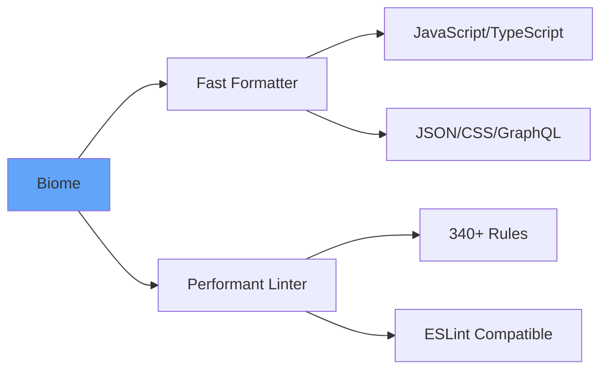
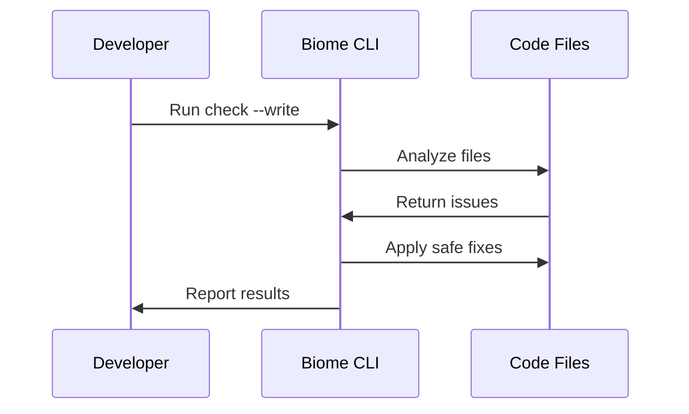

# Code Linting

Best Practices for Code Quality

---
layout: center
---

# What is Linting?

Linting is automated code analysis that enforces consistent formatting and style rules across your codebase.

**Key Features:**
- Automatic code formatting
- Style consistency enforcement
- Identifies style violations
- Maintains readable code

---
layout: two-cols
---

# Linting Rules

Rules define formatting and style standards:

**Code Formatting**
- Indentation (tabs vs spaces)
- Line length limits
- Spacing around operators

**Code Style**
- Quotes (single vs double)
- Semicolons (required or optional)
- Bracket placement

::right::

**Import Organization**
- Import order
- Grouping imports
- Removing unused imports

**Customizable**
- Enable/disable rules
- Configure preferences
- Team-specific standards

---
layout: center
---

# What is Biome?



Biome is a fast, all-in-one toolchain providing formatting and linting for web projects.

<!-- Biome replaces multiple tools (ESLint, Prettier) with a single, faster solution -->

---

# Biome Features

**Performance**
- 97% compatible with Prettier
- Faster than ESLint

**Language Support**
- JavaScript & TypeScript
- JSX & TSX
- JSON, CSS, HTML

**Developer Experience**
- Editor integration
- Clear error messages

---

# Using Biome in Node.js/TypeScript

**Installation**

```bash
npm install --save-dev @biomejs/biome
```

**Initialization**

```bash
npx @biomejs/biome init
```

Creates `biome.json` configuration file

---

# Biome Configuration

```json
{
  "$schema": "https://biomejs.dev/schemas/1.9.4/schema.json",
  "organizeImports": {
    "enabled": true
  },
  "linter": {
    "enabled": true,
    "rules": {
      "recommended": true
    }
  },
  "formatter": {
    "enabled": true,
    "indentStyle": "tab"
  }
}
```

🔗 [Full list of configuration options](https://biomejs.dev/reference/configuration/)

<!-- Configuration allows customizing formatter, linter, and import organization -->

---

# Running Biome

**Format Code**

```bash
npx @biomejs/biome format --write .
```

**Lint Code**

```bash
npx @biomejs/biome lint --write .
```

**Complete Check**

```bash
npx @biomejs/biome check --write .
```

**Recommended:**  Get the VS Code extension [here](https://biomejs.dev/reference/vscode/)

---
layout: center
---

# Automatic Fixes

Biome can automatically fix many issues:



**Safe Fixes:** Applied with `--write` flag
**Suggested Fixes:** Require manual review

---

# Automatic Fix Examples

**Before:**

```typescript
const  x=1
if (true) { console.log('test') }
let y='hello'
```

**After:**

```typescript
const x = 1;
if (true) {
	console.log("test");
}
let y = "hello";
```

<!-- Biome fixes spacing, indentation, quote style, and bracket placement -->

---

# Package.json Scripts

```json
{
  "scripts": {
    "format": "biome format --write .",
    "lint": "biome lint --write .",
    "check": "biome check --write .",
    "ci:check": "biome ci ."
  }
}
```

**Development:** Use `--write` for automatic fixes
**CI/CD:** Use `biome ci` for validation without changes

---
layout: center
---

# Key Takeaways

✅ **Linting enforces consistent code formatting**

✅ **Consistent style improves readability**

✅ **Biome provides fast formatting and linting**

✅ **Automatic fixes save development time**

✅ **Configure rules to match team standards**

---
layout: end
---

# Questions?

