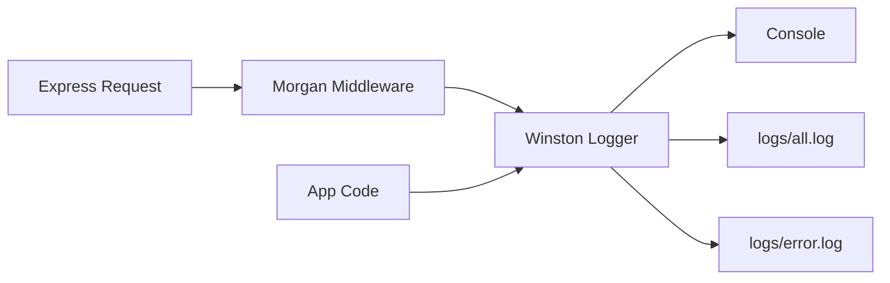

# Logging in TypeScript
## Node.js & Express with Winston + Morgan

---
layout: center
---

# Why Logging Matters

> *"Your logs are your eyes in production"*

- **Debugging** – understand what went wrong without a debugger
- **Monitoring** – track application health and performance
- **Auditing** – record important business events
- **Security** – detect and investigate incidents

---
layout: default
---

# The Problem with `console.log`

```typescript
// ❌ Don't do this
console.log("User logged in", userId);
console.log("DB error", error);
console.log("Request received");
```

**Problems:**
- No severity levels — everything looks the same
- No timestamps
- No file output — logs lost on server restart
- No environment-aware filtering

---
layout: default
---

# Log Levels

```typescript
// Severity order (lowest number = highest severity)
const levels = {
  error: 0,  // Something failed — needs immediate attention
  warn:  1,  // Unexpected but handled — degraded behaviour
  info:  2,  // Important business events — user login, order placed
  http:  3,  // Incoming HTTP requests (Morgan uses this)
  debug: 4,  // Detailed diagnostics for development
}
```

**Rule of thumb:** Production → `warn`, Development → `debug`

---
layout: two-cols-header
---

# What TO Log

::left::

**Application Events**
- Service startup / shutdown
- User authentication (login, logout, failed attempts)
- Important state changes
- Background job completions

::right::

**Technical Events**
- Unhandled errors with stack traces
- External API calls (URL, status, duration)
- Database query failures
- Performance warnings (slow queries)

---
layout: two-cols-header
---

# What NOT to Log

::left::

**Never Log Sensitive Data**
- Passwords or password hashes
- API keys / secret tokens
- Full credit card numbers
- Social security numbers

::right::

**Avoid Logging**
- Full request/response bodies (may contain PII)
- Session tokens or JWTs
- Personal identifiable information (PII)
- Medical or financial records

<!-- 
OWASP A09 – Security Logging & Monitoring Failures.
Logging sensitive data creates a secondary attack surface.
If logs are compromised, so is the data within them.
-->

---
layout: default
---

# Logging Best Practices

- **Use structured logging** — log as JSON in production for easy parsing
- **Add context** — include user ID, request ID, correlation IDs
- **Be consistent** — same format, same level conventions throughout
- **Don't over-log** — avoid logging in tight loops or hot paths
- **Rotate logs** — prevent disk exhaustion with log rotation
- **Secure your logs** — treat log files as sensitive data

---
layout: center
---

# Setting Up Winston

```bash
npm install winston
```

Winston provides:
- Custom log levels & colours
- Multiple transports (console, file, external services)
- Flexible formatting (JSON, plaintext, timestamps)
- Environment-aware log level filtering

---
layout: default
---

# `src/lib/logger.ts` — Levels & Colours

```typescript
import winston from 'winston'

const levels = {
  error: 0,
  warn:  1,
  info:  2,
  http:  3,
  debug: 4,
}

const colors = {
  error: 'red',
  warn:  'yellow',
  info:  'green',
  http:  'magenta',
  debug: 'white',
}

winston.addColors(colors)
```

---
layout: default
---

# `src/lib/logger.ts` — Dynamic Level by Environment

```typescript
// Show all logs in development; only warn+ in production
const level = () => {
  const env = process.env.NODE_ENV || 'development'
  return env === 'development' ? 'debug' : 'warn'
}
```

| Environment | Min Level | What You See |
|---|---|---|
| `development` | `debug` | Everything |
| `production` | `warn` | Warnings & errors only |

---
layout: default
---

# `src/lib/logger.ts` — Format & Transports

```typescript
const format = winston.format.combine(
  winston.format.timestamp({ format: 'YYYY-MM-DD HH:mm:ss:ms' }),
  winston.format.colorize({ all: true }),
  winston.format.printf(
    (info) => `${info.timestamp} ${info.level}: ${info.message}`
  ),
)

const transports = [
  new winston.transports.Console(),
  new winston.transports.File({ filename: 'logs/error.log', level: 'error' }),
  new winston.transports.File({ filename: 'logs/all.log' }),
]
```

---
layout: default
---

# `src/lib/logger.ts` — Export the Logger

```typescript
const Logger = winston.createLogger({
  level: level(),
  levels,
  format,
  transports,
})

export default Logger
```

**Usage anywhere in your app:**

```typescript
import Logger from './lib/logger'

Logger.error('Database connection failed', { host: dbHost })
Logger.warn('Deprecated endpoint called')
Logger.info('User logged in', { userId })
Logger.debug('Computed result', { value })
```

---
layout: default
---

# Example log output (development)

```
2024-01-15 10:23:45:123 error: This is an error log
2024-01-15 10:23:45:124 warn:  This is a warn log
2024-01-15 10:23:45:125 info:  This is an info log
2024-01-15 10:23:45:126 http:  GET /users 200 - 12 ms
2024-01-15 10:23:45:127 debug: This is a debug log
```

- Each line is coloured by severity
- All logs written to `logs/all.log`
- Only errors written to `logs/error.log`

---
layout: center
---

# HTTP Request Logging with Morgan

```bash
npm install morgan @types/morgan
```

Morgan is an Express middleware that:
- **Automatically logs every HTTP request**
- Integrates with Winston via a custom stream
- Can be skipped in production

---
layout: default
---

# `src/config/morganMiddleware.ts`

```typescript
import morgan, { StreamOptions } from 'morgan'
import Logger from '../lib/logger'

// Route Morgan output through Winston's http level
const stream: StreamOptions = {
  write: (message) => Logger.http(message),
}

// Only log requests in development
const skip = () => {
  const env = process.env.NODE_ENV || 'development'
  return env !== 'development'
}

const morganMiddleware = morgan(
  ':method :url :status :res[content-length] - :response-time ms',
  { stream, skip }
)

export default morganMiddleware
```

---
layout: default
---

# Wiring Morgan into Express

```typescript
import express from 'express'
import Logger from './lib/logger'
import morganMiddleware from './config/morganMiddleware'

const app = express()
const PORT = process.env.PORT || 3000

// Register Morgan before your routes
app.use(morganMiddleware)

app.get('/health', (_, res) => {
  Logger.info('Health check called')
  res.json({ status: 'ok' })
})

app.listen(PORT, () => {
  Logger.info(`Server running on http://localhost:${PORT}`)
})
```

---
layout: default
---

# Morgan Token Format

```
:method :url :status :res[content-length] - :response-time ms
```

**Produces logs like:**

```
GET  /api/users     200  342 - 23 ms
POST /api/users     201  128 - 45 ms
GET  /api/users/99  404  48  - 8 ms
DELETE /api/users/1 403  60  - 5 ms
```

Each request is automatically logged — no manual `Logger.http()` calls needed.

---
layout: default
---

# Project Structure

```
src/
├── lib/
│   └── logger.ts          # Winston logger configuration
├── config/
│   └── morganMiddleware.ts # Morgan HTTP request logger
├── routes/
│   └── userRoutes.ts
├── controllers/
│   └── userController.ts
└── index.ts               # Register morganMiddleware here
logs/
├── all.log                # All log levels
└── error.log              # Errors only
```

---
layout: default
---

# Security Considerations

```typescript
// ❌ Never log sensitive data
Logger.info(`User login attempt`, { 
  email, 
  password, // NEVER log passwords
  token,    // NEVER log tokens
})

// ✅ Log only what you need
Logger.info('User login attempt', { 
  email,
  ip: req.ip,
  userAgent: req.headers['user-agent'],
})
```

- Add `logs/` to `.gitignore` — never commit log files
- Apply file permissions: `chmod 640 logs/*.log`
- Consider a log management service (Datadog, Splunk) for production

---
layout: default
---

# Environment-Specific Configuration

| Setting | Development | Production |
|---|---|---|
| Log Level | `debug` | `warn` |
| Console output | ✅ Coloured | ✅ JSON |
| File output | ✅ | ✅ |
| HTTP request logs | ✅ All | ❌ Skipped |
| Stack traces | ✅ Full | ✅ Full |
| PII in logs | ❌ Never | ❌ Never |

---
layout: default
---

# Summary



- **Winston** — structured, level-aware application logging
- **Morgan** — automatic HTTP request/response logging
- Together they give you complete observability into your Express app

---
layout: default
---

# Key Takeaways

- Replace all `console.log` with Winston log levels
- Use `info` for business events, `error` for failures, `debug` for diagnostics
- Morgan handles HTTP request logging automatically — don't do it manually
- **Never log passwords, tokens, or PII**
- Adjust log verbosity by environment via `NODE_ENV`
- Add `logs/` to `.gitignore`

---
layout: center
---

# Further Reading

- [Winston documentation](https://github.com/winstonjs/winston)
- [Morgan documentation](https://github.com/expressjs/morgan)
- [Article: Better logs for Express with Winston & Morgan](https://dev.to/vassalloandrea/better-logs-for-expressjs-using-winston-and-morgan-with-typescript-516n)
- [OWASP: Security Logging and Monitoring Failures](https://owasp.org/Top10/A09_2021-Security_Logging_and_Monitoring_Failures/)

---
layout: end
---

# Happy Logging! 🪵
