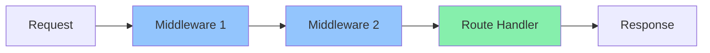

# Middleware in Express

Functions that sit between the request and your route handler

---
layout: center
---

# What is Middleware?

A middleware function runs **during** the request-response cycle — before your route handler sends a response.



---
layout: default
---

# The Middleware Signature

Every middleware function receives three arguments:

```typescript
function myMiddleware(req: Request, res: Response, next: NextFunction) {
  // Do something with the request or response
  next(); // Pass control to the next middleware
}
```

- `req` — the incoming request
- `res` — the outgoing response
- `next` — call this to move to the next middleware

> Forgetting to call `next()` will leave the request hanging.

---
layout: center
---

# Types of Middleware

---
layout: two-cols
---

# Built-in Express Middleware

Express ships with middleware you can use immediately.

**Parse JSON request bodies:**
```typescript
app.use(express.json());
```

**Parse HTML form submissions:**
```typescript
app.use(express.urlencoded({ extended: true }));
```

::right::

**Serve static files:**
```typescript
app.use(express.static("public"));
```

**Example — `express.json()` in action:**
```typescript
app.post("/expenses", (req, res) => {
  // Without express.json(), req.body is undefined
  const { amount, description } = req.body;
  res.json({ amount, description });
});
```

---
layout: default
---

# Middleware Order Matters

Middleware runs **top to bottom**, in the order you register it.

```typescript
app.use(express.json());       // ✅ Parses body first
app.use(logRequests);          // ✅ Then logs
app.use("/expenses", router);  // ✅ Then handles routes
```

```typescript
app.use("/expenses", router);  // ❌ Runs before body is parsed
app.use(express.json());       // Too late — req.body is undefined
```

> Always register body parsers and authentication middleware **before** your routes.

---
layout: default
---

# Writing Custom Middleware

```typescript
import { Request, Response, NextFunction } from "express";

function logRequests(req: Request, res: Response, next: NextFunction) {
  console.log(`${req.method} ${req.path}`);
  next();
}

// Register for all routes
app.use(logRequests);

// Or for a specific route only
app.use("/expenses", logRequests);
```

---
layout: default
---

# Real-World Example — Validation Middleware

The validation middleware from the [API Validation with Zod slides](../../week-1/part-4/part-5/validation/validation.md) is custom middleware in action:

```typescript
// src/middleware/validate.ts
export function validateBody(schema: ZodSchema): RequestHandler {
  return (req, res, next) => {
    const result = schema.safeParse(req.body);
    if (!result.success) {
      res.status(400).json({ errors: result.error.issues.map(...) });
      return;
    }
    req.body = result.data; // replace with validated, typed data
    next();                 // pass control to the route handler
  };
}
```

```typescript
// Used in the router — runs before the controller
router.post("/", validateBody(CreateExpenseSchema), controller.create.bind(controller));
```

> The same `req → middleware → next() → handler` pattern, applied to input validation.

---
layout: two-cols
---

# Application vs Route Middleware

**Application-level** — applies to every request:

```typescript
const app = express();

app.use(express.json());
app.use(logRequests);
```

**Router-level** — scoped to a specific router:

```typescript
const router = express.Router();

router.use(requireAuth);

router.get("/", getExpenses);
router.post("/", createExpense);
```

::right::

**When to use each:**

| Scope | Use for |
|---|---|
| App-level | Parsing, logging, CORS |
| Router-level | Auth, per-feature logic |
| Route-level | Validation ([see Zod slides](../../week-1/part-4/part-5/validation/validation.md)) |

---
layout: center
---

# Error Handling Middleware

---
layout: default
---

# The Error Handler Signature

Error handling middleware takes **four** parameters — Express identifies it by the extra `err` argument.

```typescript
function errorHandler(
  err: Error,
  req: Request,
  res: Response,
  next: NextFunction
) {
  console.error(err.message);
  res.status(500).json({ error: "Something went wrong" });
}

// Must be registered LAST
app.use(errorHandler);
```

> Call `next(err)` from any middleware or route to skip to the error handler.

---
layout: default
---

# Passing Errors to the Handler

```typescript
router.get("/:id", async (req, res, next) => {
  try {
    const expense = await expenseService.getById(req.params.id);
    res.json(expense);
  } catch (err) {
    next(err); // Forwards to your error handler
  }
});
```

```typescript
// Error handler picks it up
function errorHandler(err: Error, req: Request, res: Response, next: NextFunction) {
  res.status(500).json({ error: err.message });
}
```

---
layout: center
---

# Common Third-Party Middleware

---
layout: two-cols
---

# cors & helmet

**`cors`** — allow cross-origin requests (needed when frontend and backend run on different ports):

```bash
npm install cors
npm install -D @types/cors
```

```typescript
import cors from "cors";

app.use(cors({ origin: "http://localhost:3000" }));
```

::right::

**`helmet`** — sets secure HTTP response headers automatically:

```bash
npm install helmet
```

```typescript
import helmet from "helmet";

app.use(helmet());
```

> Use both on every Express app — they're small, zero-config wins.

---
layout: default
---

# morgan — HTTP Request Logging

Logs every request with method, path, status code, and response time.

```bash
npm install morgan
npm install -D @types/morgan
```

```typescript
import morgan from "morgan";

// "dev" format: coloured output, good for development
app.use(morgan("dev"));

// "combined" format: Apache-style, good for production
app.use(morgan("combined"));
```

**Example output:**
```
GET /expenses 200 12.345 ms - 512
POST /expenses 201 8.102 ms - 128
```

---
layout: default
---

# Putting It All Together

```typescript
import "dotenv/config";
import express from "express";
import cors from "cors";
import helmet from "helmet";
import morgan from "morgan";
import { expenseRouter } from "./routes/expenseRouter.js";
import { errorHandler } from "./middleware/errorHandler.js";

const app = express();

// Security & utility middleware — registered first
app.use(helmet());
app.use(cors({ origin: process.env.FRONTEND_URL }));
app.use(morgan("dev"));
app.use(express.json());

// Routes
app.use("/expenses", expenseRouter);

// Error handler — always last
app.use(errorHandler);

app.listen(process.env.PORT ?? 3000);
```

---
layout: default
---

# Summary

| Middleware | Purpose | Register |
|---|---|---|
| `express.json()` | Parse JSON request bodies | Before routes |
| `express.urlencoded()` | Parse form submissions | Before routes |
| `helmet()` | Secure HTTP headers | First |
| `cors()` | Allow cross-origin requests | Before routes |
| `morgan()` | Log HTTP requests | Before routes |
| Error handler | Catch and respond to errors | Last |

---
layout: end
---

# Questions?
