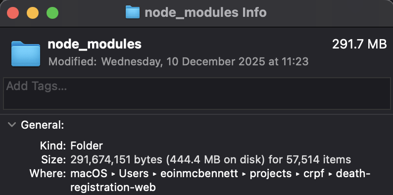

# APIs 
Foundations for building HTTP services with Node and Express

---

# How Node projects work
- `package.json` - defines project information, scripts, and dependency ranges for npm to install
- `node_modules` - folder that holds all the dependencies your project needs
> Dependencies are other projects that your project needs to run

- Dev tooling npm/yarn/pnpm
- `npm` or the "Node Package Manager" is the one we'll be using
- Others exist but function largely the same way

- Package managers provide the tools for you to install dependencies in your project

---

# Common commands
- `npm install` - Installs all project dependencies listed in `package.json`
- `npm run <Your command here>` - Runs the script listed in your `package.json`
- `npm install <x>` - Installs the dependency from the npm registry
- `npm install <x> --save-dev` - Saves the dependency as dev only. We'll cover more on this in the coming weeks

---

# Git Etiquette
How to manage node projects in Git

Check the size of the node modules folder on any of your projects




Use `` to embed an image in Markdown.

---

# Git Etiquette

## Do you think `node_modules` should be comitted?

---

# Git Etiquette
- Since we can rebuild the `node_modules` folder with `npm install` we don't need to commit it!
- Having to dodge accidentally adding this to git with `git add` is a pain
- Git gives us a way around this thankfully

---

# Git Etiquette
- Since we can rebuild the `node_modules` folder with `npm install` we don't need to commit it!
- Having to dodge accidentally adding this to git with `git add` is a pain
- Git gives us a way around this thankfully

## .gitignore
This is a special file containing a list of file paths git will ignore when using `git add`

We use it to stop people accidentally comitting `node_modules`

Any file that doesn't belong in our repository should be ignored!

See [this](https://www.atlassian.com/git/tutorials/saving-changes/gitignore) guide for more info 

---

# Setting up a Node project with Typescript

### Guide to setup the project will be in our teams chat!

We'll just focus on getting you guys setup with typescript running

Don't worry about unit testing frameworks or linters for now.

Make sure when you run `npm init -y` your in the root folder of your project!

e.g `team5-lib-back-app`

---

# What are APIs
- Application Programming Interfaces expose ways of interacting with other services from your code.

A nice analogy is a restaurant

You don't necessarily know or care how the food is made

You just know what you can order and what you're going to get back

## 
- You've probably encountered alot of APIs so far without realising.

- Libraries you use in your code expose APIs for you to use their functionality easily

- Most of the apps on your phone or websites you use consume APIs to deliver content to you

---

# What is Express?
- Lightweight Node framework that allows you to handle HTTP requests and respond to them
- Very easy to get started, `const app = express();`
- Define http routes like this:
```typescript
app.get('/books', () => {
    // Fetch information
    // Return information
});
```

- This reads almost like plain english!
- Express is very flexible with how requests are handled, you can define middleware etc that can run for all requests.
- For now we'll just be focusing on creating basic endpoints

---

# Installing Express
Run these commands in your project

`npm install express && npm install -D @types/express`

Replace the content of you src.ts with this and run your app

```typescript
import express from 'express';
import { Request, Response, NextFunction } from 'express';

const app = express();
const port = 3000

app.use(express.json());

app.get('/', (req: Request, res: Response, next: NextFunction) => {
  res.send('Hello world!');
});

app.listen(port, () => {
  console.log(`App listening on port ${port}`);
})
```

Try hit `http://localhost:3000/` with a GET request in insomnia and check the result!

---

# General structure of Express API projects
- `src/` - All typescript source code
    - `controller` - API controllers, the actual endpoint definitions
    - `service` - Usually wrappers for business logic / external systems. e.g User Service
    - `model` - Holds classes that represent your application data
    - `dao` - Data access objects, hold the logic to interact with your database
- `test/`
    - Every src folder usually has a counterpart here where their tests are located.

This can differ between projects, these are just the most common layouts I've seen

---

# REST principles
6 guiding principles for REST APIs

---

# Uniform interface
- Use clear nouns like `/book` or `/user` so everyone can find the same thing.
- Keep url formatting consistent.

- If `GET book/1` returns a book with id 1 then `GET loan/1` should return the loan with ID 1

Keeping this stuff consistent will help you later!

---

# Client and Server
- The client builds the UI, the server owns the data and business rules.
- This keeps the client and the server simplified and their responsibilities clearly defined

Your client application wouldn't go and connect directly to your database to make a change.

This allows you to develop these applications in paralel.

---

# Stateless requests
- Don't store session state on the server; treat each request as a new thing.
- Send authentication, pagination, and any other info the server needs inside the request from the client.
- Stateless APIs are easier to scale, retry and debug when something goes wrong.

---

# Cache smartly
- Decide if the data your sending back is cacheable
- Mark a response as cacheable when its data can be reused safely.
- Clients can then skip repeat calls for the same info, which speeds up the app.
- Update or remove cached data anytime the original resource changes.

- Can use some HTTP headers to accomplish this for the client or some projects might have a custom solution on the backend in some instances

---

# Layered systems keep things predictable
- Build with layers (e.g., security, routing, business logic) so each layer has one job.
- Clients talk only to the first layer they see, so intermediaries can add monitoring or retries.
- Swap or update layers without forcing a client change.

A client application might only be able to talk to one API, but that API might talk to any number of other services the client can't see.

---

# Optional: code on demand
- Servers can send tiny scripts or helpers so the client can gain new features without redeploying.
- This is optional; your API should still work if the client never runs this code.

- Not widely used at all, would likely be a very easy target for a hacker.

---

# Any Questions?

