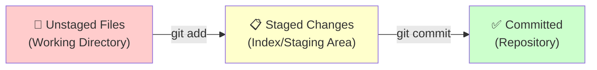

# Using Git

---

## What is source control?

Source control is the practice of managing changes to source code over time. 

It allows developers to collaborate, track changes, and maintain a history of modifications to their codebase. 

Git is one of the most widely used version control systems.

Other examples include Subversion, Mercurial, CVS.

Don't worry about these at all we'll just need git

---

## Most Used Git Commands
- `git clone` - Pull a repository down to your local machine
- `git add <files>` - Stage files to be comitted
- `git commit -m "<message>"` - Create a commit with the message provided
- `git status` - See the status of your workspace, what files are stages, modified etc
- `git log` - See the commit history, --oneline to clean it up a bit

---

## git commit
Probably the most used command

`git commit -m "Added functionality"` - Takes anything you've staged with git add and commit it with that message

`git add <>` is required before this will work! 
---

## git add

`git add <>` - Stages files to be committed. Used to select which changes you want to include in your next commit.


## How do I specify the files to add in git add?

- `git add ./src/controller/UserController.ts` - Stages a single file at this directory
- `git add ./src/model/` - Stages all changes in the folder `/src/model`
- `git add .` - Stages every changed file in the repository. **BE CAREFUL!**

What happens if I accidentally stage something I didn't mean to?
---

## git reset
The opposite to git add

- `git reset ./src/controller/UserController.ts` - Unstages a single staged file at this directory
- `git reset ./src/model/` - Unstages all staged files in the folder `/src/model`
- `git reset .` - Unstages every staged file in the repository.

**BE EVEN MORE CAREFUL !!!**
git reset has a very powerful alter ego

This isn't just used for unstaging files. git reset can be used to entirely reset your workspace to a specific commit or branch

- `git reset --hard` - Forces your current branch to be exactly like the remote one, regardless of your local state.

This is how you lose work! ^ 
---

## git log
A nice way of seeing commit history quickly
- `git log --oneline` - Shows each commit on a single line


---

## Exercise 1 - Committing and History

**Task:** Create a local repository and practice the basic Git workflow

1. Create a new folder called `git-practice` and open it in vs code
2. Initialize a Git repository: `git init`
3. Create a file `README.md` with some text
4. Check the status: `git status` (file should be unstaged)
5. Stage the file: `git add README.md`
6. Check status again: `git status` (file should be staged)
7. Commit: `git commit -m "Add README"`
8. Make changes to `README.md`, add more text
9. Use `git add .` to stage all changes
10. Commit again: `git commit -m "Update README"`
11. View your history: `git log --oneline`

---

## Remote Repositories

A remote repository is a version of the project hosted on the internet, separate from your local machine.

Remote repositories are often the source of truth, especially true for branches like main / master etc...

Often have a branch that is protected (can't be pushed to locally)

**Popular platforms:** GitHub, GitLab, Bitbucket, Azure DevOps

**Key commands:**
- `git clone <url>` - Copy a remote repository to your machine
- `git push` - Upload your local commits to the remote
- `git pull` - Download changes from the remote

Next we're going to setup your laptops to be able to interact with remote repositories on github

---

## Step 1: Generating an SSH Key

Open a terminal and run the following commands

`ssh-keygen -t ed25519 -C "your.name@kainos.com"`
Accepts the defaults for now by pressing enter.

*It's good practice to set a password on these keys but I wouldn't for now! Please do this if your project needs an ssh for git access*

If that command worked you be able to run this command and see your public key

`cat ~/.ssh/id_ed25519.pub`

Copy everything the whole output of this command and head over to github

---

## Adding a Key to GitHub
- On github, click your profile picture on the top right.
- Head to settings > SSH and GPG keys
- You should see this screen > Selet New SSH Key


---

## SSH Key Form

Add your public key here
<br>
**Once it's added you'll need to go back to the previous page and Configure SSO for the Kainos organisation**


---

## Exercise 2 - Remote Repositories

**Task:** Push your Exercise 1 repository to GitHub

1. Create a new repository on GitHub (don't initialize with README)
2. In your `git-practice` folder, add the remote:
   ```bash
   git remote add origin git@github.com:YOUR_USERNAME/git-practice.git
   ```
3. Rename your branch to main (if needed):
   ```bash
   git branch -M main
   ```
4. Push your commits to GitHub:
   ```bash
   git push -u origin main
   ```
5. Visit your GitHub repository URL to verify your commits are there
6. Make another commit locally, then push it:
   ```bash
   git push
   ```

Your code from Exercise 1 should now be visible on GitHub!

---

## Branching

Think of a branch as a **parallel line of development**. Imagine your code as a tree trunk:
- **main/master** - The stable trunk (production code)
- **Branches** - Separate branches growing from the trunk

**Why branch?**
- **Isolate work** - Work on features without affecting anyone
- **Parallel development** - Multiple developers work on different features simultaneously
- **Experiment safely** - Try new ideas without breaking the main code
- **Code review** - Changes are reviewed before merging back

**Common branch types:**
- `main` - Production-ready code
- `feature/user-auth` - Feature branches (work on specific features)
- `bugfix/login-error` - Bug fix branches

---

## Pull Requests
This is the mechanism we use to get our changes into main!

You push your local branch to github and raise a PR in which:
- Automated check run linters, unit tests, vulnerability scans (CI/CD pipelines)
- You get reviews from your team.
- ~~You get roasted!~~
- Your code gets merged to main and eventually released!

After this process everyone on your team now has your changes.

---

## A quick note on Code reviews
Getting comments on your code can feel a bit demotivating. It's never personal, always take it constructively.

Treat code reviews as a way to expand your own knowledge.

Be proactive in reviewing other developers code!

Don't be afraid to reply to comments with extra info if it's necessary, or add your own comments.

If you need to make changes make sure you resolve the comment they relate to.

---

## git branch

The `git branch` command is used to **create, list, and manage branches** in your repository.

**List all branches:**
```bash
git branch              # List local branches
```

**Create a new branch:**
```bash
git checkout -b feature-login      # Create and switch to new branch
```

**Switch to a branch:**
```bash
git checkout feature-login   # Switch to existing branch
```

**Rename a branch:**
```bash
git branch -m old-name new-name    # Rename a branch
```

---

## Merging vs Rebasing

**Merging** preserves all history by creating a merge commit. Best for shared branches and collaboration.

**Rebasing** replays commits on a different base for a cleaner linear history. Best for local branches.

```bash
# Merge
git checkout main
git merge feature-branch

# Rebase
git checkout feature-branch
git rebase main
```

**Rule:** Merge for shared branches, rebase for local branches.

---

## Squashing
Squashing is a technique used to tidy up your commit history on your feature branch.

It can be quite difficult to review a feature branch with lots of commits

Use `git log --oneline` to see how many commits you want to squash, the case below it would be 3
```markdown
23abc32 - fix
5342344 - whoops
324bcde - CRPF3-3000 Fixed field not saving issue
```

Use `git rebase -i HEAD~3` to start an interactive rebase

In whatever texteditor opens you'll want to change the word `pick` to `f` (fixup) for the fix and whoops commit. 

This 'squashes' the commits marked with fixup into the first available commit with pick

In this example any changes made in fix and whoops would not be part of CRPF3-3000

You will likely need to force push after doing this `git push -f`

**ONLY DO THIS IF YOU'RE THE ONLY DEVELOP WORKING ON A BRANCH!!**

---

## Exercise 3 - Branches & Pull Requests

1. Create a feature branch: `git checkout -b feature/add-features`
2. Modify your `README.md` 
3. Commit: `git add . && git commit -m ""`
4. Push: `git push -u origin feature/add-features`
5. Create a Pull Request on GitHub
6. Merge the PR
7. Pull changes: `git checkout main && git pull`

---

## Useful Tips
- Commit early and often
- Rebase or merge master / main into your branch daily so you don't fall behind!
- `git commit --amend` can be used to add any files you've put in git add to last commit
- If your git merge / rebase goes horrible wrong use `git <merge or rebase> --abort`
- Review your own changes before raising a PR
- Keep you commit messages clear and to the point
- Pull before you push when working on shared branches

## Useful Resources
- [Atlassian Git Cheat sheet](https://www.atlassian.com/git/tutorials/atlassian-git-cheatsheet)
- [Oh Shit, Git!?!](https://ohshitgit.com/)
---
layout: end
---

# Questions?
