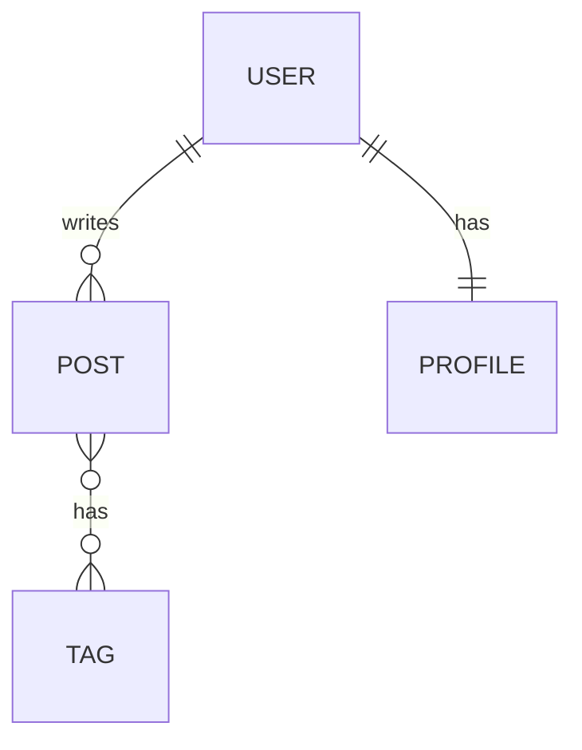

# Databases

An Introduction to Database Systems and SQL

---

# Types of Database

- **Relational Databases** - Structured data in tables (PostgreSQL, MySQL, SQL Server)
- **NoSQL Databases** - Flexible schema for unstructured data (MongoDB, Redis, Cassandra)
- **Graph Databases** - Relationship-focused storage (Neo4j, ArangoDB)
- **Time-Series Databases** - Optimized for time-stamped data (InfluxDB, TimescaleDB)

We'll be focusing on PostgreSQL throughout the academy

<!--
Different database types serve different purposes. Relational databases are best for structured data with clear relationships. NoSQL is great for flexible, scalable applications. Graph databases excel at relationship queries. Time-series databases are optimized for metrics and IoT data.
-->

---

# Relationships

- **One-to-One** - Single record relates to single record
- **One-to-Many** - Single record relates to multiple records
- **Many-to-Many** - Multiple records relate to multiple records



<!--
Understanding relationships is crucial for database design. One-to-one is rare (like User-Profile). One-to-many is common (User has many Posts). Many-to-many requires junction tables (Posts have many Tags, Tags have many Posts).
-->

---

# Normalisation

Database design technique to reduce redundancy and improve data integrity

- **1NF** - Atomic values, no repeating groups
- **2NF** - 1NF + no partial dependencies
- **3NF** - 2NF + no transitive dependencies

Benefits: Eliminates redundancy, ensures consistency, simplifies updates

<!--
Normalisation organizes data efficiently. Each normal form builds on the previous one. While fully normalized databases are ideal for consistency, sometimes denormalization is used for performance in read-heavy applications.
-->

---

# First Normal Form (1NF)

**Rules:**
- Each column contains atomic (indivisible) values
- No repeating groups or arrays
- Each row must be unique

**Before 1NF:**
```
Student | Courses
--------|------------------
John    | Math, Science, Art
```

**After 1NF:**
```
Student | Course
--------|--------
John    | Math
John    | Science
John    | Art
```

<!--
1NF is the foundation of normalization. Atomic means each cell has only one value - no lists or arrays. Every row must be uniquely identifiable, typically through a primary key. This makes the data queryable and maintainable.
-->

---

# Second Normal Form (2NF)

**Rules:**
- Must be in 1NF
- Remove partial dependencies
- Non-key attributes must depend on entire primary key

**Before 2NF (composite key: StudentID, CourseID):**
```
StudentID | CourseID | StudentName | CourseName
----------|----------|-------------|------------
1         | 101      | John        | Math
1         | 102      | John        | Science
```

**After 2NF:**
```
Students: StudentID | StudentName
Courses:  CourseID  | CourseName
Enrollment: StudentID | CourseID
```

<!--
2NF eliminates partial dependencies where non-key attributes depend on only part of a composite key. If StudentName depends only on StudentID (not the full key), it should be in a separate table. This prevents update anomalies.
-->

---

# Third Normal Form (3NF)

**Rules:**
- Must be in 2NF
- Remove transitive dependencies
- Non-key attributes must depend only on primary key

**Before 3NF:**
```
StudentID | Name | Department | DepartmentHead
----------|------|------------|---------------
1         | John | CS         | Dr. Smith
2         | Jane | CS         | Dr. Smith
```

**After 3NF:**
```
Students: StudentID | Name | DepartmentID
Departments: DepartmentID | Department | DepartmentHead
```

<!--
3NF eliminates transitive dependencies where non-key attributes depend on other non-key attributes. DepartmentHead depends on Department, not StudentID, so it belongs in a separate table. This prevents data inconsistencies and redundancy.
-->

---
layout: center
---

# SQL

Structured Query Language

---

# DDL

**Data Definition Language** - Define and modify database schema

```sql
-- Create table
CREATE TABLE users (
    id SERIAL PRIMARY KEY,
    email VARCHAR(255) UNIQUE NOT NULL,
    created_at TIMESTAMP DEFAULT NOW()
);

-- Alter table
ALTER TABLE users ADD COLUMN username VARCHAR(50);

-- Drop table
DROP TABLE users;
```

<!--
DDL commands define the structure of your database. CREATE makes new tables, ALTER modifies existing ones, DROP deletes them. These operations affect the schema, not the data itself.
-->

---

# DML

**Data Manipulation Language** - Modify data within tables

```sql
-- Insert data
INSERT INTO users (email, username) 
VALUES ('user@example.com', 'johndoe');

-- Update data
UPDATE users SET username = 'janedoe' 
WHERE email = 'user@example.com';

-- Delete data
DELETE FROM users WHERE id = 1;
```

<!--
DML commands work with the actual data. INSERT adds new records, UPDATE modifies existing ones, DELETE removes them. Always be careful with UPDATE and DELETE - use WHERE clauses to avoid affecting all rows.
-->

---

# DQL

**Data Query Language** - Retrieve data from database

```sql
-- Simple query
SELECT * FROM users WHERE username LIKE 'john%';

-- Join query
SELECT users.username, posts.title 
FROM users 
JOIN posts ON users.id = posts.user_id;

-- Aggregation
SELECT COUNT(*) as total_users FROM users;
```

<!--
DQL is focused on SELECT statements. You can filter with WHERE, join tables, aggregate with COUNT/SUM/AVG, and sort results. This is the most commonly used SQL operation.
-->

---

# What is an ORM?

**Object-Relational Mapping** - Bridge between objects and database tables

Benefits:
- Write database queries in your programming language
- Type-safe database operations
- Automatic migrations and schema management
- Database abstraction layer

Popular ORMs: Prisma, TypeORM, Sequelize (Node.js), Hibernate (Java), Entity Framework (.NET)

<!--
ORMs translate between object-oriented code and relational databases. Instead of writing SQL, you work with objects. This provides type safety, reduces boilerplate, and makes code more maintainable. However, ORMs can have performance overhead for complex queries.
-->

---

# Migrations

Version control for your database schema

```typescript
// Example Prisma migration
model User {
  id        Int      @id @default(autoincrement())
  email     String   @unique
  username  String?
  posts     Post[]
  createdAt DateTime @default(now())
}
```

- Track schema changes over time
- Apply updates consistently across environments
- Rollback capability if needed

<!--
Migrations are essential for team development. They ensure everyone has the same database structure. Each migration represents a change to the schema. They're applied in order, creating a history of your database evolution.
-->

---

# Prisma

Modern TypeScript ORM for Node.js

```typescript
// Define schema
const user = await prisma.user.create({
  data: {
    email: 'user@example.com',
    posts: {
      create: { title: 'My first post' }
    }
  }
});

// Query with relations
const users = await prisma.user.findMany({
  include: { posts: true }
});
```

Features: Type-safe queries, auto-complete, migration system, Prisma Studio

<!--
Prisma is one of the best ORMs for TypeScript. It generates a fully type-safe client from your schema. Prisma Studio provides a GUI for your database. The migration system is robust and easy to use.
-->

---

# Optimisation

Strategies to improve database performance

- **Indexing** - Speed up queries on frequently searched columns
- **Query Optimization** - Avoid N+1 queries, use joins efficiently
- **Connection Pooling** - Reuse database connections
- **Caching** - Store frequently accessed data in memory
- **Partitioning** - Split large tables into smaller pieces

<!--
Database performance is critical for application scalability. Indexes make queries faster but slow down writes. Always analyze slow queries with EXPLAIN. Use connection pooling in production. Consider caching for read-heavy workloads. Partition very large tables for better performance.
-->

---

# Security

Protecting your database from threats

- **SQL Injection Prevention** - Use parameterized queries, never concatenate user input
- **Authentication** - Strong passwords, role-based access control
- **Encryption** - Encrypt sensitive data at rest and in transit
- **Least Privilege** - Grant minimal necessary permissions
- **Regular Backups** - Maintain recovery capability

<!--
Database security is paramount. SQL injection is still one of the top security risks. Always use prepared statements or ORMs. Encrypt sensitive data. Never give applications more database permissions than needed. Regular backups are your safety net.
-->

---
layout: end
---

# Thank You

Questions?
