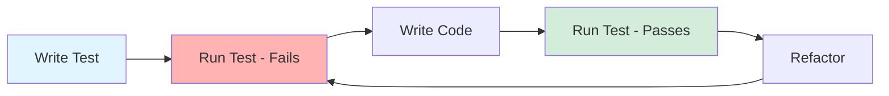

# Software Testing with Vitest

A practical guide to unit and integration testing

---
layout: center
---

# What is Testing?

Testing is the practice of verifying that software behaves as expected.

- Automated code execution to check correctness
- Catches bugs before production
- Documents expected behavior
- Enables confident refactoring

<!-- 
Testing is a fundamental practice in software development. It's not just about finding bugs - it's about building confidence in your code and creating living documentation of how your system should work.
-->

---

# What are Unit Tests?

Unit tests verify individual components in isolation.

- Test one function or class at a time
- Fast execution (milliseconds)
- Mock external dependencies
- Focus on specific behavior

```typescript
// Example: Testing a single function
function add(a: number, b: number): number {
  return a + b;
}

test('add should sum two numbers', () => {
  expect(add(2, 3)).toBe(5);
});
```

<!-- 
Unit tests are your first line of defense. They're small, fast, and focused. Think of them as testing individual Lego bricks before building the castle.
-->

---

# Why Do We Need Unit Tests?

Unit tests provide multiple benefits for development.

- **Quick feedback**: Run in seconds
- **Pinpoint failures**: Exact location of bugs
- **Enable refactoring**: Change with confidence
- **Living documentation**: Code examples
- **Reduce debugging time**: Issues caught early

<!-- 
Unit tests make development faster, not slower. The time you invest in writing tests is saved many times over in debugging and maintenance.
-->

---

# How to Write Unit Tests

Follow the AAA pattern for clarity.

- **Arrange**: Set up test data and conditions
- **Act**: Execute the code being tested
- **Assert**: Verify the expected outcome

```typescript
test('user validation', () => {
  // Arrange
  const user = { name: 'Alice', age: 25 };
  
  // Act
  const isValid = validateUser(user);
  
  // Assert
  expect(isValid).toBe(true);
});
```

<!-- 
The AAA pattern makes tests readable and maintainable. Anyone should be able to understand what's being tested just by reading the test.
-->

---

# Writing Unit Tests with Vitest

Vitest is a fast, modern testing framework.

**Key features**:
- Vite-powered (blazing fast)
- TypeScript support out-of-the-box
- Jest-compatible API
- Built-in mocking and spying

```typescript
import { describe, it, expect } from 'vitest';

describe('Calculator', () => {
  it('multiplies numbers correctly', () => {
    expect(multiply(4, 5)).toBe(20);
  });
});
```

<!-- 
Vitest is designed for modern JavaScript/TypeScript projects. It's fast, has great DX, and works seamlessly with Vite projects.
-->

---

# Vitest Configuration

Basic setup in your project.

```typescript
// vitest.config.ts
import { defineConfig } from 'vitest/config';

export default defineConfig({
  test: {
    globals: true,
    environment: 'node',
    coverage: {
      provider: 'v8',
      reporter: ['text', 'html'],
    },
  },
});
```

```json
// package.json
{
  "scripts": {
    "test": "vitest",
    "test:ui": "vitest --ui",
    "coverage": "vitest --coverage"
  }
}
```

<!-- 
This configuration enables globals (no need to import test functions), sets Node environment, and configures coverage reporting.
-->

---

# Mocking in Vitest

Mock external dependencies for isolation.

```typescript
import { vi, test, expect } from 'vitest';

// Mock a module
vi.mock('./database', () => ({
  query: vi.fn().mockResolvedValue([{ id: 1 }]),
}));

// Mock a function
const mockFn = vi.fn().mockReturnValue(42);

test('uses mocked data', async () => {
  const result = await query('SELECT * FROM users');
  expect(result).toEqual([{ id: 1 }]);
  expect(query).toHaveBeenCalledWith('SELECT * FROM users');
});
```

<!-- 
Mocking is essential for unit tests. It isolates the code under test from external dependencies like databases, APIs, or file systems.
-->

---

# What are Integration Tests?

Integration tests verify multiple components working together.

- Test interactions between modules
- Use real or test databases
- Slower than unit tests
- Closer to production scenarios

```typescript
test('user registration flow', async () => {
  // Tests database, validation, and email service together
  const user = await registerUser({
    email: 'test@example.com',
    password: 'secure123',
  });
  
  expect(user.id).toBeDefined();
  expect(user.emailVerified).toBe(false);
});
```

<!-- 
Integration tests ensure that your components play nicely together. They catch issues that unit tests miss, like incorrect API contracts or database schema mismatches.
-->

---

# Why Do We Need Integration Tests?

Integration tests catch different issues than unit tests.

- **Interface contracts**: APIs work together correctly
- **Data flow**: Information passes between layers
- **Configuration issues**: Environment setup problems
- **Real dependencies**: Database queries, external APIs
- **End-to-end workflows**: Complete user journeys

<!-- 
While unit tests verify individual pieces, integration tests verify the connections between pieces. Both are essential for comprehensive testing.
-->

---

# How to Write Integration Tests

Test realistic scenarios with real dependencies.

```typescript
import { beforeAll, afterAll, test } from 'vitest';
import { setupTestDb, teardownTestDb } from './test-helpers';

beforeAll(async () => {
  await setupTestDb();
});

afterAll(async () => {
  await teardownTestDb();
});

test('creates and retrieves user', async () => {
  const created = await db.users.create({ name: 'Bob' });
  const retrieved = await db.users.findById(created.id);
  
  expect(retrieved.name).toBe('Bob');
});
```

<!-- 
Integration tests often need setup and teardown. Use beforeAll/afterAll for expensive operations like database connections.
-->

---

# Writing Integration Tests with Vitest

Separate configuration for integration tests.

```typescript
// vitest.config.integration.ts
export default defineConfig({
  test: {
    include: ['**/*.integration.test.ts'],
    environment: 'node',
    testTimeout: 10000, // Longer for real operations
    setupFiles: ['./test/setup-integration.ts'],
  },
});
```

```json
// package.json
{
  "scripts": {
    "test:unit": "vitest run --config vitest.config.ts",
    "test:integration": "vitest run --config vitest.config.integration.ts"
  }
}
```

<!-- 
Keep integration tests separate from unit tests. They're slower and may require external services like databases.
-->

---

# Integration Test Example

Testing API endpoints with database.

```typescript
// user.integration.test.ts
import { describe, test, expect } from 'vitest';
import request from 'supertest';
import { app } from '../src/app';

describe('User API Integration', () => {
  test('POST /users creates user and returns 201', async () => {
    const response = await request(app)
      .post('/users')
      .send({ name: 'Alice', email: 'alice@example.com' })
      .expect(201);
    
    expect(response.body).toHaveProperty('id');
    expect(response.body.name).toBe('Alice');
  });
});
```

<!-- 
This test verifies the entire request-response cycle: routing, validation, database insertion, and response formatting.
-->

---

# Best Practices

Write maintainable and effective tests.

- **Test behavior, not implementation**
- **One assertion concept per test**
- **Use descriptive test names**
- **Keep tests independent**
- **Avoid test interdependence**
- **Use test helpers for common setup**
- **Run tests frequently during development**

<!-- 
Good test practices make your test suite a valuable asset rather than a maintenance burden. Tests should be as clean as production code.
-->

---

# Test Naming Conventions

Clear names make test failures obvious.

```typescript
// ❌ Bad: Vague
test('it works', () => { ... });

// ✅ Good: Specific behavior
test('returns 404 when user not found', () => { ... });

// ✅ Good: Describes scenario
test('throws error when email is invalid', () => { ... });

// ✅ Good: Pattern - should/when/given
test('should calculate discount when user is premium', () => { ... });
```

<!-- 
When a test fails, the name should tell you what broke without reading the code. Think of test names as documentation.
-->

---

# What is Coverage?

Coverage measures how much code is tested.

**Types of coverage**:
- **Line coverage**: Percentage of lines executed
- **Branch coverage**: Percentage of if/else paths taken
- **Function coverage**: Percentage of functions called
- **Statement coverage**: Percentage of statements executed

```bash
npm run coverage
```

<!-- 
Coverage is a useful metric but not the goal. 100% coverage doesn't guarantee bug-free code. Focus on testing critical paths and edge cases.
-->

---

# Coverage Reports

Vitest generates detailed coverage reports.

```typescript
// vitest.config.ts
export default defineConfig({
  test: {
    coverage: {
      provider: 'v8',
      reporter: ['text', 'html', 'lcov'],
      include: ['src/**/*.ts'],
      exclude: ['**/*.test.ts', '**/*.spec.ts'],
      thresholds: {
        lines: 80,
        functions: 80,
        branches: 80,
      },
    },
  },
});
```

<!-- 
Set coverage thresholds to maintain quality. Start with achievable targets (70-80%) and increase gradually. Don't obsess over 100%.
-->

---

# Using AI to Write Tests

AI assistants can accelerate test writing.

**How AI helps**:
- Generate test scaffolding
- Suggest edge cases
- Create mock data
- Write repetitive tests
- Identify missing tests

**Prompt examples**:
- "Write unit tests for this function"
- "What edge cases should I test?"
- "Create integration tests for this API endpoint"

<!-- 
AI is great for generating test boilerplate and suggesting scenarios you might miss. Always review and understand the generated tests.
-->

---

# AI Testing Workflow

Effective use of AI for testing.

```
1. Write your code
2. Ask AI: "List the cases i'd need to test for this method"
3. Review generated tests - do they cover edge cases?
4. Ask AI: "What edge cases am I missing?"
5. Refine tests based on suggestions
6. Run tests and iterate
```

**Tip:**: Give AI context about your testing setup, frameworks, and conventions for better results.

**Do not just ask AI to write all your tests without checking they actually cover what you need**

<!-- 
AI is a tool, not a replacement for thinking. Use it to save time on boilerplate while you focus on test design and coverage.
-->

---

# Test-Driven Development (TDD)

Write tests before code (optional but powerful).



**Benefits**:
- Clear requirements before coding
- Built-in test coverage
- Better design through testability

<!-- 
TDD forces you to think about requirements and design before implementation. It's not for everyone, but worth trying.
-->

---

# Common Testing Pitfalls

Avoid these mistakes.

- **Testing implementation details**: Test behavior, not internals
- **Flaky tests**: Tests that randomly fail
- **Test interdependence**: Tests affecting each other
- **Over-mocking**: Mock only external dependencies
- **Ignoring failing tests**: Fix or remove them

---
layout: center
---

# Summary

**Unit Tests**
- Fast, isolated, test individual functions
- Use mocks for dependencies
- Run frequently during development

**Integration Tests**
- Test component interactions
- Use real or test dependencies
- Slower but essential for confidence

**Vitest**: Modern, fast, TypeScript-friendly testing framework

**AI**: Accelerates test writing but requires review

<!-- 
Testing is an investment that pays dividends. Start with unit tests for critical logic, add integration tests for important workflows, and build coverage gradually.
-->

---
layout: end
---

# Questions?
